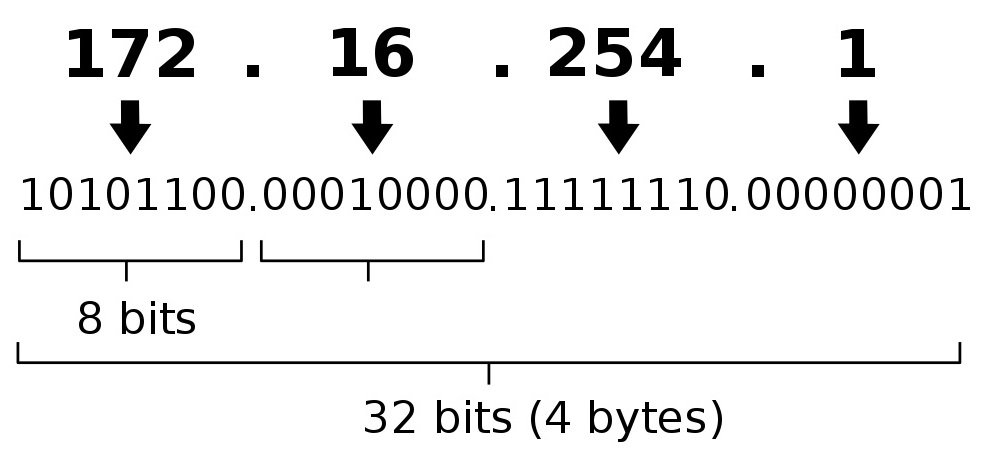
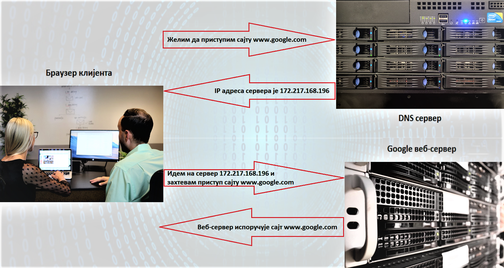

Интернет адресе и протоколи - URL, DNS, IP адреса
==================================================

.. infonote::

 На овом часу ћеш научити:
    •	врсте интернет адреса и која је њихова намена;
    •	типове интернет адреса и начине адресирања;
    •	који протоколи се користе за комуникацију у рачунарској мрежи.

Сваког дана стотину милиона људи широм света истовремено захтевају приступ садржајима различитих интернет страница и очекују њихову доступност без чекања, застоја и грешака. 
Да би то било могуће и да би се успешно реализовало, мора постојати јасно успостављен систем комуникације између ИКТ уређаја повезаних у рачунарску мрежу како би се комуникација и пренос података на интернету несметано одвијали.
Подсетимо се да рачунари који омугућују приступ различитим интернет сервисима представљају сервере, док рачунари који захтевају коришћење тих сервиса представљају клијенте. 
Комуникација између клијената и сервера се непрестано одвија по тачно утврђеним протоколима као што су HTTP и HTTPS за испоручивање садржаја интернет странице, SMTP за пријем, слање и чување електронске поште или FTP за пренос датотека.

У претходном разреду објаснили смо значење појмова URL, DNS и IP адресе. Потсетимо се шта представљају ови појмови. 

**URL** (енг. **Uniform Resource Locator**) представља јединствену локацију ресурса (појединачне веб-стране, датотека и других ресурса) на мрежи. Као синоним за URL адресу често се користи веб-адреса.

**IP адреса** (енг. **Internet Protocol Address**) је јединствена адреса сваког уређаја прикљученог на интернет. IP адресе се записују **бинарним записом** помоћу цифара 0 и 1. 
За записивање IP адресе потребно је 32 бита (бинарне цифре), нпр. 11000000 10101000 00000001 10011000. Да би људи могли лакше да памте и манипулишу IP адресама, оне се записују са четири броја у декадном бројном систему тако што се 32-битна IP адреса дели на четири дела, а сваки од њих може бити број од 0 до 255. 
Тако 11000000.10101000.00000001.10011000 постаје 192.168.1.152 у декадном запису. На овај начин могу да се адресирају више од четири милијарде различитих ИКТ уређаја у мрежи. IP адресе се не додељују насумично већ постоје одређена правила за њихово додељивање. 

IP адресе могу бити:
 * **статичке** - када су непроменљиве за један уређај, 
 * **динамичке** - када се при сваком повезивању у мрежу додељује другачија IP адреса. 

Протокол на основу кога се одвија адресирање на интернету и интернет саобраћај назива се **IPv4** (енг. Internet Protocol version 4) протокол. Како се интернет интензивно развија, услед постојања све већег броја веб-сајтова практично је све мање расположивих IP адреса.
Због тога је усвојена нова верзија интернет протокола **IPv6** која омогућава повећање броја доступних IP адреса. Код IPv6 протокола IP адреса се састоји од 8 блокова од по 4 хексадецималне цифре раздвојене двотачкама.
Подсетимо се да хексадецимални бројни систем представља бројни систем са основом 16 (за разлику од декадног бројног система који има основу 10). За писање бројева у хексадецималном бројном систему користи се истих 10 арапских цифара као и у декадном бројном систему (0-9) и још 6 почетних слова алфабета (А–F).

Примери IP адреса у протоколима IPv4 и IPv6:
 * IPv4 – 172.217.168.196
 * IPv6 – 2001:0DB8:85A3:0000:0000:8A2E:0370:7334

Како можеш да откријеш која је твоја IP адреса? Један од начина је да одеш на неки од сајтова кој раде проверу IP адресе попут https://whatismyipaddress.com/ip-lookup. 
Како је људима тешко да памте и манипулишу оваквим нумеричким адресама са великим бројем цифара, за представљање IP адресе користе се мнемоничке адресе које представљају комбинацију слова и цифара. Такве адресе се називају веб-адресе. 
Тако је веб-адреса сајта https://www.google.com/ а IP адреса сервера на коме је тај сајт смештен је 172.217.168.196. Било да у адресном пољу интернет прегледача укуцамо веб-адресу или IP адресу резултат ће бити исти, добићемо почетну страницу Google сајта. 
Да би овакав начин адресирања био изводљив, уведен је интернет сервис **Систем интернет домена** (енгл. DNS), који претвара мнемоничку адресу у IP адресу. DNS (енг. *Domain Name System*) је интернет сервис који врши конвертовање IP адресе из бројева у симболичку адресу како би се лакше памтила односно омогућава превођење текстуалних ознака у нумеричке ознаке и обратно.

На који начин су повезани URL, DNS и IP адреса?
-----------------------------------------------

Када у пољу претраге претраживача унесеш адресу https://www.google.com, твој рачунар шаље захтев DNS серверу да пронађе адресу сервера на коме је овај сајт смештен. DNS сервер преводи текстуалну URL адресу у нумеричку IP адресу и упућује на тражену адресу. 
Дакле улога DNS сервера јесте да се за тражене услуге на одређеном сајту добију одговарајуће IP адресе неопходне за комуникацију и размену података у мрежи.

На сајту https://tools.keycdn.com/ преко URL адресе можеш добити IP адресу. Ово може бити важно ако желиш да сазнаш на ком серверу се налази нека веб-страница. Некада се дешава да из неког разлога DNS не ради, па онда страници можеш приступити преко IP адресе.

Како на интернету постоји велики број сервера, а сваки од њих мора имати јединствено име, произилази да сервери морају имати сложена имена. Из тог разлога уводи се појам интернет домена. 
Домен је скуп имена за сервере који припадају једној организацији (предузећу, школи, државној установи итд.). Систем имена је **хијерархијски организован**. Последњи део интернет домена назива се **домен највишег нивоа** (енг. Top-Level Domain - **TLD**). 
На пример домени комерцијалних организација групишу се у домен вишег нивоа .com (www.google.com, www.microsoft.com), едукативне организације се налазе у домену .edu (www.harvard.edu) итд.

Између појмова „интернет домен” и „назив интернет домена” постоји јасна разлика. Често се када се каже  „интернет домен”  мисли на назив интернет домена. Интернет домен представља скуп података који описују једну целину на интернету (интернет адресе се везују за одређене локације на интернету као што су сервери, сајтови и др). 
Назив интернет домена јесте текстуална ознака коју сваки корисник може регистровати на интернету за своје потребе. Приликом регистрације домена, назив домена се уписује у **Централни регистар** којим управља **Регистар интернет домена**. 
Практично назив интернет домена је интернет (веб) адреса коју корисник региструје у оквиру неког постојећег интернет домена. На пример, веб-адреса www.petlja.org представља адресу која је  регистрована у оквиру домена .org.
Назив интернет домена састоји се из низа слова и цифара раздвојених тачкама. Правила код давања назива домену су да може да садржи цифре (0–9), слова енглеског алфабета (а–z) (или неког другог писма) и цртицу (-), а назив не сме бити краћи од два, нити дужи од 63 знака, не сме да садржи цртицу на почетку или крају, као ни две узастопне цртице на трећој и четвртој позицији.
Домен .rs припада доменима са интернационализованим називима, што омогућава да се у имену домена нађу и карактери č, ć, š, ž и đ. Подсетимо се да имамо и .срб домен, код кога се користи ћирилица за називе домена.

Резимирајмо основне термине:
 * **IP адреса** (енг. **Internet Protocol Address**) је јединствена нумеричка адреса за сваки уређај прикључен на интернет.
 * **URL** (енг. **Uniform Resource Locator**) јесте јединствена локација ресурса на интернету.
 * **DNS** (енг. **Domain Name System**) јесте интернет сервис који омогућава превођење текстуалних ознака веб адреса у нумеричке ознаке и обратно.
 * **DNS сервер** је уређај који омогућава да се за тражене услуге на одређеном интернет домену добију одговарајуће IP адресе неопходне за комуникацију и размену података у мрежи.
 * **Интернет домен** јесте скуп података који описују једну целину на интернету, тј. интернет адресе се везују за одређене локације на интернету као што су сервери, сајтови и др. 
 * **Назив интернет домена** јесте текстуална ознака која се може регистровати за сопствене потребе. Приликом регистрације, назив се уписује у Централни регистар, којим управља Регистар интернет домена.
 * **Интернет протокол** јесте скуп стандарда који омогућавају пренос пакета података између рачунара и других уређаја повезаних на исту мрежу или на различите мреже.
