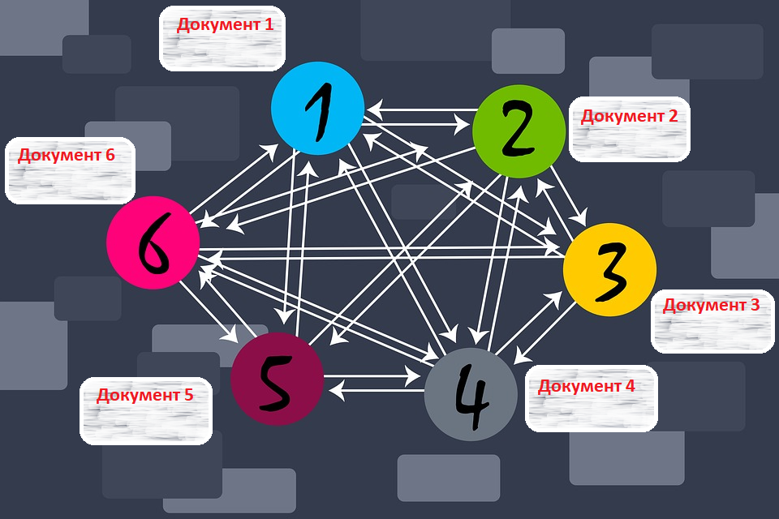
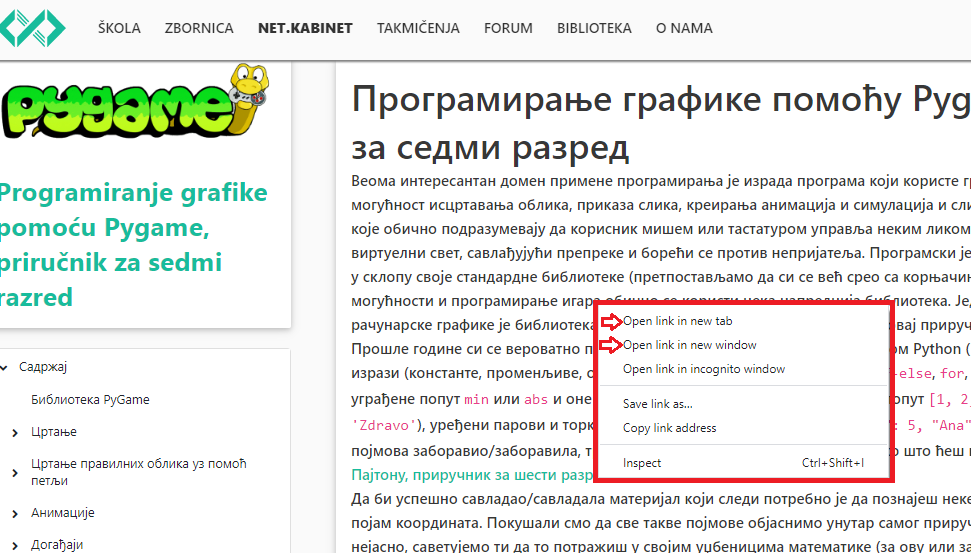
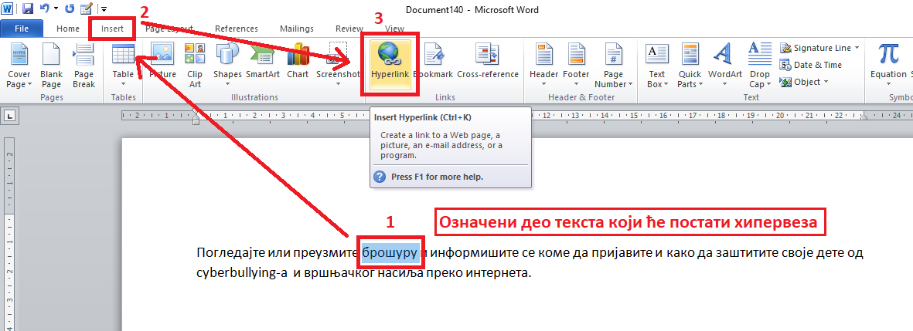
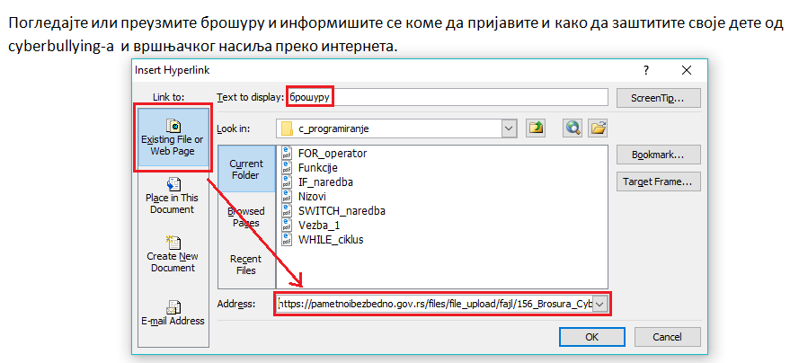
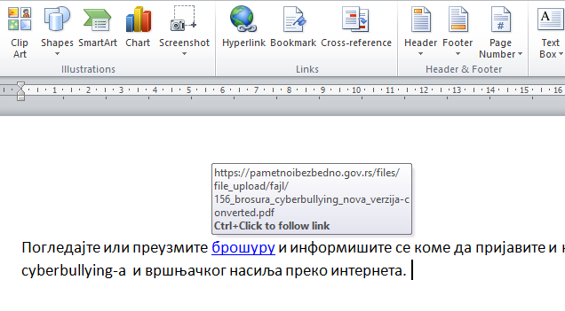
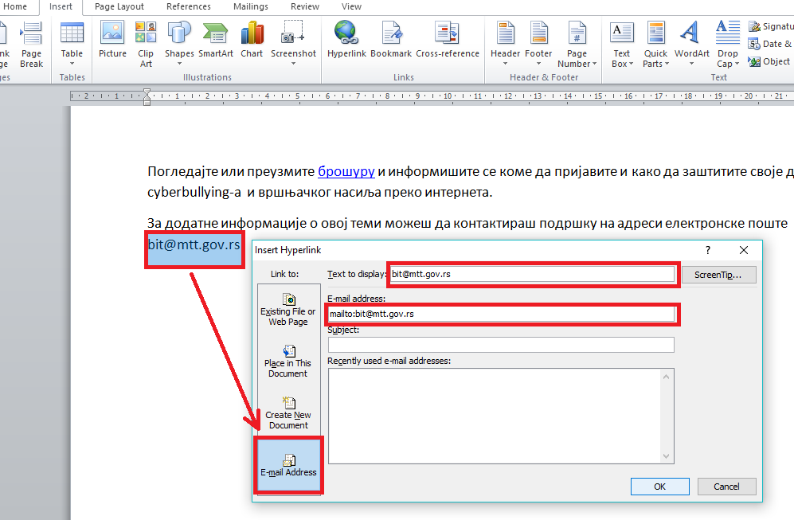
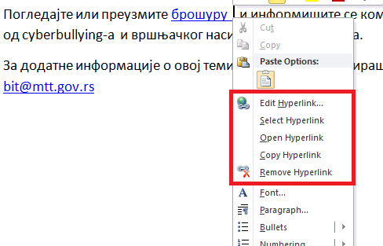
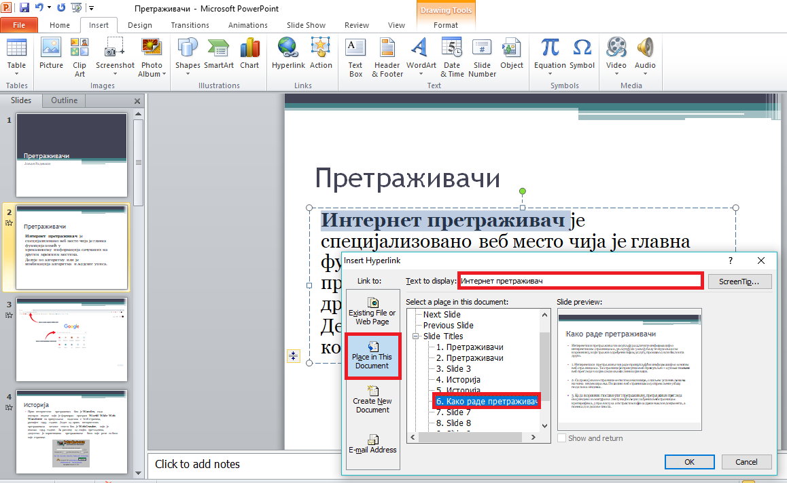

Хипервеза и хипертекст
=======================

Када читаш књигу, обично је читаш редом страницу по страницу, од почетка па све до краја. Такав редослед читања назива се **линеаран** (праволинијски). Најчешћи начин на који читаш текстуалне документе који су у израђени у неком програму за обраду текста јесте управо такав, линеаран начин приступа. 
У дигиталном тексту постоји могућност и другачије организације редоследа читања захваљујући постојању посебних **веза** или **линкова** које те воде ка другим деловима текста у оквиру самог документа, неког другог документа или ка било ком другом ресурсу на интернету. 
Такав посебно означен део текста који води ка другим деловима истог текста или ка неком другом садржају назива се **хипервеза** или **хиперлинк** (енг. **hyperlink**), а текст који садржи хипервезе назива се **хипертекст** (енг. **hypertext**). 
Хипертекст је текст у ком одабрана реч, више речи или слика може служити као хипервеза (hyperlink) према другим текстовима, сликама или звучним записима. Текстуални хиперлинкови су обично подвучени и у другој боји у односу на остатак текста на веб-страници. 
Хипертекст омогућује произвољан **нелинеаран** редослед читања, односно прегледања садржаја, што омогућује претраживање интернета. Све интернет странице којима приступаш представљају хипертекст који садржи хипервезе, а оне те повезују са страницама које желиш да посетиш. 
Сетимо се назива протокола за пренос и приказивање веб-страница HTTP - HyperText Transfer Protokol.

Приказ хипервеза унутар једног веб-сајта
-----------------------------------------

Сваки **веб-сајт** се састоји од **веб-страна** које су **повезане хиперлинковима**, који се скраћено називају само линкови. Веб-стране практично можемо сматрати хипертекстуалним документима. Међутим, како поред текста, веб-стране садрже и слике, анимације, звучне и видео записе, оне су мултимедијалне па је исправније рећи да су веб-стране хипермедијални документи.
За читање хипертекста користи се израз прегледање (енгл. browsing) па по томе и назив програма за прегледање хипертекста на вебу **веб-прегледач** или **веб-браузер** или скраћено само **браузер**.
Кликом на линк веб прегледач те пребацује на садржај који се налази на истој или на другој страници тог сајта или неког другог сајта. Некада су линкови подешени тако да се, када се кликне на њих, садржај на који упућују отвара у новој картици веб-прегледача или у новом прозору. Уколико то није случај, онда се саржај на који линк упућује приказује у истом прозору уместо претходног садржаја. 
Уколико то желиш да промениш, потребно је да кликнеш десним тастером миша на линк и одабереш опцију **Отвори линк у новој картици (Open link in new tab)** или **Отвори линк у новом прозору (open link in new window)**.

Понекад је потребно да и у документима које креираш користиш хипервезе. Такве хипертекстуалне односно хипермедијалне документе можеш стварати и помоћу програма за обраду текста или израду мултимедијалних презентација. У наставку ћеш научити како да убациш хипервезе у Word документ и PowerPoint презентацију.

Уметање хипервезе у текстуални документ у Microsoft Word-у
-----------------------------------------------------------

Једна од могућности за примену хипервеза у текстуалном документу је приликом креирања садржаја када је уместо броја странице могуће користити хипервезе. На тај начин попут приступа одређеним интернет страницамa преко хипервеза и у текстуалном документу можеш приступати различитим деловима истог документа, што је посебно погодно када су у питању документи са великим бројем страна па се лако може прелазити рецимо са једног на друго поглавље документа. Ово је погодно на пример за креирање збирке песама код које садржај можеш креирати користећи могућност да се уместо преко броја стране одговарајућој песми приступа преко хиперлинка. На овај начин креирају се хиперлинкови у оквиру самог документа.

Понекад је потребно креирати хипервезе ка неким другим документима који су снимљени на рачунару или се налазе на интернету. 

У програму Microsoft Word опција за додавање хипервезе налази се на картици **Insert** у групи **Links**. За прављење хипервезе најпре је потребно да означиш део текста који ће представљати хипервезу (као што је на слици означена реч брошура) а онда кликнути на опцију Insert/Hyperlink након чега се отвара прозор у коме се у пољу Text to display аутоматски налази текст који је означен, али ту можеш унети и неки други текст који ће представљати хипервезу, те ће тај текст заменити претходно означени.

Затим је потребно да подесиш путању (Link to...): 
 * до постојећег документа или веб-стране (Existing File or Web page);
 * у оквиру документа који тренутно уређујеш (Place in This Document);
 * до новог документа (Create New Document);
 * до имејл адресе (E-mail Address).

Садржај којем желиш да приступиш може се налазити:
 * у фолдеру где се налази и документ који уређујеш (Current Folder);
 * међу посећеним странама (Browsed Pages);
 * међу недавно уређиваним фајловима (Recent Files).
 
Такође, у пољу Address можеш унети интернет адресу садржаја којем желиш да приступиш, као што је то приказано на слици.

Након тога означени део текста постаје хипервеза обојена обично плавом бојом и подвучена а када поставиш курсор преко ње добићеш обавештење на коју веб адресу ће те одвести.

Путања хипервезе може се поставити да води и до адресе електронске поште и тај поступак је приказан на наредној слици.

Креирану хипервезу можеш накнадно изменити, отворити, копирати или уклонити онако како је и креирана на картици **Insert** задавањем опције **Hyperlink** у групи **Links** или ако десним кликом миша кликнеш на њу и изабереш одговарајућу опцију од понуђених опција.

Оно што је битно да знаш и о чему треба да водиш рачуна јесте путања до садржаја коме желиш да се приступи. Постоје два типа путања до овог садржаја, тзв. апсолутне и релативне путање. 
Апсолутна путања је комплетна путања одређене датотеке или фасцикле почев од root фасцикле. Релативна путања је путања одређене датотеке или фасцикле у односу на тренутну радну фасциклу.
На пример, ако желиш да направиш хипервезу ка датотеци slika.jpg која се налази у фолдеру Informatika на c диску рачунара, потребно је да **у пољу Address** откуцаш:
c:\Informatika\slika.jpg  и то је **апсолутна путања**, док slika.jpg је **релативна путања**.
Релативна путања ти омогућава приступ документу и када га преснимиш у неки други фолдер. Једино је важно да се документ који садржи хипервезу налази у истом фолдеру као и садржај којем желиш да приступиш.

Уметање хипервезе у мултимедијалну презентацију у Microsoft PowerPoint-у
-------------------------------------------------------------------------

На сличан начин као и у текстуалном документу, односно у програму Microsoft Word, хипервезе можеш креирати и у слајд-презентацијама, на пример у програму Microsoft PowerPoint. 

Поступак је следећи:
 * потребно је најпре да означиш део текста, облик или слику, 
 * затим на главном менију (или из помоћног менија када кликнеш десним тастером миша) изабереш опцију **Link/Insert Link**. 

У PowerPoint-у је карактеристично то да је сваки слајд већ обележен као место у документу до кога може водити линк па је постављање линкова ка другим слајдовима веома једноставно. У прозору **InsertHyperlink** треба да одабереш опцију **Place in this document** као што је то означено на слици, затим кликнеш на слајд до кога линк треба да те одведе и затим избор потврдиш кликом на дигме OK. 

У PowerPoint-у можеш додати, као и у Word-у, хипервезу ка неком веб-сајту, видео-запису који се налази на YouTube-у или репродуковати аудио запис који се налази на рачунару, што презентацију може учинити занимљивијом. 
