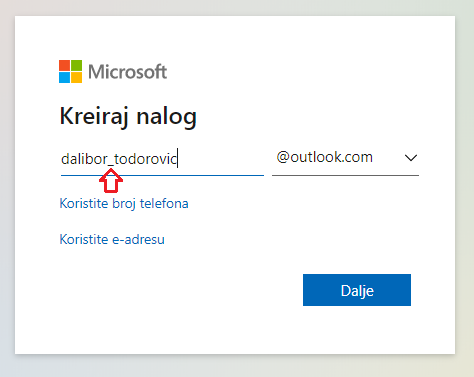
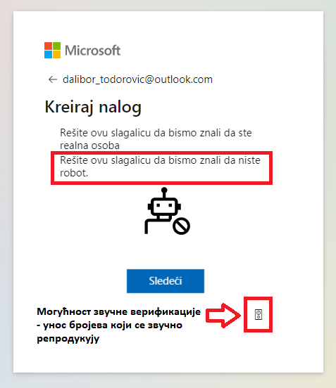
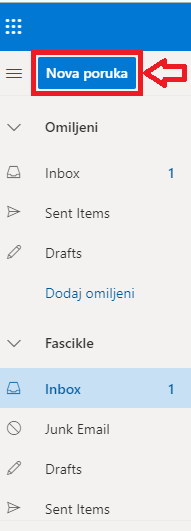

Електронска пошта
==================

.. infonote::

 На овом часу ћеш научити нешто више о:
    •	електронској пошти;
    •	деловима електронске адресе;
    •	креирању налога;
    •	слању и примању електронске поште;
    •	организацији и складиштењу порука и фасциклама;
    •	нежељеној е-пошти;
    •	руковању контактима;
    •	саветима за правилну и безбедну комуникацију путем елекронске поште.

Захваљујућу убрзаном развоју технологије данас је комуникација и размена информација изузетно брза, лака и доступна. Један од сервиса који омогућава слање и пријем електронских порука између два корисника или групе корисника јесте **електронска пошта**. О електронској пошти је било речи у претходном разреду приликом изучавања интернет сервиса. Подсетимо се да су **интернет сервиси** услуге које нам интернет пружа, а да је електронска пошта (енг. *e-mail*) један је од интернет сервиса који је настао међу првима. 
Популарност електронске поште је велика из више разлога, међу којима су најважнији то што је могуће послати разне врсте фајлова (документе, слике, видео и аудио записе, архивиране податке и др.), трошкови испоруке су мали, а поруке се брзо и лако преносе (и на великим раздаљинама), при чему у тренутку слања поруке особа којој шаљемо електронску пошту не мора бити „на мрежи” (енг. *online*).

За слање и пријем порука електронске поште користи се интернет сервис **веб-мејл** (енгл. *webmail*). Да би неко могао да користи овај сервис мора да има своју адресу **електронске поште** или имејл (енгл. *e-mail*) адресу. Подсетимо се од чега се она састоји.

Делови електронске адресе:
 * **корисничко име** - име које сваки корисник креира за себе под условом да је доступно, односно да није већ креирано од стране неког другог корисника код истог провајдера,
 * **знак@** (изговара се “ет”)
 * **име провајдера** - сервиса који пружа услугу коришћења електронске поште.

Пример једне имејл адресе је: dalibor_todorovic@outlook.com
Адресу електронске поште можеш да креираш код свог провајдера (добављача интернет услуга) и она ће садржати након знака @ име тог провајдера. 
Међутим, данас је најчешћи случај да људи за слање и примање мејлова користе неке од познатијих веб-мејл сервиса, најчешће Microsoft-а или Google-а. Веб-мејл сервис омогућава приступ електронској пошти из прегледача веба са било ког уређаја који је повезан на интернет.

Креирање налога
----------------

Да би корисници интернета могли да шаљу и примају електронску пошту, потребно је да имају своју електронску адресу. Уколико је немају, могу је добити тако што ће **бесплатно креирати** налог код Google сервиса електронске поште (Gmail веб сервиса) на адреси mail.google.com или www.gmail.com одабиром опције “Отвори налог”. За отварање налога на овом сервису важи ограничење узраста, односно налог могу отворити старији од 13 година.
Осим Google-а, адресу електронске поште можеш бесплатно креирати и преко других сервиса електронске поште, као што је Microsoft. Ако желиш да креираш налог преко овог сервиса, потребно је да у веб-прегледачу откуцаш: https://account.microsoft.com.
На страници пронађи и одабери опцију **Create a Microsoft account**. 

.. image:: ../../_images/email01.png
   :width: 900px   
   :align: center 

У празно поље унеси корисничко име које желиш и домен „outlook” па кликни на дугме **Next**. Уколико клинеш на опцију Get a new email address биће ти понуђено да одабереш да ли желиш као име провајдера да користиш outlook или hotmail.
За креирање корисничког имена, осим слова и бројева, можеш користити и тачке и цртице. Могуће је да ћеш изабрати корисничко име које је већ заузето, па у том случају можеш осим свог имена користити и годину рођења, скраћени облик или неку другу алтернативу.

.. image:: ../../_images/email03.png
   :width: 350px   
   :align: center 

Следећи корак је да изабереш **лозинку**. Подсети се која су **правила креирања добре лозинке**. За лозинку је најбоље да изабереш комбинацију (великих и малих) слова, бројева и специјалних знакова.

.. image:: ../../_images/email07.png
   :width: 350px   
   :align: center 

На последњем кораку унеси тражене карактере како би се верификовало да налог не отвара неки софтвер (робот) и твој налог је већ спреман за употребу.
Постоји могућност да уколико ти је приказани скуп карактера недовољно читљив тражиш приказ новог скупа карактера опцијом **New** или захтеваш звучну репродукцију опцијом Audio.
Прозор може да изгледа као на некој од наредних слика. 

.. image:: ../../_images/email08a.png
   :width: 350px   
   :align: center 

Када је налог креиран, отвара се страница за његово подешавање. У горњем левом углу изабери **More actions / Edit Profile** па можеш додати слику, датум рођења, својe пребивалиште и остале податке.

.. image:: ../../_images/email12.png
   :width: 480px   
   :align: left

.. image:: ../../_images/email15.png
   :width: 480px   
   :align: right 

.. image:: ../../_images/email10.png
   :width: 450px   
   :align: center 

.. image:: ../../_images/email11.png
   :width: 450px   
   :align: center 

Без обзира на то да ли користимо веб-мејл сервис или неку од постојећих апликација за рад са електронском поштом, основне функције које су нам на располагању су:
 * креирање новог мејла
 * слање мејла
 * преузимање пристиглих мејлова
 * читање примљених мејлова
 * одговарање на примљени мејл
 * прослеђивање примљеног мејла на друге мејл адресе
 * брисање мејла
 * креирање адресара.

Слање и пријем поште
--------------------

Да би написао/написала електронску поруку, на главном менију изабери Account. Кликни на падајући мени More actions и изабери View inbox. Пратећи следеће кораке, подеси програм на српски језик.

На следећој слици jе приказан мени са опцијама за креирање нове поруке, приступ фасциклама (фолдерима) и њихово уређивање у **Microsoft сервису за електронску пошту**.  

Веома слично изгледа мени са опцијама за креирање нове поруке, приступ фасциклама (фолдерима) и њихово уређивање и у **Google сервису**.

.. image:: ../../_images/email30a.png
   :width: 200px   
   :align: center 

Нову поруку можеш креирати кликом на **Nova poruka**. Потребно је унети **адресу примаоца (Za), наслов поруке (Dodaj temu) и текст поруке**. Такође, можеш унети и неки фајл који желиш да пошаљеш кликом на **Priloži**. Овде треба имати у виду то да већина програма за слање електронске поште има ограничења када су у питању поруке које садрже велике фајлове. 
Такође, због безбедности електронске комуникације, систем за слање имејлова неке типове датотека (као што је на пример извршна датотека - са екстензијом .exe) региструје као опасан садржај и забрањује њихово слање. 
Кликом на **Pošalji** порука ће се послати, док кликом на **Odbaci** одустајеш од слања поруке.

На следећој слици jе приказан прозор за креирање нове поруке и њено уређивање у **Microsoft сервису** за електронску пошту.

.. image:: ../../_images/email20.png
   :width: 450px   
   :align: center 

Прозор за креирање нове поруке и њено уређивање у **Google сервису** за електронску пошту изгледа као на следећој слици.

- Приликом писања поруке, води рачуна о правилима граматике и писане електронске комуникације и придржавај се правописа.
- Немој користити s, c, dj, z уместо š, ć, č, đ, ž.
- После знакова интерпункције, испред и иза заграде увек куцај размак.
- Пре слања поруке, провери да ли је текст граматички и правописно исправно написан.
- Провери да ли је садржај примерен (не садржи псовке и увреде) и да ли је твоја порука правилно форматирана (садржи наслов поруке, фонт ниje ни превелики, ни премали, усклађена су поравнања, постоје пасуси и сл.).
- Колико је наслов поруке важан – казује ти и то што ће те сам програм за слање порука упозорити ако желиш да пошаљеш поруку без наслова. Труди се да текст буде јасан и да укаже на садржај поруке.
- Писање поруке започни поздравом, а заврши потписом.
- Да би се нагласила важност поруке коју шаљеш, можеш јој доделити један од три нивоа приоритета:

    * ``High`` (!) – висок приоритет, поруку је потребно да што пре прочиташ;
    * ``Normal`` – нормални приоритет;
    * ``Low`` – низак приоритет, поруку можеш прочитати и касније.

У доњем делу прозора за слање поруке налазе се алати за форматирање поруке који су слични алатима за форматирање текста у неком програму за обраду текста.

.. image:: ../../_images/email20f.png
   :width: 600px   
   :align: center

У садржај имејла може се додати хипервеза ка одређеној веб-страници или другој имејл адреси. Након што се подеси хипервеза и кликне на ОК појављује се линк који је обично подвучен и обојен плавом бојом. 

На примљену поруку може се одговорити пошиљаоцу избором опције стрелице (``Одговори``). Ако је неко послао поруку теби и опцијом ``CC`` на још неколико адреса, имаш могућност да одговориш свима одједном кликом на двоструку стрелицу лево (``Одговори свима``). За прослеђивање поруке на другу имејл адресу користи се опција стрелица десно (``Проследи``).

У сваком тренутку, са било ког уређаја својим порукама можеш приступити користећи одговарајућу адресу, која зависи од добављача имејл услуга, на пример: https://outlook.live.com/mail/inbox 

Организација и складиштење порука (Фасцикле)
---------------------------------------------

Порука се аутоматски чува у фасцикли **Radne verzije** док је уређујеш и не пошаљеш. Када је пошаљеш, налази се у фасцикли **Poslate stavke**. У фасцикли **Prijemno poštansko sanduče** налазе се примљене поруке.
Ако желиш неке поруке да сачуваш, а да ти не заузимају место у пријемном сандучету, можеш их преместити у фасциклу **Arhiva**. Такође, можеш креирати и нове фасцикле и организовати своје поруке према неком критеријуму (нпр. школа, забава, име контакта и др.).
Ако поруке желиш да означиш по важности, по темама или другим критеријумима (да их категоризујеш), то можеш урадити кликом левим тастером на **Kategorizuj**. Можеш да креираш нову категорију и да јој додељујеш име и боју.
Поруке из фасцикле у фасциклу можеш премештати једноставним превлачењем левим тастером миша.

Ако случајно или намерно обришеш неку поруку, она ће се налазити у фасцикли **Izbrisane stavke**. Тим порукама можеш приступити све док их трајно не избришеш појединачно, или кликом на ``Isprazni fasciklu`` обришеш садржај целе фасцикле **Izbrisane stavke**.
Веб-сервис Gmail за разврставање порука користи ознаке (енгл. *Labels*) и филтере (енгл. *Filters*). 
   
Поред основних ознака овај сервис омогућава да се имејлови архивирају, означе као важни као и да корисник креира нове ознаке у складу са својим потребама.
Означавање порука по важности може ти помоћи да пратиш поруке везане за нпр. неки пројекат, задатак, контакт и др.

Нежељена е-пошта
-----------------

Која је то нежељена пошта? Како је веома једноставно послати електронску пошту, често се дешава да се имејл адресе злоупотребљавају па корисници сервиса електронске поште често добијају нежељену и непримерену пошту (енгл. *Spam*). 
Системи за електронски пошту помоћу одговарајућих алгоритама могу да препознају спам поруке и аутоматски их сврставају у фасциклу **Нежељена е-пошта** (енгл. *Spam* или *Junk Email*). 
Међутим, програм може понекад и да погреши, па да и пошту која није нежељена смести у поменуту фасциклу. Зато је неопходно проверити и поруке које су пристигле у фасциклу *Нежељена е-пошта*, али не треба их отварати ако ти делују сумњиво, јер често могу да садрже вирусе.  
Најчешће садрже рекламе, обавештења о освојеној награди или великом наследству, понуди за бесплатна путовања или курсеве, све са циљем да преваре корисника и злоупотрбе личне податке. 

.. image:: ../../_images/email34.png
   :width: 180px   
   :align: center 

.. image:: ../../_images/email35.png
   :width: 750px   
   :align: center 

Систем често приказује и обавештење и упозорење да нека пошта делује опасно. Корисник имејлове који су означени као непожељни може да обрише појединачно или све одједном, одабиром одговарајуће опције за то, након чега су спам поруке трајно уклоњене. 
У неким системима спам поруке се аутоматски бришу након 30 дана. 

.. image:: ../../_images/email36.png
   :width: 500px   
   :align: center 

.. image:: ../../_images/email37.png
   :width: 500px   
   :align: center 

Нежељену пошту не очекујемо и потпуно је безвредна. Нежељене поруке се, између осталог, шаљу и због фишинга и ширења штетног кода. 
Подсетимо се да је фишинг (енг. *phishing*) или “пецање” врста интернет преваре у којој се без знања корисника долази до поверљивих података о њему - лозинки, бројева картица или података о банковном рачуну. До фишинга долази или директном комуникацијом порукама или преко веб-сајтова који представљају лажне веб-странице а заправо изгледају исто или веома слично оригиналним веб-страницама на којима корисници уносе своје податке.

Није увек лако открити да ли је нека веб-страница лажна или не. Постоји неколико начина да се препозна покушај “пецања”. Неки од њих су:
 * да ли језик којим је садржај поруке написан садржи грешке
 * да ли се у поруци експлицитно траже лични подаци попут матичног броја, броја банковног рачуна, адресе, лозинке и слично
 * састав имејл адресе - да ли садржи назив организације која је послала мејл
 * да ли су подаци наведени у мејлу (назив организације, адреса, број телефона) они који су наведени и на званичном веб-сајту те организације
 * на које адресе воде линкови у сумњивим имејловима (што се може проверити постављањем курсора преко линка, када се у статусној линији приказује URL адреса на коју линк води).

За вежбу препознавања фишинга препоручујемо ти да посетиш и решиш два квиза на адресама https://phishingquiz.withgoogle.com/ и https://www.opendns.com/phishing-quiz/

Ако желиш да се заштитиш од досадних нежељених порука, придржавај се следећих савета:
 * Користи најмање две имејл адресе. Једну ћеш користити за регистровање на разним форумима, за електронску куповину и сл., а другу за слање и примање електронске поште.
 * Буди креативан/креативна приликом креирања имејл адресе, немој користити само име и презиме.
 * Никада не одговарај на нежељене поруке.
 * Не објављуј своју приватну адресу на местима која су свима доступна.
 * Користи најновије верзије веб-прегледача.

Како би се додатно заштитио/заштитила од нежељене поште, потребно је да сазнаш више информација о пошиљаоцу. Ако знаш одакле ти је послата нежељена порука, можеш да блокираш пошиљаоца. Информације о пошиљаоцу можеш наћи у заглављу поруке. Свака порука електронске поште састоји се из заглавља и тела. Заглавље је препуно техничких података које већина програма за слање електронских порука не приказује. Ипак, већина програма омогућује да се заглавље прикаже, ако је потребно.

Није намера сваке спам поруке превара корисника. Поједине врсте електронских порука, за које би се могло рећи да представљају спам, заправо су поруке за чије је слање, свесно или несвесно, корисник дао одобрење приликом регистрације на неком веб-сајту. Ако корисник приликом посете неком веб-сајту означи поље за потврду поред питања о томе да ли жели да прима обавештења о производима неке компаније, онда он даје сагласност за пријем оваквих рекламних порука. Уколико не жели пријем таквих имејлова са специфичне имејл адресе или одређеног сајта, онда је довољно да се одјави са мејлинг листе на коју је пријављен опцијом која најчешће гласи ``Unsubscribe from this list``, а која се налази у мејлу са обавештењима. 

Контакти
--------

Контакте можеш да додајеш (**+Novi kontakt** или **+Dodaj kontakt**) и да их увезеш (**+Uvezi kontakte**) са својих осталих налога, ако их имаш. Такође, своје контакте можеш да групишеш по неком критеријуму тако што ћеш креирати нову фасциклу (Nova fascikla).
Outlook памти адресе чим пошаљеш прву поруку. Када почнеш да куцаш адресу, он ти аутоматски нуди листу коришћених адреса које су сагласне са откуцаним почетком. Да би сачувао своје контакте, кликни на иконицу **Osobe** у доњем левом углу екрана и отвара ти се одговарајући прозор.

Можда имаш и омиљене особе, са којима се често дописујеш, па их можeш прогласити омиљеним тако што ћеш их изабрати и левим тастером миша клинкути на Dodaj u omiljene lokacije. Контакте можеш уређивати и избрисати. Кликом на Upravljaj можеш увести, извести или повезати дуплиране контакте.

Савети за правилну и безбедну комуникацију путем елекронске поште 
------------------------------------------------------------------

Приликом употребе електронске поште, придржавај се следећих безбедносних савета:
 * Приликом одабира лозинке за свој налог одабери лозинку тако да буду испоштована правила “јаке лозинке”, односно да она садржи комбинацију великих и малих слова, цифара и специјалних знакова и никоме је не откривај
 * Води рачуна о томе коме ћеш све дати своју адресу електронске поште као и свој број телефона
 * Свака порука електронске поште треба да садржи кратак и јасан наслов који се односи на садржај поруке и најбоље илуструје поруку
 * На почетку поруке се увек обрати саговорнику, а на крају поруке се потпиши
 * Поруку не треба писати искључиво великим словима јер се такав начин обраћања сматра викањем
 * Употребу емотикона у поруци треба свести на минимум
 * Приликом првог обраћања некој особи треба да се представиш и објасниш како си дошао/дошла до контакта (имејл адресе) те особе
 * Порука не треба да буде предугачка (не дужа од 100 редова) нити да садржи превише прилога 
 * Води рачуна о броју и величини прилога који се шаљу уз поруку
 * Пре слања поруке провери да ли су испоштована сва правописна правила и да ли су приложене све датотеке које наводиш у поруци
 * Примљену поруку не би требало прослеђивати без дозволе аутора односно особе која је поруку послала
 * Порука која се прослеђује може се скратити, али не треба је модификовати тако да се мења њен садржај
 * Не прослеђуј поруке које представљају ланчана писма тзв. ланци среће
 * Не одговарај на сумњиве и непожељне поруке нити отварај прилоге које оне садрже, јер се могу активирати вируси, па их је најбоље обрисати без читања
 * Слање на више адреса опцијом Сс: само уз претходни договор са свим учесницима у комуникацији. Уместо тога користи опцију Всс: за навођење више адреса прималаца.
 * Кад завршиш са комуникацијом, одјави се са налога
 * Ако приметиш да је неко заборавио да се одјави са свог налога електронске поште, одјави га ти.
