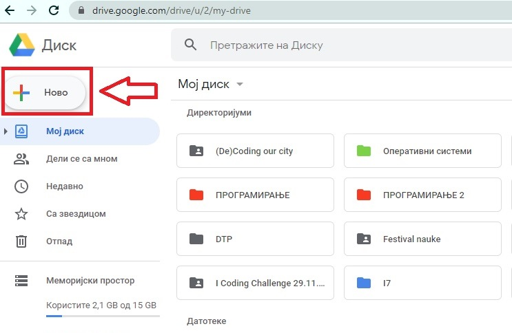
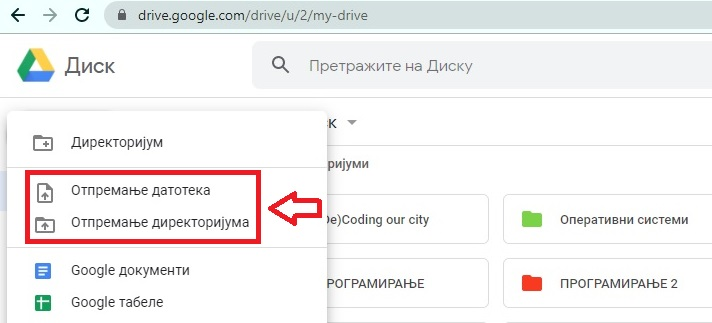

Рачунарство у облаку
=====================

.. infonote::

 На овом часу ћемо говорити о:
    •	рачунарству у облаку;
    •	складиштима у облаку, претраживању и проналажењу датотека у облаку;
    • сарадничком креирању и дељењу докумената у облаку; 
    • подешавању одговарајућих нивоа приступа.

Могућност да своје датотеке (текстуалне, звучне, видео записе, фотографије...) не чуваш на свом рачунару, већ на неким удаљеним серверима (посебним рачунарима за чување података) и да им путем интернета приступаш са било које локације и било ког уређаја у било ком тренутку назива се **складиштење у облаку** (енгл. **Cloud storage**). 
Постоје бројни сервиси који пружају ову услугу попут сервиса **Google Drive** у оквиру Google налога, затим **OneDrive** коришћењем Microsoft налога, **Dropbox** и других. Организација података на овим серверима је хијерархијска и по структури слична организацији података на диску твог рачунара.

Неки од ових сервиса пружају могућност да креираш нове датотеке различитог типа или отвараш и модификујеш већ постојеће отпремљене датотеке. Једна од највећих предности сервиса у облаку је што се датотеке и фасцикле могу делити са више корисника. На тај начин свако може истовремено да доприноси раду на документу, што представља сараднички рад на документу. 
Овакав концепт рада назива се **“рачунарство у облаку”**. 

Претраживање и проналажење датотека у облаку
--------------------------------------------

Корисницима **Google налога** на располагању је коришћење услуге **Гугл диск** (енгл. **Google Drive**) који представља један од најпознатијих и најчешће коришћених складишта у облаку. Корисницима је на располагању бесплатни меморијски простор од 15GB (укључујући и сервис електронске поште Gmail). За више простора потребно је купити неки од понуђених пакета. 
То је уобичајени принцип на коме функционише рачунарство у облаку - нуде се бесплатно одређене функционалности са ограниченим меморијским простором а уз доплату се добија већи простор и проширени спектар услуга на коришћење.

.. image:: ../../_images/GoogleDrive.jpg
   :width: 800px   
   :align: center 

Погледај у следећем видеу **како се претражују фасцикле и датотеке на Гугл диску**:

.. ytpopup:: 8G7pPlwvX5Q
      :width: 735
      :height: 415
      :align: center

Корисницима **Microsoft налога** на располагању је коришћење услуге **Уандрајв** (енгл. **OneDrive**) који такође представља један од најпознатијих и најчешће коришћених складишта у облаку. Корисницима је на располагању бесплатни меморијски простор од 5GB, а за више простора потребно је купити неки од понуђених пакета.

Погледај у следећем видеу **како се претражују фасцикле и датотеке у OneDrive-у**:

.. ytpopup:: RPNALFFDn0s
      :width: 735
      :height: 415
      :align: center

Сарадничко креирање и дељење докумената у облаку
------------------------------------------------

Гугл диск нуди могућност да се **отпреме датотеке и фасцикле** које су претходно сачуване на диску локалног рачунара, или да се директно **креирају нове датотеке и фасцикле у облаку**. 
Одабиром опције **Ново** (енгл. **New**) пружа се могућност да се у облаку креира датотека (**file**) или фасцикла (**folder**). 
Датотекама и фасциклама се у облаку управља на исти начин као и на диску рачунара. Могу се копирати, премештати, преименовати, брисати и делити.

|

|

|

|

|

Погледај у следећем видеу **како се отпремају фасцикле и датотеке на Гугл диску**:

.. ytpopup:: NNmZMtvCaUU
      :width: 735
      :height: 415
      :align: center

Поред ових опција могу се креирати и нови документ за обраду текста (**Google документи**), нова слајд-презентација (**Google презентације**), нови упитник (**Google упитници**) и многи други типови докумената. 
Онлајн апликације за рад са текстом и презентацијама имају скоро све функционалности као и апликације инсталиране на рачунару и међусобно су компатибилне, што значи да уколико започнеш рад на неком документу у апликацији на рачунару, па онда тај документ отпремиш на Гугл диск можеш да наставиш да га уређујеш у онлајн апликацији и обрнуто. 
Ако креираш неки документ у облаку, можеш да га преузмеш локално на диск свог рачунара и наставиш са радом у апликацији инсталираној на рачунару.

.. image:: ../../_images/NovoGDrive.jpg
   :width: 800px   
   :align: center 

Погледај у следећем видеу **како се креира Гугл презентација**:

.. ytpopup:: UzCy4AcyzYg
      :width: 735
      :height: 415
      :align: center

Готово идентичне могућности су на располагању и у OneDrive-у.

Погледај у следећем видеу како се манипулише фасциклама и датотекама у OneDrive-у:

.. ytpopup:: -4em81Nbank
      :width: 735
      :height: 415
      :align: center

Погледај у следећем видеу **како се премештају датотеке и фасцикле у OneDrive-у**:

.. ytpopup:: oF59pvZi4x8&
      :width: 735
      :height: 415
      :align: center

Једна од највећих предности рачунарства у облаку су могућност лаког дељења и сараднички рад. 

Датотеке и фасцикле на Гугл диску се могу поделити на више начина:
 * да буду **јавне** и да свако може да им приступи
 * да могу да им приступе **само особе које имају линк** до њих
 * да могу да им приступе **само особе са којима су подељене**.

За дељење садржаја користи се опција **Дели**. Одабиром ове опције отвара се прозор у коме је потребно изабрати начин на који ће се датотека или фолдер делити као и право приступа особа са којима се они деле, да ли ће имати само могућност приступа датотеци за читање или и за уређивање.

У овом кораку је потребно одабрати да ли ће особа са којом се дели документ имати **право приступа** особа са којима се они деле, да ли ће имати само могућност приступа датотеци за читање или и за уређивање.

Погледај у следећем видеу **како се дели Гугл документ**:

.. ytpopup:: rSMV-PO1RwQ
      :width: 735
      :height: 415
      :align: center