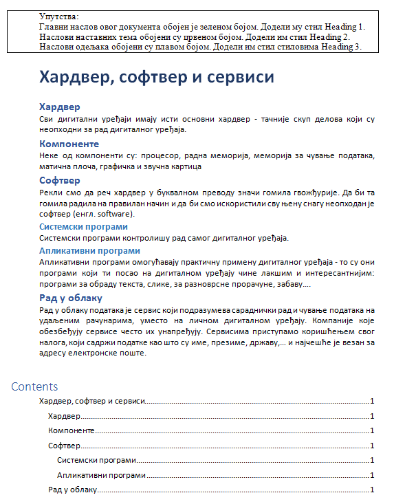

Задаци. Обрада текста – преглед садржаја текстуалног документа
==============================================================

Задатак 1.
~~~~~~~~~~

Покрени програм за обраду текста и модификуј стил Heading 1 тако што ћеш му променити:

-  врсту фонта у Times New Roman;
-  боју у зелену;
-  фонт у искошен;
-  поравнање у центрирано.

Задатак 2.
~~~~~~~~~~

Преузми датотеку Stilovi.docx, која се налази на `линку <../../_images/Stilovi.docx>`_. Сачувај је на свом рачунару, а затим је отвори.

Пратећи упутства дата у документу, означи главни наслов, наслове наставних тема и наслове одељака стиловима Title, Heading 1 и Heading 2 (тим редоследом).

Модификуј стил Heading 2 тако што ћеш му променити:

► величину фонта на 16;

► боју у црвену;

► поравнање у центрирано.

Kреирај садржај на крају документа. 

Сачувај документ користећи само тастатуру.

Задатак 3.
~~~~~~~~~~

Преузми датотеку Vezba1.docx, која се налази на `овом линку <../../_images/Vezba1.docx>`_. Сачувај је
на свом рачунару, а затим отвори датотеку.

Измени датотеку тако да изгледа као документ са слике.

    
Kреирај садржај на крају документа. 

Сачувај документ користећи само тастатуру.