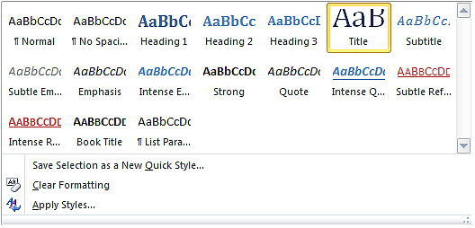
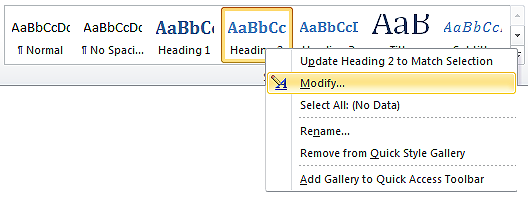
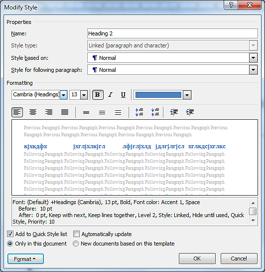

Обрада текста – преглед садржаја текстуалног документа
======================================================

.. infonote::
 
 На овом часу ћеш научити:
    •	разлику између визуелне презентације и логичке структуре текста;
    •	како да користиш стилове за уређивање текстуалног документа;
    •	да креираш преглед садржаја текстуалног документа;
    •	на који начин можеш да користиш стилове и креираш садржај документа у апликацији Google Docs.

У петом и шестом разреду у програму за унос и обраду текста, упознали смо опције за едитовање и форматирање
текста и помоћу њих мењали његов садржај и изглед, односно визуелну презентацију текста.

Да би текстуални документ који садржи више текста био прегледнији требало би га уредити тако да садржи
главни наслов, више одељака (одвојених целина текста) и поднаслове за њих.

Такво организовање садржаја текста, које подразумева **дефинисање наслова**, **поднаслова**, **пасуса**,
**набрајања** и слично, назива се логичка структура или логички изглед текста и тиме ћемо се бавити у
овој лекцији.

Додавање стилова
-----------------

Да би текст био логички структуриран потребно је да дефинишеш стилове. **Стилови** представљају скуп
правила која омогућавају брзо обликовање текста, односно доследно форматирање елемената текста (нпр.
свих наслова, поднаслова...). Једноставније речено, главни наслов читавог документа има свој стил
(фонт, величину, боју, позицију...), наслови одељака свој стил (фонт, величину, боју, позицију...)
различит од стила главног наслова, поднаслови свој стил различит од претходна два, итд.

Поступак означавања стилова састоји се од означавања (селектовања) дела текста и одабира одговарајућег
стила из палете уграђених стилова, која се налази на картици Home.
 

Уграђене стилове могуће је изменити у палети стилова, десним кликом на одабрани стил и одабиром опције
``Modify``.
 

Отвориће се прозор **Modify Style**, у оквиру кога је могуће изменити фонт, величину, поравнање, боју
и остале атрибуте уграђеног стила.

.. infonote::
    
    Променe стила важe само у оквиру документа у којем су извршене. Нови документ имаће само уграђене стилове. 

Опис поступка за примену и прилагођавање стила можеш погледати на видеу који следи:

.. ytpopup:: VGH23rVr2d8
    :width: 735
    :height: 415
    :align: center

Захваљујући дефинисаној логичкој структури текста, можеш врло лако да формираш преглед садржаја текстуалног
документа.

Пре него што формираш садржај у текстуалном документу, потребно је да сваки наслов и поднаслов буде дефинисан
одређеним стилом - Heading 1 (Naslov 1), Heading 2 (Naslov 2)...

Када форматираш наслове и поднаслове у текстуалном документу, следећи корак је да се позиционираш (кликнеш
мишем) на место у документу где желиш да поставиш преглед садржаја, а затим да на картици References
одабереш опцију Table of Contents. Отвориће се падајућа листа са понуђеним изгледом прегледа садржаја
текстуалног документа.
 
.. figure:: ../../_images/L71S1.png
    :width: 500px
    :align: center
    :class: screenshot-shadow

Након одабира једног од понуђених изгледа садржаја, приказ садржаја текстуалног документа (наслови,
поднаслови и бројеви страница на којима се они налазе) постаће део твог документа.

Опис поступка за креирање садржаја текстуалног документа можеш погледати на следећем видеу:

.. ytpopup:: xVSpoZrV0xs
    :width: 735
    :height: 415
    :align: center

У случају да си у међувремену додао нови наслов или поднаслов, довољно је да извршиш ажурирање садржаја.

.. |update| image:: ../../_images/L71S3.png
             :width: 150px

Ажурирање садржаја вршиш кликом на садржај и одабиром опције „Update Table“ на картици References као што је приказано на слици.

.. figure:: ../../_images/L71S4.png
    :width: 500px
    :align: center

Рад са стиловима и креирање садржаја у Google Docs
-----------------------------------------------------

Све поменуте акције могу се извести и у програмима Google Docs.  

.. figure:: ../../_images/L67S4.png
    :width: 500px
    :align: center

Опис поступка за примену и прилагођавање стила у Google документу можеш погледати на следећем видеу:

.. ytpopup:: N1Fn-ISVPkQ
    :width: 735
    :height: 415
    :align: center

Уметање прегледа садржаја текстуалног документа вршиш одабиром картице Уметање → Садржај.

.. figure:: ../../_images/L71S5.png
    :width: 300px
    :align: center

Опис поступка за креирање садржаја у Google Docs можеш погледати на следећем видеу:

.. ytpopup:: XstrRIw1aRA
    :width: 735
    :height: 415
    :align: center

.. infonote::

 **Шта смо научили?**
    •	да визуелна презентација текста представља облик у коме се приказује на екрану и како ће изгледати на папиру када се одштампа;
    •	да логичка структура текста описује организацију садржаја текста (наслове, поднаслове, пасусе);
    •	да стилови омогућавају доследно форматирање елемената текста који се налазе на истом нивоу логичке структуре (нпр. свих наслова, свих поднаслова...);
    •	да је уграђене стилове могуће изменити (променити боју, величину фонта и сл.);
    •	да је пре креирања садржаја потребно дефинисати све наслове и поднаслове;   
    •	да логички структуриран текст омогућава уметање прегледа садржаја текстуалног документа.