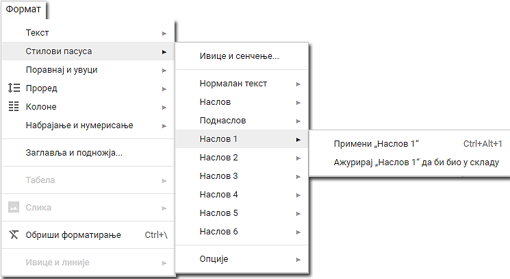

Обрада текста – преглед садржаја текстуалног документа
======================================================

.. infonote::
 
 На овом часу ћеш научити:
    •	разлику између визуалне презентације и логичке структуре текста;
    •	како да користиш стилове за уређивање текстуалног документа;
    •	да креираш преглед садржаја текстуалног документа;
    •	на који начин можеш да користиш стилове и креираш садржај документа у апликацији Google Docs.

У петом и шестом разреду у програму за унос и обраду текста, бавили смо се опцијама за едитовање и форматирање текста. Тачније, бавили смо се мењањем садржаја и изгледа текста, односно бавили смо се визуалном презентацијом текста. 

Уколико садржи више текста, да би читаоцу текстуални документ био прегледан требао би да има главни наслов, да буде подељен на одељке (наслове појединачних прича) и поднаслове.

У овој лекцији бавићемо се логичком структуром или логичким изгледом текста, односно бавићемо се организацијом садржаја текста (дефинисање наслова, поднаслова, пасуса). Дефинисањем логичке структуре текста обезбеђује се лако прилагођавање изгледа текста неким специфичним захтевима (нпр. одређена боја свих наслова, искошеност свих поднаслова...).

Додавање стилова
-----------------

Да би текст био логички структуриран потребно је да дефинишемо стилове. **Стилови** представљају скуп правила која омогућавају брзо обликовање текста, односно доследно форматирање елемената текста (нпр. свих наслова, поднаслова...). 
Једноставније речено, главни наслов читавог документа има свој стил (фонт, величину, боју, позицију...), наслови одељака свој стил (фонт, величину, боју, позицију...) различит од стила главног наслова, поднаслови свој стил различит од претходна два, итд.

Поступак означавања стилова своди се на означавање (селектовање) дела текста и одабир одговарајућег стила из палете уграђених стилова, која се налази у менију **Home**.
 

Уграђене стилове могуће је изменити у палети стилова, десним кликом на одабрани стил и одабиром опције ``Modify``.
 
.. image:: ../../_images/L67S2.png
    :width: 500px
    :align: center

Отвориће се прозор **Modify Style**, у оквиру кога је могуће изменити фонт, величину, поравнање, боју и сличне атрибуте уграђеног стила.
  

.. image:: ../../_images/L67S3.png
    :width: 500px
    :align: center

**Напомена:** Промена стила важе само у оквиру документа у коме је извршена. Нови документ имаће само уграђене стилове. 

Опис поступка за примену и прилагођавање стила можете погледати на доњем видеу:

.. ytpopup:: VGH23rVr2d8
    :width: 735
    :height: 415
    :align: center

Захваљујући дефинисаној логичкој структури текста, можемо врло лако да формирамо преглед садржаја текстуалног документа.

Пре него што формирамо садржај у текстуалном документу, потребно је да сваки наслов и поднаслов буде дефинисан одређеним стилом Heading 1 (Naslov 1), Heading 2 (Naslov 2),....

Када форматирамо наслове и поднаслове у текстуалном документу, следећи корак је да се позиционирамо (кликнемо мишем) на место у документу где желимо да поставимо преглед садржаја, а затим да на картици **References** одаберемо опцију ``Table of Content``. 
Отвориће се падајућа листа са понуђеним изгледом прегледа садржаја текстуалног документа. 
 
.. image:: ../../_images/L71S1.png
    :width: 500px
    :align: center

Након одабира једног од понуђених изгледа садржаја, приказ садржаја текстуалног документа (наслови, поднаслови и бројеви страница на којима се они налазе) постаће део нашег документа. 

Опис поступка за креирање садржаја текстуалног документа можете погледати на следећем видеу:

.. ytpopup:: xVSpoZrV0xs
    :width: 735
    :height: 415
    :align: center

У случају да смо у међувремену додали нови наслов или поднаслов, довољно је да извршимо ажурирање садржаја.

Ажурирање садржаја вршимо кликом на садржај и одабиром опције |update| на картици **References**.
 
.. image:: ../../_images/L71S4.png
    :width: 500px
    :align: center

Рад са стиловима и креирање садржаја у Google Docs
-----------------------------------------------------

Све поменуте акције могу се извести и у програмима Google Docs.  

Опис поступка за за примену и прилагођавање стила у Google документу можете погледати на доњем видеу:

.. ytpopup:: N1Fn-ISVPkQ
    :width: 735
    :height: 415
    :align: center

Уметање прегледа садржаја текстуалног документа вршимо одабиром картице ``Уметање`` → ``Садржај``.

.. image:: ../../_images/L71S5.png
    :width: 300px
    :align: center

Опис поступка за креирање садржаја у Google Docs можете погледати на следећем видеу:

.. ytpopup:: XstrRIw1aRA
    :width: 735
    :height: 415
    :align: center

.. infonote::

 **Шта смо научили?**
    •	да визуелна презентација текста представља његов појавни облик (то што видимо на екрану биће одштампано на папиру);
    •	да логичка структура текста описује организацију садржаја текста (наслове, поднаслове, пасусе);
    •	да стилови омогућавају доследно форматирање елемената текста који се налазе на истом нивоу логичке структуре (нпр. свих наслова, свих поднаслова...);
    •	да је уграђене стилове могуће модификовати (променити боју, величину фонта и сл.);
    •	да је пре креирања садржаја потребно дефинисати све наслове и поднаслове;   
    •	да логички структуриран текст омогућава уметање прегледа садржаја текстуалног документа.
