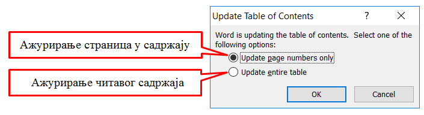

Рад са текстом – преглед садржаја текстуалног документа
=======================================================

.. infonote::
 
 На овом часу ћемо говорити о:
    •	 визуелној презентацији текста;
    •	 логичкој структури текста;
    •	 стиловима;
    •	 прегледу садржаја текстуалног документа.

У петом и шестом разреду у програму за унос и обраду текста, бавили смо се акцијама едитовања и форматирања, као и дефинисањем логичке структуре текста којим се обезбеђује лако прилагођавање изгледа текста неким специфичним захтевима (нпр. одређена боја свих наслова, искошеност свих поднаслова...). 

Хајде да се подсетимо!

Питање:
~~~~~~~

.. fillintheblank:: L71P1

    Како се назива скуп правила која омогућавају брзо обликовање текста, односно доследно форматирање елемената текста (нпр. свих наслова, поднаслова…? Одговор унеси малим словима ћириличким писмом.

    Одговор: |blank|

    - :стил: Тачно
      :x: Одговор није тачан.

Питање:
~~~~~~~

.. mchoice:: L71P2
    :answer_a: да
    :feedback_a: Тачно    
    :answer_b: не
    :feedback_b: Нетачно
    :correct: a

	Да ли уграђене стилове можеш модификовати? Означи тачан одговор.

Захваљујући дефинисаној логичкој структури текста можемо врло лако да формирамо преглед садржаја текстуалног документа.

Пре него што формирамо садржај у текстуалном докумнету потребно је да сваки наслов и поднаслов буде дефинисан одређеним стилом Heading 1 (Naslov 1), Heading 2 (Naslov 2),....

Када форматирамо наслове и поднаслове у текстуалном документу следећи корак је да се позиционирамо (кликнемо мишем) на место у документу где желимо да поставимо преглед садржаја, а затим да у картици References одаберемо опцију Table of Content. 
Отвориће се падајућа листа са понуђеним изгледом прегледа садржаја текстуалног документа. 
 
.. image:: ../../_images/L71S1.png
    :width: 500px
    :align: center

Након одабира једног од понуђених изгледа садржаја, приказ садржаја текстуалног документа (наслови, поднаслови и бројеви страница на којима се налазе) аутоматски ће бити видљив. 

Опис поступка за креирање садржаја текстуалног документа можете погледати на доњем видеу:

.. ytpopup:: xVSpoZrV0xs
    :width: 735
    :height: 415
    :align: center

У случају да смо у међувремену додали нови наслов или поднаслов, довољно је да извршимо ажурирање садржаја.

.. |update| image:: ../../_images/L71S3.png
             :width: 150px

Ажурирање садржаја вршимо кликом на садржај и одабиром у картици References опције |update|.
 

Све поменуте акције могу се извести и у програмима Google Doc. 

Уметање прегледа садржаја текстуалног документа вршимо одабиром картице Уметање → Садржај.

Опис поступка за креирање садржаја у Google Doc можете погледати на доњем видеу:

.. ytpopup:: XstrRIw1aRA
    :width: 735
    :height: 415
    :align: center

.. infonote::

 **Шта смо научили?**
    •	да визуелна презентација текста представља његов појавни облик (то што видимо на екрану биће одштампано на папиру);
    •	да логичка структура текста описује организацију садржаја текста (наслове, поднаслове, пасусе);
    •	да стилови омогућавају доследно форматирање елемената текста који се налазе на истом нивоу логичке структуре (нпр. свих наслова, свих поднаслова...);
    •	да је уграђене стилове могуће модификовати (променити боју, величину фонта и сл.);
    •	да је пре креирања садржаја потребно дефинисати све наслове и поднаслове;   
    •	да логички структуриран текст омогућава уметање прегледа садржаја текстуалног документа.
