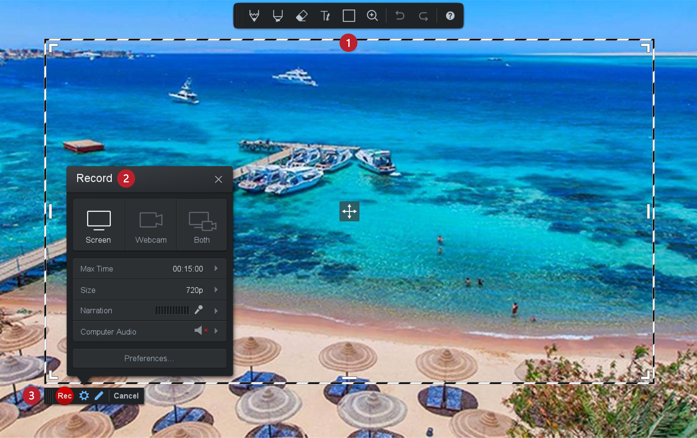

Снимање видео-записа
====================

.. infonote::
 
 На овом часу научићеш:
    •	 да креираш видео-записе коришћењем програма за снимање екрана дигиталног уређаја.

У седмом разреду користићеш програм за снимање екрана дигиталног уређаја за креирање видео-упутства. 
За снимање екрана постоји велики број разноврсних програма, а ми ћемо користити један од бесплатних програма
Screencast-o-matic. Програм преузимамо са интернет адресе: https://screencast-o-matic.com/, а затим
инсталираш на рачунар. 

Изглед радне површине програма Screencast-o-matic дат је на доњој слици:

1.  Оквир простора који се снима;
2.  Подешавање параметара видео-записа;
3.  Покретање и заустављање снимања видео-записа.

Подешавање параметара видео-записа 
----------------------------------

Простор за подешавање параметара видео-записа састоји се од неколико делова.

У врху овог простора бираш шта улази у видео.

.. image:: ../../_images/L710S2.png
    :width: 400px

- Опција ``Screen`` се користи за снимање само екрана.
- Опција ``Webcam`` се користи за снимање само видео-камером дигиталног уређаја (на пример, снимање себе док говориш).
- Опција ``Both`` се користи када желиш да у видео уђе и снимак екрана и снимак са видео-камере.

Поред опције за снимање, постоје још неки делови који су јако важни за креирање видео-записа:

-  обавештење да је максимална дозвољена дужина снимка 15 минута;

   .. image:: ../../_images/L710S3.png
       :width: 400px

-  одабир величине оквира простора који снимаш;

   .. image:: ../../_images/L710S4.png
       :width: 400px

-  одабир микрофона који снима оно што говориш;

   .. image:: ../../_images/L710S5.png
        :width: 400px

-  обавештење да у бесплатној верзији програм снима само оно што забележи микрофон.

   .. image:: ../../_images/L710S6.png
      :width: 400px

Покретање и заустављање снимања 
--------------------------------

.. |u1| image:: ../../_images/L710S7.png
         :width: 30px

.. |u2| image:: ../../_images/L710S8.png
         :width: 250px

.. |u3| image:: ../../_images/L710S9.png
         :width: 250px

Када кликнеш на дугме |u1| започињеш снимање видео-записа. 

Да би се зауставило (паузирало) снимање, потребно је да кликнеш на паузу (плаво дугме |u2|), а да би 
се завршило снимање кликнеш на `Done` |u3|.

Кликом на ``Done``, програм ће захтевати да чуваш или додатно уређујеш видео-запис. 

Када одабереш опцију ``Save / Upload``, и одабереш опцију ``Save As Video File``, чуваш снимљени видео-запис
на рачунару.

Опис поступка креирања видео-записа можеш погледати на следећем видеу:

.. ytpopup:: IVHQGPFTNDg
    :width: 735
    :height: 415
    :align: center

За конверзију типова датотека у предходним разредима користили смо програм Format Factory. 

Подсећања ради:

-  Тип датотеке мењаш када се нађеш у ситуацији да програм који користиш „не уме“ да ради са датотеком коју уређујеш. 
-  Тип датотеке мењаш и када желиш да она заузима мање меморијског простора.

.. infonote::

 **Шта смо научили?**
    •	да ствараш видео-записе снимајући екран дигиталног уређаја (што је згодно за прављење видео-туторијала).