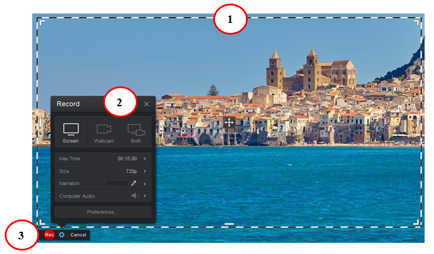
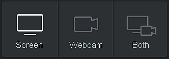

Снимање видео-записа
====================

.. infonote::
 
 На овом часу ћемо говорити о:
    •	 снимању видео-записа коришћењем програма за снимање екрана дигиталног уређаја.

У седмом разреду користићемо програм за снимање екрана дигиталног уређаја како бисмо креирали видео-упутства. 
За снимање екрана постоји велики број разноврсних програма, ми ћемо користити један од бесплатних програма screencast-o-matic. 
Програм преузимамо са интернет адресе: https://screencast-o-matic.com/, а затим инсталирамо на рачунар. 

Изглед радне површине програма screencast-o-matic дат је на доњој слици:

1.  Оквир простора који се снима;
2.  Подешавање параметара видео-записа;
3.  Покретање и заустављање снимања видео-записа.

Подешавање параметара видео-записа 
----------------------------------

Простор за подешавање параметара видео-записа састоји се од неколико делова.

У врху овог простора бирамо шта улази у видео.

- Опција Screen се користи за снимање само екрана
- Опција Webcam се користи за снимање само видео-камером дигиталног уређаја (на пример, снимање себе док говорите)
- Опција Both се користи када желимо да у видео уђе и снимак екрана и снимак са видео-камере

Поред опције за снимање, постоје још неки делови који су јако важни за креирање видео-записа:

-  обавештење да је максимална дозвољена дужина снимка 15 минута;

   .. image:: ../../_images/L710S3.png
       :width: 400px

-  одабир величине оквира простора који снимамо;

   .. image:: ../../_images/L710S4.png
       :width: 400px

-  одабир микрофона који снима оно што говоримо;

   .. image:: ../../_images/L710S5.png
        :width: 400px

-  обавештење да у бесплатној верзији програм снима само оно што забележи микрофон.

   .. image:: ../../_images/L710S6.png
      :width: 400px

Покретање и заустављање снимања 
--------------------------------

Када кликнемо на дугме |u1| започињемо снимање видео-записа. 

Да бисмо зауставили (паузирали) снимање, потребно је да кликнемо на паузу (плаво дугме |u2|), а да бисмо завршили снимање кликнемо на `Done` |u3|.

Кликом на `Done`, програм ће захтевати да чувамо или додатно уређујемо видео-запис. 

Када одаберемо опцију `Save / Upload`, и одаберемо опцију `Save As Video File` чувамо снимљени видео-запис на рачунару.

Опис поступка креирања видео-записа можете погледати на следећем видеу:

.. ytpopup:: IVHQGPFTNDg
    :width: 735
    :height: 415
    :align: center

За конверзију типова датотека у предходним разредима користили смо програм Format Factory. 

Подсећања ради:

-  Тип датотеке мењамо када се нађемо у ситуацији да програм који користимо "не уме" да ради са датотеком коју уређујемо. 
-  Тип датотеке мењамо и када желимо да она заузима мање меморијског простора.

.. infonote::

 **Шта смо научили?**
    •	да стварамо видео записе снимајући екран дигиталног уређаја (што је згодно за прављење видео-туторијала).