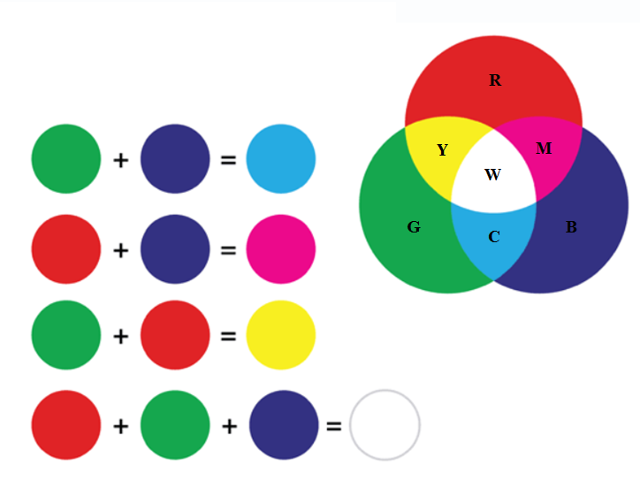
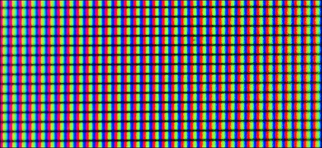
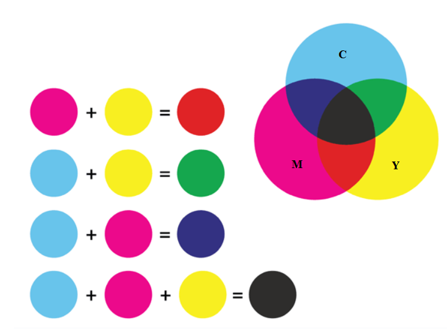

Рачунарска графика
==================

.. infonote::
 
 На овом часу научићеш:
    •	 шта је рачунарска графика и како се представља у рачунару;
    •	 шта је RGB модел боја и које су његове карактеристике;
    •	 како резолуција утиче на оштрину слике;
    •	 шта је CMYK модела боја и које су његове карактеристике.

Данас корисник скоро сваки дигитални уређај може да контролише помоћу икона и слика, а не само уношењем текста.
Област рачунарства која се бави креирањем, обрадом, прилагођавањем слика и анимација помоћу рачунара
назива се рачунарска графика. O рачунарској графици говорили смо и у петом и у шестом разреду. 

Рачунарска графика се користи у различитим областима попут машинства, архитектуре, грађевине, саобраћаја,
електротехнике и електронике, али и у уметности, а такође у медицини, фармацији, физици, биологији,
хемији, математици, примењеној математици и информатици. Поред тога, рачунарска графика је опште примењена
у филмској индустрији, користи се и за израду компјутерских игара, као и у веб-дизајну. Рачунарски генерисане
слике које видимо на телевизији и у филмовима напредовале су до те мере да их је готово немогуће разликовати
од слика из стварног света. 

Како разликујемо боје
---------------------

.. learnmorenote:: Како разликујемо боје

    Вид се формира преламањем светлости кроз наше око. У људском оку налазе се две врсте специјалних чулних
    ћелија осетљивих на светлост - то су чепићи и штапићи. У чепићима постоје три различита протеина, који када су
    осветљени шаљу одређене сигнале ка мозгу. Због тога ове протеине називамо фоторецепторским протеинима,
    или фоторецепторима. Један од ових фоторецептора је највише осетљив на црвену, други на зелену, а трећи
    на плаву светлост. Светлост која уђе у наше око активира сваку од ове три врсте рецептора у одређеној мери.
    При томе светлости различитих боја доводе до различитих нивоа побуде црвених, плавих и зелених рецептора.
    Сваку комбинацију нивоа побуде црвених, плавих и зелених рецептора доживљавамо као одређену нијансу боје.
    На тај начин нам рецептори у чепићима омогућавају да распознајемо боје.

    На пример, светлост која побуђује наше рецепторе за црвену и зелену видимо као жуту. Због тога, када
    позорницу на концерту осветле два рефлектора, од којих један емитује црвену, а други зелену светлост,
    ми позорницу видимо исто као да је обасјава један рефлектор који емитује жуту светлост.

RGB модел боја
--------------

Особине људског ока о којима је било речи могу да се искористе за генерисање боја (тачније, стварање
доживљаја боја код човека). Наиме, када се ка оку емитује одређена количина црвене, зелене и плаве
светлости, свака од њих побуђује одговарајуће рецепторе у чепићима. Мозак интерпретира ту комбинацију
побуда као ону нијансу боје која би изазвала исте такве побуде. То значи да за сваку нијансу може да се
одреди колико црвене, зелене и плаве светлости је потребно упутити ка људском оку да би оно реаговало
исто као на дату нијансу. 

Следећа слика показује светлост боје се добија комбиновањем црвене, плаве и зелене светлости.

- Светлост боје цијан (енгл. *cyan* - означена словом *C*) добија се комбиновањем једнаких количина зелене и плаве светлости;
- Светлост боје магента (енгл. *magenta* - означена словом *M*) добија се комбиновањем једнаких количина црвене и плаве светлости;
- Светлост жуте боје (енгл. *yellow* - означена словом *Y*) добија се комбиновањем једнаких количина црвене и зелене светлости.
- Светлост беле боје (енгл. *white* - означена словом *W*) добија се комбиновањем једнаких количина црвене, зелене и плаве светлости.

Представљање светлости разних боја помоћу одређених количина црвене, зелене и плаве светлости називамо
**RGB** (Red, Green, Blue) модел боја. Пошто наши рецептори за црвену, зелену и плаву светлост раде
независно једни од других, то се дејство емитоване црвене, зелене и плаве светлости комбинује (сабира)
у људском оку. Зато се за RGB модел боја користи и назив адитивни модел. У овом моделу свака боја може
да се зада помоћу три броја, а то су потребне количине црвене, плаве и зелене светлости које заједно
производе доживљај полазне боје.

Појачавањем интензитета све три компоненте добија се светлија, а смањивањем тамнија боја. Сиву боју добијамо комбиновањем исте количине црвене, зелене и плаве светлости умереног интензитета. Када комбинујемо исте количине све три светлости високог интензитета, видећемо белу боју, а одсуство све три ове светлости видимо као црну боју. Различите нијансе свих могућих боја се добијају мењањем (подешавањем) односа основних компоненти. 

Сви уређаји код којих се слика добија емитовањем светлости користе RGB модел и раде на описани начин. Овде спадају телевизори, монитори рачунара, пројектори, као и екрани мобилних телефона и других дигиталних уређаја. Екрани дигиталних уређаја се састоје од сићушних делова који се зову пиксели. Сваки пиксел садржи изворе црвеног, зеленог и плавог светла, који могу да емитују светлост различитог интензитета. 

Ево како би изгледао екран дигиталног уређаја посматран помоћу микроскопа или снимљен макро камером:

|

Избором одговарајућег интензитета сваке од три светлости за сваки пиксел добијамо доживљај разних нијанси у различитим деловима екрана.

~~~~

Сваки светлећи екран може да прикаже слику одређеног квалитета. Квалитет слике је одређен дубином боје и резолуцијом.

**Дубина боје** је број битова (бинарних цифара) који се користе за запис боје једног пиксела. Дубина боје одређује укупан број различитих боја које могу да се запишу и користе у приказу слике. На пример:

.. csv-table:: Примери дубине боје
    :header: "Дубина боје", "Број различитих боја"
    :widths: 15, 85
    :align: left

    1 бит,      ":math:`2^1 = 2` боје (најчешће црна и бела, може да се користи нпр. за слику текстуалног документа)"
    8 бита,     ":math:`2^8 = 256` боја (то може да буде било којих 256 боја које се наведу у такозваној палети боја дате слике)"
    24 бита,    ":math:`2^{24} \approx 16` милиона боја"

Можемо да закључимо да, што је већа дубина боје, то слика садржи више боја и нијанси боја. Таква слика има реалистичнији изглед.

Данас се најчешће користи избор боја који називамо *TrueColor*. Он је дубине 24 бита, што значи да се за сваки пиксел користи 24 бита, односно 3 бајта (један бајт се састоји од 8 бита). 

У систему боја *TrueColor* се од три расположива бајта користи по један бајт за сваку од три RGB компоненте. С обзиром на то да 1 бајт садржи 8 бита, jедним бајтом могуће је представити :math:`2^8 = 256` различитих интензитета. То значи да се за сваки пиксел може комбиновати 256 интензитета црвене, 256 интензитета зелене и 256 интензитета плаве (сваки са сваким), што даје укупно :math:`256 \cdot 256 \cdot 256 = 16~777~216` боја. Ово је за човека потпуно реалистична слика, јер се процењује да људско око може да разликује око 10 милиона боја.

**Резолуција** представља број пиксела на екрану дигиталног уређаја. Што је виша резолуција екрана, то он може да прикаже оштрију (прецизнију) слику.

На основу свега наведеног можемо да кажемо да количина меморије коју заузима слика на екрану зависи од дубине боје, али и од резолуције слике. Тако на пример, за слику дубине 24 бита и резолуције 640 x 480 пиксела, потребна је количина меморије од: 640 x 480 x 3 бајта = 900 KB.

Са појединих уређаја који производе слику можемо да добијемо само осветљеност, али не и боју (нпр. рендгенски снимци, ултразвук, скенирани отисци прстију и сл.). Такве слике се обично приказују у нијансама сиве и често се користи дубина 8 бита, односно 256 различитих интензитета светлости. При томе 0 обично одговара црном пикселу, а 255 белом пикселу. 

Како видимо боје предмета
-------------------------

.. learnmorenote:: Како видимо боје предмета

    Сунчева светлост садржи светлост свих боја. Предмети око нас због своје структуре упијају (апсорбују) светлост одређених боја, а одбијају (рефлектују) светлост других боја (делимично или потпуно провидни предмети могу и да пропуштају светлост одређене боје). Када гледамо у неки предмет, до нашег ока стиже само светлост која се одбија од предмета и она одређује како видимо предмет. На пример:

    - ако предмет одбија само светлост црвене боје (а све остале упија), само црвена светлост стиже до нашег ока и побуђује само рецепторе за црвену, па предмет видимо као црвен;
    - ако предмет одбија само светлост жуте боје, до ока стиже само жута светлост, која углавном побуђује рецепторе за црвену и зелену, а такве побуде мозак тумачи као жуто;
    - ако предмет одбија све боје, до ока стижу све боје и побуђују све три врсте рецептора, а такав предмет видимо као бео;
    - ако предмет не одбија ни једну боју (тј. упија светлост свих боја), до ока не стиже светлост ни једне боје и такав предмет видимо као црн (а видимо га само зато што предмети око њега одбијају светлост неке боје и стварају контраст).

    На следећој слици Сунце обасјава јабуку светлошћу свих боја (које су представљене различитим таласастим линијама), а јабука упија светлост свих боја осим једне, која се једина одбија и стиже до нашег ока. Та светлост побуђује само рецепторе за црвено и зато ову јабуку видимо као црвену.

    .. image:: ../../_images/L72S1.png
        :width: 600px
        :align: center

    На слици су рецептори за црвену, зелену и плаву светлост означени редом словима *L, M, S*, што су почетна слова речи *long, medium, short* (дуго, средње, кратко), јер се светлост простире у облику таласа, а ти таласи су дужи за црвену боју, средње дужине за зелену, а краћи за плаву.

CMYK модел боја
---------------

Пигменти су обојене материје које се не растварају у води и које се могу користити за бојење разних предмета. Можемо рећи да су пигменти оно због чега предмети (и жива бића) имају боју. Како и свака материја, пигменти упијају светлост одређених боја, а светлост осталих боја одбијају. Тако, на пример, пигмент који видимо као жути јесте пигмент који упија светлост плаве боје (а одбија црвену и зелену светлост, чију комбинацију ми видимо као жуту). Према томе, када жути пигмент обасјамо белом светлошћу (тј. светлошћу свих боја), та бела светлост приликом одбијања губи плаву боју. Можемо да кажемо да жути пигмент одузима плаву боју од светлости којом је осветљен. Слично је и са осталим пигментима. 

- цијан пигмент одузима црвену боју од светлости којом је осветљен;
- магента пигмент одузима зелену боју од светлости којом је осветљен;
- жути пигмент (као што смо већ рекли) одузима плаву боју од светлости којом је осветљен.

Мешањем ових пигмената у одговарајућој количини, можемо да одузмемо било коју комбинацију боја од беле светлости. На тај начин се праве боје којима се сликају уметничка дела, боје се зидови, кожа, метал, дрво, платно, једном речју сви предмети око нас. Тако добијамо и боје које се користе у штампачима за штампање слика и докумената у боји.

Основни пигменти који се комбинују за добијање свих могућих боја су цијан, магента, жути и црни. Ове четири боје чине основу **CMYK модела боја**. Акроним CMYK настао је од енглеских речи Cyan, Magenta, Yellow, Key (као „кључна“ боја се користи црна). Свака боја се описује помоћу количина цијан, магента и жутог пигмента, које треба помешати да бисмо мешавину видели као тражену боју.

Претходну слику треба разумети овако:

- магента пигмент одузима (упија) зелену боју, а жути одузима (упија) плаву боју. Зато мешањем магента и жутог пигмента добијамо пигмент који одузима и плаву и зелену боју, а тај пигмент видимо као црвени.
- цијан пигмент одузима црвену боју, а жути одузима плаву боју. Зато мешањем цијан и жутог пигмента добијамо пигмент који одузима и црвену и плаву боју, а тај пигмент видимо као зелени.
- цијан пигмент одузима црвену боју, а магента одузима зелену боју. Зато мешањем цијан и магента пигмента добијамо пигмент који одузима и црвену и зелену боју, а тај пигмент видимо као плави.

За мешање пигмената кажемо да је суптрактивно, јер сваки додати пигмент одузима (упија) светлост одређене супротне боје, па се та супротна боја не одбија и не види.

Теорија одузимања боја помоћу пигмената није у потпуности тачна. По тој теорији, мешањем сва три основна пигмента (цијан, магента, жути) у једнаким количинама требало би да се добиje црна боја. Међутим, уместо црне се добија нека нијанса смеђе боје. Због тога се у CMYK моделу уводи и четврта боја – црна боја (Key (Black)). 

Као што је поменуто, CMYK модел се користи за штампање докумената. Када треба одштампати слику, записи боје се прерачунавају из RGB модела у CMYK модел, јер је за штампање потребно одредити потребне количине цијан, магента и жутог пигмента које треба ставити на одређено место на папиру.

.. infonote::

 **Шта смо научили?**
    •	рачунарска графика јe област рачунарства која се бави креирањем, обрадом, прилагођавањем слика и анимација помоћу рачунара;
    •	пиксел je најмањи елемент дигиталне слике који се може обрађивати;
    •	резолуција je основна мера за оштрину неке слике и дефинише се као број пиксела на екрану;
    •	дубина боје одређује укупан број различитих нијанси боје које се могу представити;
    •	RGB (Red, Green, Blue) модел боја је адитиван модел, јер се светлости различитих боја добијају комбиновањем (сабирањем) светлости три основне боје;
    •	CMYK (енгл. Cyan, Magenta, Yellow, Key (Black)) модел боја је суптрактиван, јер свака од основних боја - пигмената у штампи (цијан, магента, жута) одузима, тј. упија једну од основних боја (црвена, зелена, плава) од светлости којом се осветли.