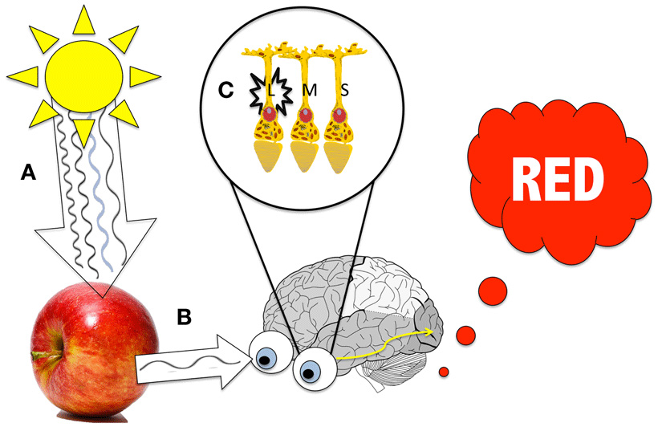

Рачунарска графика
==================

.. infonote::
 
 На овом часу ћемо говорити о:
    •	 рачунарској графици;
    •	 RGB моделу приказа боја;
    •	 структури пиксела и резолуцији;
    •	 CMYK моделу приказа боја. 

O рачунарској графици говорили смо и у петом и у шестом разреду. Као знаш рачунарска графика је област рачунарства која се бави креирањем, обрадом, прилагођавањем слика и анимацијом помоћу рачунара. 

Данас корисник скоро сваки дигитални уређај контролише помоћу икона и слика, а не само уношењем текста. Рачунарска графика је врло корисна. То је област која се користи у различитим дисциплинама попут машинства, архитектуре, грађевине, саобраћаја, електротехнике и електронике, али и у уметности, а такође у медицини и фармацији, физици, биологији и хемији, математици, примењеној математици и информатици. 
Поред тога, рачунарска графика је опште примењена у филмској индустрији, користи се и за израду компјутерских игара, као и у веб дизајну. Рачунарски генериране слике које видимо на телевизији и у филмовима напредовале су до те мере да их је готово немогуће разликовати од слика из стварног света. 

Како видимо боје
----------------

Човек види свет око себе у зависности од начина на који се светлост у оку прелама. Светлост је састављена од честица светлости - фотона. Постоји више врста фотона. Наше око може да детектује светлост између 400 и 700 нанометара. Различите таласне дужине се виде као другачије боје.
Мозак ствара слике предмета у зависности од начина како се фотони одбијају од предмета. 
Ти фотони се зову видљиви фотони, и има их шест врста: љубичасти (390- 430 nm), плави (460-480 nm), зелени (490- 530 nm), жути (550- 580 nm), наранђасти (590- 640 nm), црвени (650- 800 nm).

У нашем оку налазе се две врсте специјалних чулних ћелија осетљивих на светлост (фоторецептора) - чепићи и штапићи.

**Чепићи** нам омогућавају да распознајемо боје (централни вид). Ове чулне ћелије имају способност да распознају фине детаље и брзе промене слика.

**Штапићи** одређују видно поље (периферни вид). Тако је омогућено кретање у простору и вид при слабој светлости.

Процењено је да људско може да разликује преко 10 милиона боја.

Наш мозак обрађује слике предмета које видимо у зависности од количине светлости која се апсорбује или одбија од тог предмета. 
Предмети неке боје апсорбују (упијају), а друге одбијају. Наш мозак региструје само оне фотоне које се одбијају. 

На пример, када тело апсорбује свих шест врста видљивих фотона, ми га тада видимо као црно, јер видљиви фотони не стижу до нашег мозга. 
Наш мозак региструје да је предмет беле боје када се од предмета одбије свих шест врста видљивих фотона. 

Када је структура предмета или тела таква да се фотони делимично одбијају, и апсорбује више различитих врста видљивих фотона, мозак региструје комбинацију одбијених видљивих фотона, тј. неку од боја.
На пример, када светлост обасја неки предмет, рецимо шољу, тај предмет апсорбује део светлости, а рефлектује остатак. Која се таласна дужина апсорбује и рефлектује зависи од својства предмета који је обасјан светлошћу.

Мозак види слику тако што упоређује садржај тренутне слике са сликама које је до тада "видео" као помоћу претходног знања о боји конкретних предмета. 
Резултат тога је да боје које видимо нису истоветне са бојама у природи, већ су "улепшане".

RGB модел приказа боја
----------------------

У свим дигиталним уређајима који производе слику, црвена, зелена и плава користе се као основне боје. Овај начин приказивања боја назива се RGB (Red, Green, Blue) модел приказа боја. 

.. image:: ../../_images/L72S2.png
    :width: 600px
    :align: center

Једна боја се описује кроз три вредности: део црвене, део зелене и део плаве боје. На горњој слици:

- B – основна боја  (плава)
- R – основна боја  (црвена)
- G – основна боја  (зелена)
- Y – изведена боја (жута)
- M – изведена боја (магента, розе, циклама)
- C – изведена боја (цијан, тиркизна, светло плава)
- W – бела боја

RGB модел приказа боја представља адитивни метод (мешање) стварања слике који је заснован на комбиновању (сабирању) светлости три основне боје. 

У зависности од интензитета добија се светлија или тамнија боја, а од односа тих боја, нијанса. 
На овој начин раде монитори, пројектори и остали уређаји код којих се слика добија емитовањем светлости.

На рачунару, телевизорима и мобилним уређајима се на екрану налазе мале тачке, пиксели, који се састоје од три правоугаоника који се налазе један поред другог. 
Један од њих емитује различите количине црвене, други зелене, а трећи плаве светлости. 
Као што смо рекли, од интензитета светлости коју сваки од њих емитује зависи коју боју посматрач види. 

Ако бисте користили лупу или објектив макро камере и приближили се екрану дигиталног уређаја, ево како би то изгледало:

.. image:: ../../_images/L72S3.jpg
    :width: 600px
    :align: center

Пиксел ће бити сив ако сва три правоугаоника емитују исту количину светлости умереног интензитета. Ако сва три правоугаоника емитују исту количину светлости високог интензитета видећемо бели пиксел, у супротном, ако се не емитује светлост, видећемо црни пискел.

Ниво интензитета светлости сваког правоугаоника је означен бројем. Овај број се записује бинарно (комбинација нула и јединица). Овај број битова назива се **дубина боје**. Он одређује укупан број различитих нијанси одерђене боје.
На пример, ако вредност дубине једног пискела износи 1 бит он може имати само две вредности: белу и црну. Међутим, ако слика има дубину боје од 8 битова, она садржи 256 боја (2^8), док слика са дубином од 24 бита имаће 16 милиона боја.

А што је већа дубине боје, слика ће садржати више боја и нијанси боја. Можемо закључити да, што је већа дубина боје, то је слика више реалистично представљена.

Данас се најчешће користи дубина боје TrueColor. Она подразумева по 1 бајт за сваку од три RGB компоненте. 
С обзиром на то да 1 бајт садржи 8 битова, jедним бајтом могуће је представити 2^8 = 256 различитих боја. 
Вредност једног пиксела је представљена са 3 бајта, по један бајт за сваку од RGB боја.
На основу тога, број боја по сваком пикселу износи 256х256х256= 16.777.216. 

Сваки монитор може да прикаже слику различитог квалитета. Дубина боје и резолуција карактеришу квалитет слике.

**Резолуција** дефинише број пиксела на екрану дигиталног уређаја. Она је основна мера за оштрину неке слике.

На основу свега горе наведеног можемо да кажемо да количина меморије коју заузима слика зависи од дубине боје, али и од резолуције слике. 

Тако на пример, за слику резолуције 640 x 480 пиксела, чији су пиксели представљени 24-битним бројем, потребна је количина меморије од: 640 x 480 x 3 бајта = 900 KB.

Ако вредност пиксела представимо 8-битним бројем (1 бајт), онда се такве слике називају 8-битне сиве слике. Оне садрже само информацију о светлости пиксела, али не и о боји. Код њих је могуће представити 256 нивоа светлости при чему 0 обично одговара црном пикселу, а 255 белом пикселу. 
У фотографској терминологији у питању је црно-бела слика. 

CMYK модел приказа боја
------------------------
Боје које се могу одштампати класичним штампарским машинама дефинишу се CMYK (aкроним од енглеских речи Cyan, Magenta, Yellow, Key (Black)) моделом приказа боја.

.. image:: ../../_images/L72S4.png
    :width: 600px
    :align: center

Једна боја се описује кроз три вредности: део црвене, део зелене и део плаве боје. На горњој слици:

- Y – изведена боја (жута)
- M – изведена боја (магента, розе, циклама)
- C – изведена боја (цијан, тиркизна, светло плава)

Мешањем три боје (цијан, магента, жута) у једнаким количинама требало би да се добиje црна боја. 
Међутим, не добија се, већ се добија црвено-смеђа боја. Због тога се у CMYK моделу уводи и четврта боја – црна боја (Key (Black)). 

То је суптрактивно мешање боја, јер се додавањем боја одузима светлина белог папира

CMYK модел заснован на томе да се додавањем боје на папир не емитује светлост, већ се светлост одређене боје упија. Као што знамо, наше око види само светлост која се одбија.  
Овај модел се користи за штампање докумената. Због тога се приликом штампања не користе црвена, зелена и плава, већ цијан, магента и жута које се одбијају од беле подлоге. 
Због тога се овај модел назива и суптрактивни, јер свака од основних боја у штампи (цијан, магента, жута) одузима једну од основних боја (црвена, зелена, плава).
Цијан тачкица на папиру упија црвено светло, а одбија једнаке количине зеленог и плавог светла. 
Жута боја упија плаво светло, а одбија црвено и зелено док магента упија зелено светло, а одбија црвено и плаво. 

.. infonote::

 **Шта смо научили?**
    •	да je рачунарска графика област рачунарства која се бави креирањем, обрадом, прилагођавањем слика и анимација помоћу рачунара;
    •	да је пиксел најмањи елемент дигиталне слике који се може обрађивати;
    •	да је резолуција основна мера за оштрину неке слике и дефинише се као број пиксела на екрану;
    •	да дубина боје одређује укупан број различитих нијанси боје које се могу представити;
    •	да RGB (Red, Green, Blue) модел приказа боја је адитивни метод стварања слике који се заснива на комбиновању (сабирању) светлости три основне боје;   
    •	да CMYK (енгл. Cyan, Magenta, Yellow, Key (Black)) модел приказа боја назива се и суптрактивни, јер свака од основних боја у штампи (цијан, магента, жута) одузима једну од основних боја (црвена, зелена, плава).

