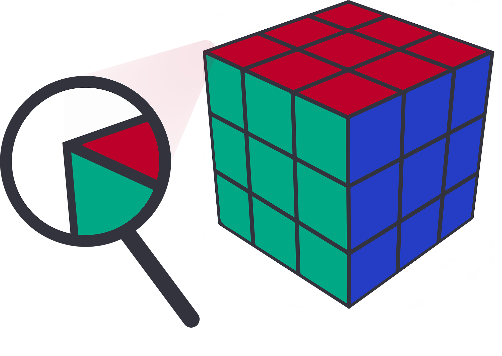
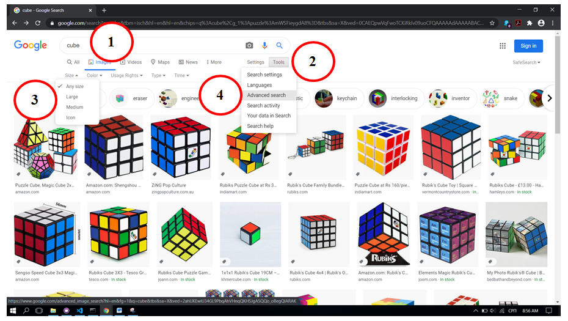
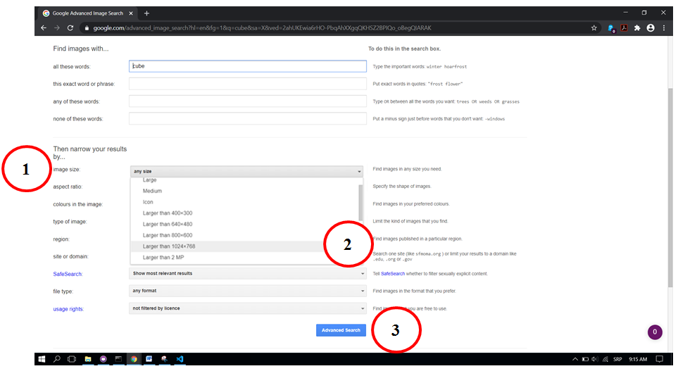

Растерска и векторска графика
=============================

.. infonote::
 
 На овом часу ћемо говорити о:
    •	 подели рачунарске графике;
    •	 компресији података;
    •	 типовима графичких датотека;
    •	 претрази слика по величини. 

Да се подсетимо, рачунарска графика представља визуелну репрезентацију информација помоћу слика тј. боја и облика на екрану дигиталног уређаја.

Прве кораке у развоју рачунарске графике направио је Ајван Сатерленд (енгл. Ivan Sutherland), који је 1962. године креирао рачунарски програм под именом Sketchpad, који је омогућавао цртање на рачунару.

.. image:: ../../_images/L73S1.jpg
    :width: 400px
    :align: center

Најчешћa поделa рачунарске графике je на:

- 2Д и 3Д графику и 
- растерску и векторску графику. 

Појам 2Д графике односи се на слике које имају 2 димензије (ширину и дужину), као што су фотографија, слика која се приказује на екрану. 

Док се појам 3Д графике односи се на креирање и приказивање тродимензионалних објеката у дигиталном облику. Ови 3Д модели се користе за креирање рачунарских игара, симулација, у архитектури и грађевинарству, те многим другим областима.
 
.. image:: ../../_images/L73S3.png
    :width: 200px
    :align: center

Растерска графика
-----------------

Хајде да се подсетимо.

Питање:
~~~~~~~

.. mchoice:: L73P1
    :answer_a: растерска графика
    :feedback_a: Тачно    
    :answer_b: векторска графика
    :feedback_b: Нетачно
    :answer_c: рачунарска графика
    :feedback_c: Нетачно
    :correct: a

    За коју врсту рачунарске графике пиксел представља основни градивни елемент. Означи тачан одговор.

У растерској графици слика је представљена правоугаоном мрежом пиксела. 

Задатак.
~~~~~~~~

На дигиталном уређају сачувана је следећа слика, која има димензије 2048x1152. 

|

    .. image:: ../../_images/L73S4.jpg
        :width: 400px
        :align: center

.. fillintheblank:: L73P2

    Колико пиксела је висока дата слика?

    Одговор: |blank|

    - :1152: Тачно
      :x: Одговор није тачан.

.. fillintheblank:: L73P3

    Колико пиксела је широка дата слика?

    Одговор: |blank|

    - :2048: Тачно
      :x: Одговор није тачан.

.. fillintheblank:: L73P4

    Од колико пиксела се састоји дата слика?

    Одговор: |blank|

    - :2359296: Тачно
      :x: Одговор није тачан.

У предходној лекцији смо научили да се у сваком пикселу налазе три извора светлости. У сваком тренутку један од њих емитује задату количину црвене, други зелене, а трећи плаве светлости. У систему боја TrueColor, ове количине се изражавају бројевима од 0 до 255. Према томе, у систему боја TrueColor се боја сваког пиксела дефинише трима бројним вредностима од 0 до 255 (0 представља одсуство једне основне боје, а 255 њен највиши интензитет). На пример, (255, 0, 0) представља црвену боју – интензитет светла црвене боје је максималан, док је интензитет зелене и плаве 0. 

.. image:: ../../_images/L73S5.png
    :width: 500px
    :align: center

Kвалитет растерске слике одређују следеће две величине:

- резолуција, која представља број пиксела слике по јединици дужине и 
- дубина боје, која је у тесној вези са бројем могућих нијанси боје за сваки појединачни пиксел. 

Што је дубина боје већа, то ће слика бити вернија. Међутим, већа дубина боје захтева и више меморије за приказивање слике. 

Оно што већ знамо је да увећавањем растерска слика губи на квалитету. Увећавањем растерске слике се не мења укупан број пиксела од којих се слика састоји, већ се пиксели приказују као већи, што доводи до губитка оштрине слике.

На следећој слици је приказана растерска слика и увећани детаљ слике.

Векторска графика
------------------

Хајде да се подсетимо.

Питање:
~~~~~~~

.. mchoice:: L73P5
    :answer_a: растерска графика
    :feedback_a: Нетачно    
    :answer_b: векторска графика
    :feedback_b: Тачно
    :answer_c: рачунарска графика
    :feedback_c: Нетачно
    :correct: b

	За коју врсту рачунарске графике важи да када се слика увећа она остаје оштра, тачније увећањем на било коју величину не губи се квалитет слике.

Векторска графика представља начин приказивања слике помоћу геометријских облика који се заснивају на математичким функцијама. Основне елементе (тачке, линије, криве, кругове, многоуглове...) који граде слику називамо објектима. Објекти који формирају слику могу да буду отворени или затворени, испуњени или неиспуњени, један поред другог или један испред другог (да се преклапају) и сл.
 
За исцртавање векторске слике, рачунари користе геометријске фигуре, тачније математичке формуле које описују начин и редослед исцртавања објеката. 
Векторска слика чини скуп геометријских фигура (нпр. круг, правоугаоник,..) и параметара који дефинишу како и где ће фигура бити исцртана (стил и боја линије, позиција центра круга или горњег левог угла правоугаоника,...). 
Количина меморије потребна за чување сваког оваквог објекта је само неколико бајтова, без обзира на то колика је величина објекта који се приказује. 
Према томе, количина меморије потребна за памћење слике зависи само од броја елемената од којих се векторска слика састоји, а не од величине слике.

Као што већ знамо у процесу увећавања векторске слике објекти се поново исртавају па се она може неограничено повећавати без губитка квалитета. 
Због тога се векторска графика користи приликом израде слика за рекламе на билбордима, плакате, као и за техничке цртеже у пројектовању. 
                        
На следећој слици је приказана векторска слика и увећани детаљ слике     

Типови графичких датотека
-------------------------

Данашњи дигитални уређаји имају камере који снимају слике високе резолуције, због чега такве слике заузимају велику количину меморије.
 
Да би се смањила количина меморије потребна за чување слика развијене су различите технике компресије дигиталне слике. 

**Компресија без губитака (lossless)** смањује величину датотеке без смањења квалитета слике. Kористи се кад је квалитет слике важнији од величине датотеке. 

**Компресија са губитком података (lossy)** користи ограничења људског ока и слика се замењује (апроксимира) сличном сликом која се може записати са мање података, тако да људско око углавном не примећује разлику између оригиналне и сачуване слике.

Најчешће коришћени типови (формати) растерских  датотека су:

1. RAW формат записа фотографије у којем фотоапарат бележи све податке које је забележио и сам дигитални сензор фотоапарата (RAW значи сиров, необрађен). У овом формату нема компресије па ни редукције квалитета слике;
2. BMP (bitmap) формат слике је један од првих формата па се растерске слике често називају битмапиране слике. У датотеку се складишти сваки пиксел слике, са одговарајућим бројем бајтова који одређују боју. Нема компресије па ни редукције квалитета слике;
3. GIF (Graphics Interchange Format) формат је ограничен на 8-битну палету, односно 256 боја чиме се смањује количина података. Погодан је за чување графике са релативно мало боја као што су дијаграми, геометријски облици, и логотипи. Подржава анимације и  често се користи за приказ анимација на веб страници;
4. JPEG (Joint Photographic Experts Group) је компресовани формат слика са губицима. Заснива се на особини људског ока да боље уочава површине и облике него варијације у боји и осветљењу. Ово је најчешће коришћен формат у раду са сликама. Због мале количине меморије коју заузима, налази примену у складиштењу слика, приказу слика путем интернета или размени путем електронске поште;
5. PNG (Portable Network Graphics) је формат за растерске слике који користи компресију без губитка. Подржава 24-битну дубину боја;
6. TIFF (Tagged Image File Format) формат користи 24-битну или 48-битну дубину боје, а екстензија за ове датотеке је TIFF или TIF. Користи се компресија без губитка, и зато је преовлађујући формат за велике слике које се користе за штампу великих плаката, високо квалитетних каталога и сл.

Формати за чување векторских датотека углавном зависе од програма у којем је садржај датотеке направљен.

Најчешће коришћени типови (формати) векторских датотека су:

1.	SVG (Scalable Vector Graphics) - формат намењен веб страницама;
2.	PDF (Portable Document Format) - формат који се користи за запис докумената намењених за читање на екрану и штампање. Подржава чување и растерских слика;
3.	CDR (CorelDraw) формат програма CorelDraw;
4.	DWG (AutoCAD) формат програма AutoCAD.

Претрага по величини слике
--------------------------
 
У шестом разреду смо претраживали слике на интернету према праву коришћења, затим их преузимали и чували на локалном рачунару.

Да се подсетимо како смо проналазили и преузимали слике са интернета:

.. image:: ../../_images/L73S8.png
    :width: 800px
    :align: center

Поступак:

1. уношење кључне речи; 
2. избор права коришћења;
3. отварање слике у новом табу; 
4. чување слике на локални рачунар.

Осим оваквог начина претраге, према праву коришћења, слике можемо претраживати и према њиховој величини.

На следећој слици приказан је поступак проналажења слике по величини на интернету:

 
Поступак:

1. уношење кључне речи; 
2. избор алатке;
3. избор величине слике Any size (било која величина); 
4. избор опције Settings → Advanced Search

Након избора опције Advanced search приказаће се прозор у коме можемо да подешавамо различите опције за претрагу слика. 
Нас у овом случају интересује претрага слике по величини. Одаберемо из падајуће листе image size (1), одаберемо величину Larger then 1024х768 (већа од 1024х768) (2) и потврдимо жељени одабир кликом на дугме Advanced Search (3).

Након избора приказаће нам се слике чија је величина, у овом случају, већа од 1024х768.

Задатак:
~~~~~~~~

Пронађи слике Николе Тесле чија је величина тачно 1920х1080 пиксела.

.. infonote::

 **Шта смо научили?**
    •	да је најчешћа подела рачунарске графике на 2Д и 3Д графику, као и на растерску и векторску графику;
    •	да се 2Д графика односи на слике које природно имају 2 димензије (ширину и дужину);
    •	да се 3Д графика користи за приказ објеката у тродимензионалном простору у дигиталном облику;
    •	да растерска графика представља графичке податке правоугаоном мрежом пиксела;
    •	да векторска графика представља начин приказивања слике помоћу објеката (геометријских облика);   
    •	да се растерска слика не може увећати без губитка квалитета;
    •	да се векторска графика може неограничено увећавати без губитка квалитета;
    •	да би се смањила количина меморије потребна за чување слика, развијене су различите технике компресије дигиталне слике;
    •	да су најчешће коришћени типови (формати) растерских датотека: RAW, BMP, GIF, JPEG, PNG, TIFF;
    •	да су најчешће коришћени типови (формати) векторских датотека: SVG, PDF, CDR, DWG;   
    •	да претрагу слике можемо вршити и према величини слике.
