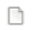
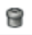
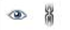
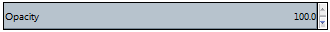
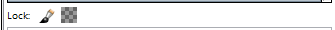
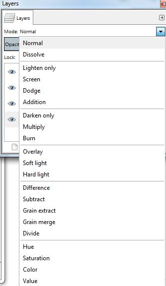

Рад са сликама - слојеви
========================

.. infonote::
 
 На овом часу ћемо говорити о:
    •	 појму и сврси слојева;
    •	 техникама за рад са слојевима;
    •	 растеризацији слојева.

За уређивање слике често се користе слојеви (Layers). 

**Слојеви** су делови слике који се користе при обради дигиталних слика за одвајање њених елемената. 
 
Коришћењем слојева можемо да правимо слике из више делова, од којих се на сваком делу може манипулисати без утицаја на било који други део слике. 
Слојеви су сложени један на други. Доњи слој је позадина слике, а компоненте у првом плану слике се налазе изнад ње.

Као и у претходним разредима обраду слика ћемо радити у програму Gimp 2. 

Aко немате инсталиран програм на свом рачунару можете погледати поступак инсталације програма на доњем видеу:

.. ytpopup:: -jSiYBv9WeU
    :width: 735
    :height: 415
    :align: center

Картица Layers (Слојеви) налази се у горњем десном делу прозора програма Gimp 2. 

У оквиру ње можемо да креирамо нове слојеве, копирамо или бришемо постојеће, приказујемо их или сакривамо, повезујемо, мењамо им провидност или бирамо начин мешања. 

На доњој слици је приказана картица Layers у програму Gimp 2: 

1 – Начин мешања слојева (Mode)
2 – Непровидност (Opacity)    
3 – Закључавање слојева                                        
4 – Палета слојева  
5 – Палета дугмића за рад са слојевима

Уколико картица Layers није приказана приликом покретања програма Gimp 2 можемо је приказати комбинацијом тастера Ctrl + L.  

Додавање и брисање слојева
---------------------------

Да бисмо креирали нови слој потребно је да кликнемо на Layer →  New Layer, или комбинацијом тастера Shift + Ctrl + L или кликом на прво дугме у дну палете Layers |g1|. 

Отвориће се прозор у коме можемо да именујемо слој, подесимо његову резолуцију и означимо да ли ће бити провидан или испуњен бојом. 

Притиском на дугме OK додајемо слој у палету слојева.

На дну палете слојева, поред дугмета за додавање новог слоја, налазе се редом: 

1. дугме за креирање нове групе слојева;
2. дугме за померање активног слоја на једно место више у палети;
3. дугме за померање активног слоја за једно место ниже у палети;
4. дугме за креирање дупликата слоја; 
5. дугме за усидравање и дугме за брисање слоја.

Да би слој био видљив, активирамо га кликом на његов назив у палети слојева. 

Кликом на дугме за брисање слоја |g2| можемо да избришемо само активан слој. 
Све измене можемо да вршимо само на активном слоју. 
Двоструким кликом на назив слоја можемо да изменимо његов назив тако што га откуцамо, а затим притиснемо тастер Enter. 

Опис поступка за креирање и брисање слојева можете погледати на доњем видеу:

.. ytpopup:: MzL1Pthu6tU
    :width: 735
    :height: 415
    :align: center  

Приказивање и сакривање слоја
-----------------------------

У картици Layers главни део чини Палета слојева у којој се налази листа свих слојева. 

.. |g4| image:: ../../_images/L74S4.png
            :width: 50px

Испред слојева могу бити видљиве (укључене) две иконице |g3| (око и ланац). 

Слој је видљив (приказан) ако је иконица ока приказана испред слоја. У случају да иконица око није видљива и слој неће бити приказан у прозору за приказ слике.

Иконица ланца означава везу између слојева. Слојеви су повезани и можемо их заједно померати када је иконица ланца видљива. Померање слојева вршимо коришћењем алата Move |g4|. 

Опис поступка за приказивање и сакривање слојева можете погледати на доњем видеу:

.. ytpopup:: XQYO0s57uOA
    :width: 735
    :height: 415
    :align: center   

Подешавање непровидности, закључавање и стапање слојева
--------------------------------------------------------

На почетку, сваки слој је дефинисан као непровидан, тачније опција Opacity је подешена на 100%. За сваки слој се засебно подешава да ли ће се мењати непровидност слоја или не.

Кликом на стрелице |g5| мењамо провидност слоја.

У програму за обраду слике могуће је закључати слојеве како бисмо спречили измену његовог садржаја. 

Опција Lock (Закључај) |g6| штити слојеве од измена на два начина:

-  кликом на иконицу четкице закључамо све пикселе на слоју;
-  кликом на иконицу провидног слоја закључавамо само провидне пикселе на слоју.

Опис поступка за подешавање непровидности и закључавања слојева можете погледати на доњем видеу:

.. ytpopup:: ICUSLkZYFf8
    :width: 735
    :height: 415
    :align: center  

У програму GIMP 2 могуће је стапање (мешање) слојева. То је опција којом се дефинише на који ће се начин пиксели на доњем слоју измешати (стопити) са пикселима који се налазе на горњем слоју.

На почетку, стапање пиксела слојева је подешено на Normal, чиме је обезбеђено да горњи слој у потпуности прекрива доњи (ако је непровидност подешена на 100%). 

Кликом на стрелицу поред опције Mode (Начин мешања) добијамо листу свих начина стапања (мешања) слојева.
 

Од горе приказаних начина мешања слојева неке можемо да користимо за:

-  потамњивање слике (Multiply, Overlay); 
-  рад са црно белим фотографијама (Dodge); 
-  отклањање ефекта црвених очију (Hue) који се понекад јавља приликом фотографисања дигиталним уређајима.

Опис поступка за мешање/стапање слојева можете погледати на доњем видеу:

.. ytpopup:: aaoRyk59l8I
    :width: 735
    :height: 415
    :align: center   

Растеризација слоја
-------------------

У појединим програмима за обраду растерске графике, као што је програм Gimp 2, текст је представљен векторском графиком. 
Повећањем величине слова не долази до губитка квалитета слике.

Векторски слој са текстом трансформишемо у растерски тако што кликнемо десним кликом на текстулани слој и појавиће се помоћни мени.
У помоћном менију треба да одаберемо опцију Discard Text information (Одбаци текстуалне информације) којом се векторски текстуални слој претворити у растерски. 
Овај процес називамо растеризовање.
**Растеризација** је процес трансформације (конвертовања) геометријских објеката у њихову растерску верзију, тачније репрезентацију помоћу пиксела.

Након процеса растеризације, увећавањем слова дошло би до губитка квалитета слике.

Поступком чувања (експортовања) слике из формата програма Gimp2 (xcf) у неки од формата растерских графичких датотека (jpg, png, bmp…) престаје могућност измене слојева.

Опис поступка растеризације слојева можете погледати на доњем видеу:

.. ytpopup:: S12A0UeWT-8
    :width: 735
    :height: 415
    :align: center 

.. infonote::

 **Шта смо научили?**
    •	да су слојеви делови слике који се користе при обради дигиталних слика за одвајање њених елемената;
    •	да је у програму Gimp 2 могуће додавати или брисати слојеве, мењати им назив, чинити их видљивим или невидљивим, непровидним или провидним, повезивати их, закључавати, стапати и растеризовати;
    •	да је у програму Gimp 2 текст векторски слој у растерској слици.