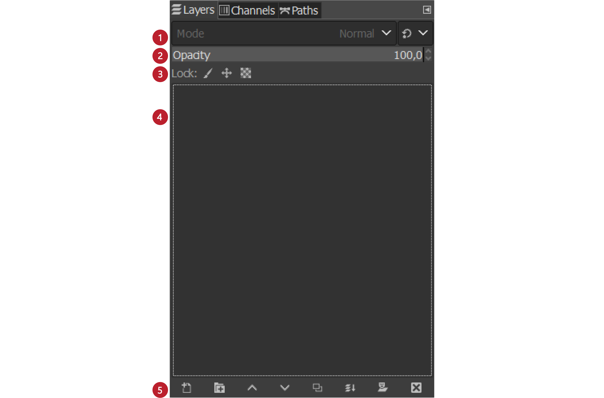
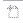
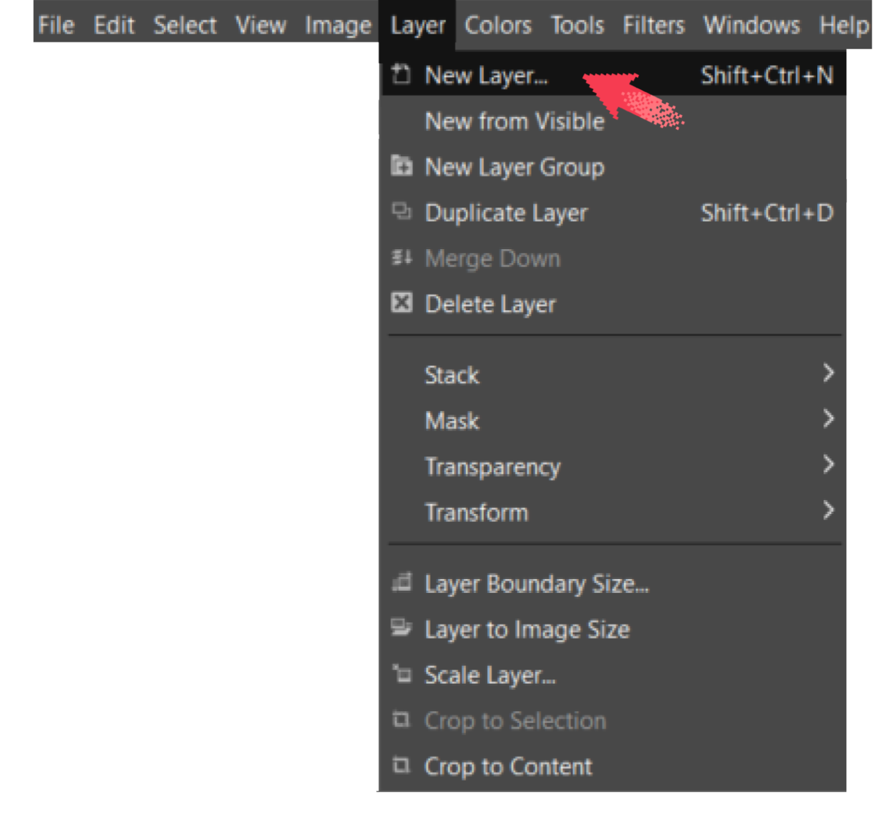
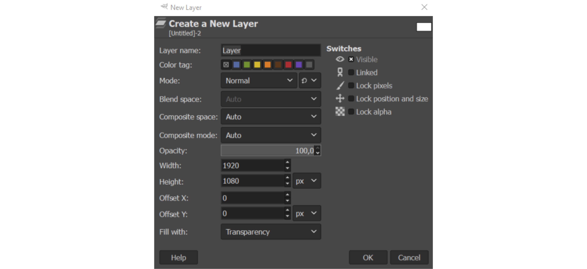
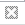
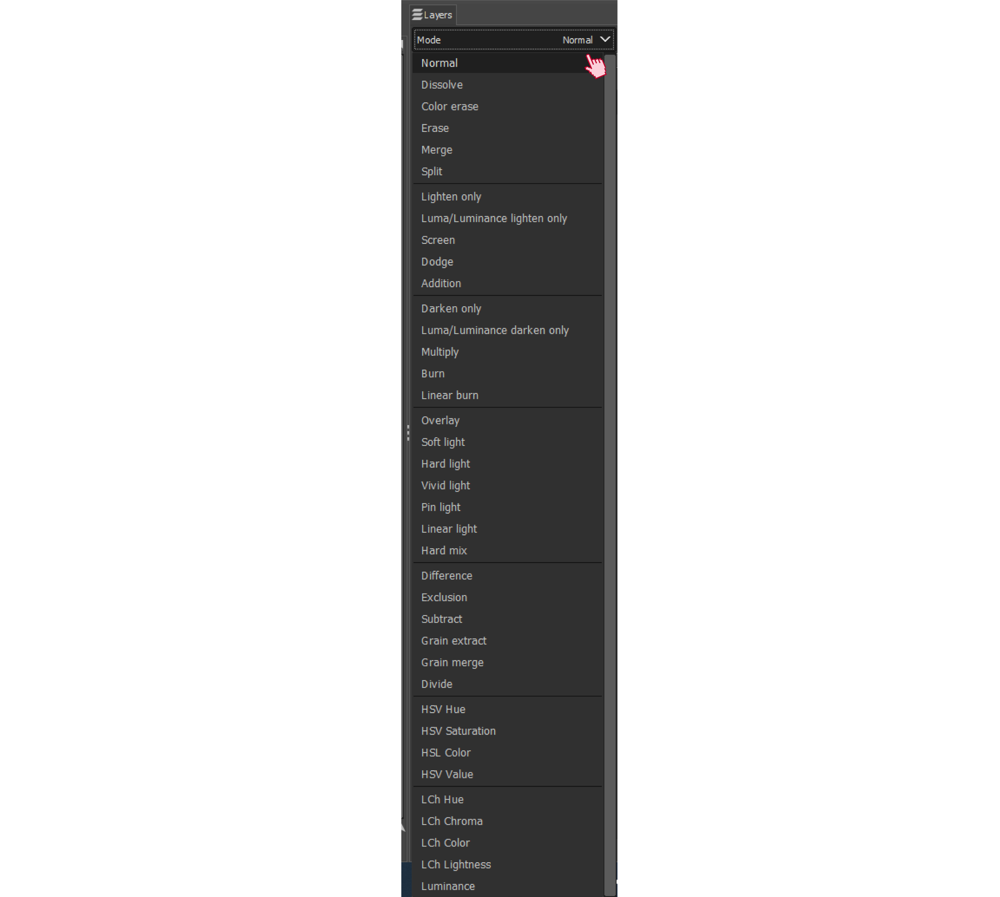

Обрада слика - слојеви
======================

.. infonote::
 
 На овом часу научићеш:
    •	 шта су слојеви у рачунарској графици и која је њихова намена;
    •	 технике за рад са слојевима;
    •	 шта представља поступак растеризације слојева.

.. mchoice:: pitanje_programi
    :multiple_answers:
    :answer_a: Paint
    :answer_b: Inkscape
    :answer_c: Gimp2
    :answer_d: Corel Draw
    :answer_e: Adobe Photoshop
    :feedback_a: Тачан одговор.
    :feedback_b: Одговор није тачан.
    :feedback_c: Тачан одговор.
    :feedback_d: Одговор није тачан.
    :feedback_e: Тачан одговор.
    :correct: a, c, e
        
        Постоји велики број различитих програма помоћу којих можеш креирати и мењати слике. Са неким од њих упознали смо се у претходним разредима. Да ли се сећаш који су ти програми?

.. technicalnote::

    Као и у претходним разредима обраду слика ћемо радити у програму Gimp 2.
    Aко нематеш инсталиран програм на свом рачунару, можетеш погледати поступак инсталације
    програма на следећем видеу:

    .. ytpopup:: -jSiYBv9WeU
        :width: 735
        :height: 415
        :align: center

За уређивање слике често се користе слојеви (Layers). 

**Слојеви** су делови слике који се користе при обради растерских и векторских дигиталних слика за чување појединих елемената одвојено од осталих. 
 
Коришћењем слојева можеш да правиш слике из више делова, од којих се сваким делом може манипулисати
без утицаја на било који други део слике. Слојеви су сложени један на други. Доњи слој је позадина слике,
а компоненте у првом плану слике се налазе изнад ње.

Слојеве можеш да замислиш као делове слике на провидним фолијама које ређаш једну преко
друге и којима можеш да мењаш редослед. Уколико имаш на пример слику језера на коме су
два чамца, при чему на једној фолији је слика језера, на другој слика једног чамца а на трећој
слика другог чамца, уклањањем једне фолије са сликом чамца можеш добити слику језера са
једним чамцем, или уклањањем обе фолије на којима је слика чамца можеш добити слику
језера без чамца. Такође, међусобни оложај два чамца зависиће од тога која је фолија
постављена изнад које.

Картица **Layers** (Слојеви) налази се у доњем десном делу прозора програма Gimp 2. 

У оквиру ње можеш да креираш нове слојеве, копираш или бришеш постојеће, приказујеш их или сакриваш,
повезујеш, мењаш им провидност или бираш начин мешања.

Картица **Layers** у програму Gimp 2 има следеће делове: 

1. Начин мешања слојева (Mode),
2. Непровидност (Opacity),    
3. Закључавање слојева (Lock),                                      
4. Палета слојева,  
5. Палета дугмића за рад са слојевима.

Уколико картица **Layers** није приказана приликом покретања програма Gimp 2, можеш је приказати комбинацијом
тастера ``Ctrl`` + ``L``.  

Додавање и брисање слојева
---------------------------

Да би се креирао нови слој, можеш да кликнеш у менију **Layer** на опцију ``New Layer``, или да притиснеш
комбинацију тастера ``Shift`` + ``Ctrl`` + ``N``.

Нови слој се може креирати и кликом на прво дугме у дну палете `Layers` |g1|. 

Када изабереш опцију за креирање новог слоја, отвориће се прозор у коме можеш да именујеш слој, подесиш
његову величину у пикселима и означиш да ли ће бити провидан или испуњен бојом.

Притиском на дугме **OK** додајеш слој у палету слојева.

На дну палете слојева, поред дугмета за додавање новог слоја, налазе се редом: 

1. дугме за креирање нове групе слојева;
2. дугме за померање активног слоја на једно место више у палети;
3. дугме за померање активног слоја за једно место ниже у палети;
4. дугме за креирање дупликата слоја; 
5. дугме за усидравање и дугме за брисање слоја.

Све измене можеш да вршиш само на активном слоју. Слој се активира кликом на његов назив у палети слојева.

Кликом на дугме за брисање слоја |g2| можеш да избришеш само активан слој. 
 
Двоструким кликом на назив слоја можеш да измениш његов назив тако што га откуцаш, а затим притиснеш
тастер **Enter**. 

Опис поступка за креирање и брисање слојева можеш погледати на следећем видеу:

.. ytpopup:: MzL1Pthu6tU
    :width: 735
    :height: 415
    :align: center  

Приказивање и сакривање слоја
-----------------------------

У картици Layers главни део чини Палета слојева у којој се налази листа свих слојева. 

.. |g3| image:: ../../_images/L74S3.png
            :width: 70px

.. |g4| image:: ../../_images/L74S4.png
            :width: 30px

Испред слојева могу бити видљиве (укључене) две иконице: |g3| (око и ланац). 

Слој је видљив (приказан) ако је иконица ока приказана испред слоја. У случају да иконица око није видљива, слој неће бити приказан у прозору за приказ слике.

Иконица ланца означава везу између слојева. Слојеви су повезани и можемо их заједно померати када је иконица ланца видљива. Померање слојева вршимо коришћењем алата Move |g4|. 

Опис поступка за приказивање и сакривање слојева можеш погледати на следећем видеу:

.. ytpopup:: XQYO0s57uOA
    :width: 735
    :height: 415
    :align: center   

Подешавање непровидности, закључавање и стапање слојева
--------------------------------------------------------

.. |g5| image:: ../../_images/L74S5.png
            :width: 200px

На почетку, сваки слој је дефинисан као непровидан, тачније опција ``Opacity`` је подешена на 100%. За сваки слој се засебно подешава да ли ће се мењати непровидност слоја или не.

Кликом на стрелице |g5| мењаш провидност слоја.

У програму за обраду слике могуће је закључати слојеве како би се спречила измена њиховог садржаја. 

.. |g6| image:: ../../_images/L74S6.png
            :width: 200px

Опција Lock (Закључај) |g6| штити слојеве од измена на два начина:

-  кликом на иконицу четкице закључавамо све пикселе на слоју;
-  кликом на иконицу провидног слоја закључаш само провидне пикселе на слоју.

Опис поступка за подешавање непровидности и закључавања слојева можеш погледати на следећем видеу:

.. ytpopup:: ICUSLkZYFf8
    :width: 735
    :height: 415
    :align: center  

У програму GIMP 2 могуће је стапање (мешање) слојева. То је опција којом се дефинише на који ће се начин пиксели на доњем слоју измешати (стопити) са пикселима који се налазе на горњем слоју.

На почетку, стапање пиксела слојева је подешено на ``Normal``, чиме је обезбеђено да горњи слој у потпуности прекрива доњи (ако је непровидност подешена на 100%). 

Кликом на стрелицу поред опције ``Mode`` (Начин мешања) добијаш листу свих начина стапања (мешања) слојева.
 

Од горе приказаних начина мешања слојева, неке можеш да користиш за:

-  потамњивање слике (``Multiply``, ``Overlay``); 
-  рад са црно-белим фотографијама (``Dodge``); 
-  отклањање ефекта црвених очију (``Hue``) који се понекад јавља приликом фотографисања дигиталним уређајима.

Опис поступка за мешање/стапање слојева можеш погледати на следећем видеу:

.. ytpopup:: aaoRyk59l8I
    :width: 735
    :height: 415
    :align: center   

*Напомена*: Поступком чувања (експортовања) слике из формата програма Gimp2 (xcf) у неки од формата растерских графичких датотека (jpg, png, bmp…) престаје могућност измене слојева.

Растеризација слоја
-------------------

У појединим програмима за обраду растерске графике, као што је програм Gimp 2, текст је представљен векторском графиком. 
Повећањем величине слова не долази до губитка квалитета слике.

Векторски слој са текстом трансформишеш у растерски тако што кликнеш десним кликом на текстуални слој
и појавиће се помоћни мени. У помоћном менију треба да одабереш опцију ``Discard Text information``
(Одбаци текстуалне информације), којом ће се векторски текстуални слој претворити у растерски. Овај
процес назива се растеризовање. **Растеризација** је процес трансформације (конвертовања) геометријских
објеката у њихову растерску верзију, тачније репрезентацију помоћу пиксела.

Након процеса растеризације, увећавањем слова дошло би до губитка квалитета слике.

Опис поступка растеризације слојева можеш погледати на следећем видеу:

.. ytpopup:: S12A0UeWT-8
    :width: 735
    :height: 415
    :align: center 

.. infonote::

 **Шта смо научили?**
    •	слојеви су делови слике који се користе при обради дигиталних слика за раздвајање њених елемената;
    •	у програму Gimp 2 могуће је додавати или брисати слојеве, мењати им назив, чинити их видљивим или невидљивим, непровидним или провидним, повезивати их, закључавати, стапати и растеризовати;
    •	сваки слој се може посебно уређивати, а све измене можеш да вршиш само на активном слоју;
    •	у програму Gimp 2 текст је векторски слој у растерској слици.