Обрада слика – дигиталне слике
==============================

.. infonote::
 
 На овом часу ћеш научити:
    •	 да селектујеш део слике;
    •	 да промениш нивое обојености, осветљености и контраста слике;
    •	 да примениш различите филтере на дигиталну слику;
    •	 да примениш основне геометријске трансформације слике;
    •	 како да аутоматски обрадиш већи број дигиталних слика.

У програму Gimp 2 постоји више алатки помоћу којих можеш да уређујеш слике или њихове делове. За сваку
од тих алатки уређивање почиње означавањем дела слике који желиш да уређујеш. Зато ћемо прво да објаснимо
како се све може изабрати (селектовати) део слике.

Алатке за означавање (селектовање) жељеног дела слике налазе се у кутији с алаткама Toolbox (1), а одговарајуће опције су доступне и у оквиру менија ``Tools`` →  ``Selection Tools`` (2).
 
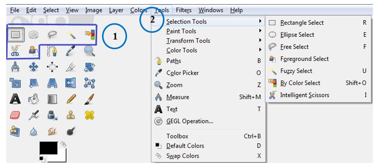

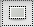

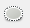

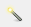

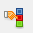

Део слике можеш да селектујеш употребом алатки за правоугаону |h1|, елипсоидну |h2|, и селекцију слободним
избором |h3| или издвајањем пиксела који имају сличне особине (суседне области сличне боје |h4|, области
исте боје на целој слици |h4|). Кликом на једну од наведених алатки, отвара се простор у коме је могуће
подесити њена својства. 

Најважнија својства алатке за избор правоугаоне селекције су:

1. ``Mode`` – преклапање селекције (Прво дугме активира режим у коме се креирањем нове селекције уклања претходна, док друго дугме активира режим у коме се креирањем нове селекције задржава претходна);

2. ``Feather edges`` – фини прелаз између селектованог и неселектованог дела слике;

3. ``Rounded corners`` - Заобљене ивице;

4. ``Expand from Center`` - Рашири из средишта.

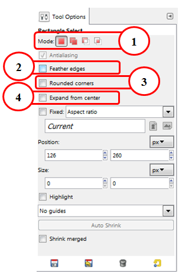

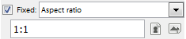

======================================== ==================================================================================================================================================================================================================================================================================================================================================================
Тип селекције                            Опис поступка селекције
======================================== ==================================================================================================================================================================================================================================================================================================================================================================
 Правоугаона селекција                    Селекцију у облику правоугаоника вршиш тако што одабереш алатку **Rectangle Select Tool** |h1| и, држећи притиснут леви тастер миша, развучеш правоугаоник. За квадратну селекцију потребно је да држиш притиснут тастер **Shift** или подесиш својства |h6| којим се задржава однос ширине и висине на 1:1 што значи да ће бити иста ширина и дужина селекције.
 Овална селекција                         Овалну селекцију вршиш тако што одабереш алатку **Ellipse Select Tool** |h2| и, држећи притиснут леви тастер миша, развучеш овални облик. Круг добијаш држећи притиснут тастер **Shift** или подешавањем својства задржавања односа ширине и висине 1:1.
 Селекција неправилног облика             Селекцију неправилног облика вршиш коришћењем алатке **Free Select Tool** |h3| (ласо). Селекцију вршишш тако што курсор поставиш на део слике који желиш да селектујеш. Држиш притиснут леви тастер миша и испратиш мишем жељени облик. Да би облик био затворен, процес селектовања мораш да завршиш у тачки из које је започет.
 Селекција суседних области сличне боје   Када кликнешмо на неку област или објекат, пиксели који имају сличну вредност боје биће такође селектовани. Да би се селектовала суседну област или објекат сличне боје користиш алатку **Fuzzy Select Tool** |h4|.
 Селекција области исте боје              Да би се селектовале све области или предмети исте боје можеш да користиш алатку **Select by Color Tool** |h5|. Када кликнеш на неку област или објекат, сви пиксели који имају исту вредност боје биће селектовани.
======================================== ==================================================================================================================================================================================================================================================================================================================================================================

Опис поступка за селекцију објеката можеш погледати на следећем видеу:

.. ytpopup:: Mxy5iiMBm-0
    :width: 735
    :height: 415
    :align: center 

Промена нивоа обојености, осветљености и контраста 
--------------------------------------------------

У програмима за обраду слике можемо да извршимо додатне корекције на слици или изабраном делу слике, као што су промене нивоа осветљености, контраста или обојености. 

У оквиру менија **Colors** можемо да подесимо:

-  ``Color Balance`` - равнотеже боја (подешавање тамних или светлијих делова слике);
-  ``Hue-Saturation`` - нијансе и засићеност;
-  ``Colorize`` - обојеност;
-  ``Brightness-Contrast`` - осветљеност, односно контраст.

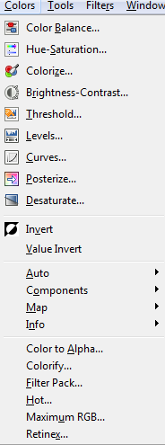

Кликом на ``Color Balance`` отвара се прозор у коме можемо да променимо тамне (``Shadows``), средње
(``Midtones``) или светле делове (``Highlights``) слике, те да,  померањем клизача, подесимо нивое боја
(``Cyan``, ``Magenta``, ``Yellow``).

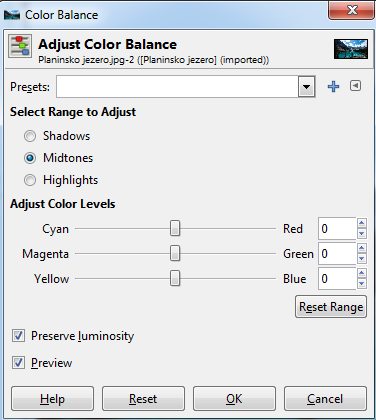

Кликом на опцију ``Brightness-Contrast`` отвара се прозор у коме померањем клизача можемо подесити осветљеност (``Brightness``) и/или контраст (``Contrast``). 

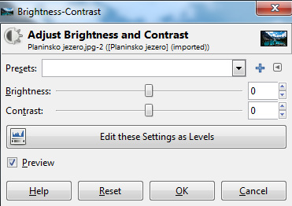

Опис поступка за промену обојености, осветљења и контраста можете погледати на следећем видеу:

.. ytpopup:: nfVL-oKgPCY
    :width: 735
    :height: 415
    :align: center 

Филтери
--------

Филтери се користе за постизање различитих ефеката на слици, као што је изоштравање или замућивање фотографије.
Филтери се могу применити на слоју или изабраном делу слоја слике.

Филтерима приступаш кроз мени **Filters**.

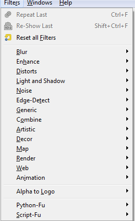

Најчешће се користе следећи филтери:

­-``Blur`` – скуп филтера којим се замућује цела слика или њен део.

­-``Enhance`` – скуп филтера помоћу којих се врши изоштравање слике, отклањање мрља, црвенила очију...

-``Distorts`` – скуп филтера са ефектима мозаика, ветра, таласа,...

-``Artistic`` – скуп филтера помоћу којих се стварају уметнички ефекти, као што је изглед уља на платну, витража ... 

Када кликнеш на одабрани филтер отвара се помоћни прозор, у којем можеш да видиш како ће изгледати слика
након примене филтера, као и да подесиш додатне параметре како би се постигао жељени резултат. Притиском
на тастер **OK** потврђујеш примену одабраног филтера.

Опис поступка за примену филтера можеш погледати на следећем видеу:

.. ytpopup:: Wjq3YDxuQpA
    :width: 735
    :height: 415
    :align: center 

Основне геометријске трансформације слике
------------------------------------------

У програму Gimp 2 постоји више алатки којима можеш да извршим разне трансформације слике, као што су
ротирање, обртање или искошавање слике. Овим алаткама приступаш у кутији с алаткама Toolbox или кроз
мени ``Tools`` → ``Transform Tools``.

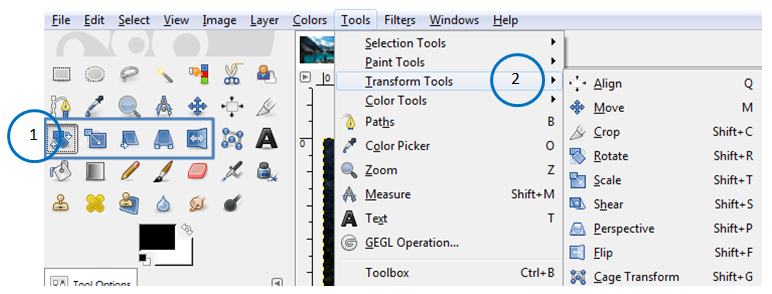

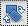

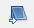

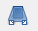

Слику или делове слике можеш да трансформишеш тако што је:

-  ротираш кликом на алатку |е1|;
-  промениш величину кликом на алатку |е2|;
-  искосиш кликом на алатку |е3|;
-  промениш перспективу кликом на алатку |е4|;  
-  преокренеш кликом на алатку |е5|.

Кликом на једну од горе наведених алатки, отвара се простор у коме је могуће подесити својства трансформације. 

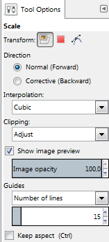

Најважнија својства су:

-  ``Transform`` – избор слоја или селекције на којој ћеш применити трансформацију;
-  ``Interpolation`` – начин на који ће пиксели који недостају на трансформисаној слици бити допуњени;
-  ``Show image preview`` – захтев да током подешавања параметара трансформације у прозору слике унапред видиш ефекат који ће се постићи.

Поред горе наведених својстава, избором неке од алатки за трансформацију слике, могу се приказати и друга својства као што је ``Flip Type`` - врста/тип преокретања који може да буде хоризонтални (``Horizontal``) или вертикални (``Vertical``).

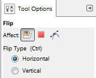

Ротација
-------- 

Често се дешава да сликa преузета са интернета или направиљена камером неког дигиталног уређаја буде погрешно
оријентисана. У програму за обраду слике постоји алатка којом је могуће ротирати слику и поставити је онако
како ти одоговара. За то ћеш користити алатку **Rotate**. 

Кликом на активни слој или изабрани део слике појавиће се прозор где подешаваш:

-  угао ротације (``Angle``) померањем клизача или уношењем бројевне вредност и
-  центар ротације. 

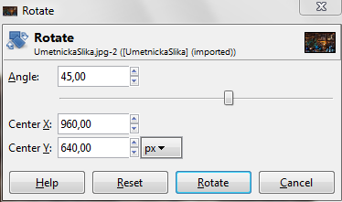

Избор потврђујеш кликом на дугме **Rotate**. Поред тога, слику можеш да ротираш и тако што кликнеш на
слој и држиш притиснут леви тастер миша док га помераш у смеру жељене ротације.
    
Искошавање
----------
	
Да би се искосила слика по хоризонтали или вертикали можеш користити алатку **Shear**. Кликом на дату
алатку отвара се прозор у коме се вредности задају кликом на стрелице или уносом бројчане вредности. 
Избор потврђујеш кликом на дугме **Shear**.

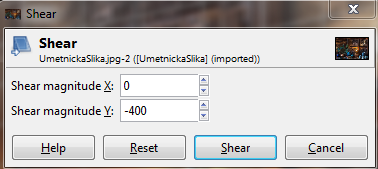
     
Преокретање  
-----------

Слику или део слике можеш да преокренеш по хоризонтали или вертикали помоћу алатке **Flip**.
   
Опис поступка за ротирање, искошавање и преокретање слике можеш погледати на следећем видеу:

.. ytpopup:: TaqUHy6gdSg
    :width: 735
    :height: 415
    :align: center 

Аутоматска обрада већег броја дигиталних слика
-----------------------------------------------

Ако желиш да у исто време промениш име или величину свих слика које се налазе у фасцикли, то је у програму
за обраду слике могуће коришћењем програмских додатака. Један од таквих додатака је dbp.exe који омогућава
аутоматску обраду (промена имена, величине,...) више дигиталних слика.

Додатак можеш преузети са овог линка: https://alessandrofrancesconi.it/projects/bimp/. Да би се додатак
инсталирао, потребно је да га ископираш у фасиклу plug-ins програма Gimp 2. Место фасцикле plug-ins зависи
од тога где је на твом рачунару инсталиран програм Gimp 2.
 
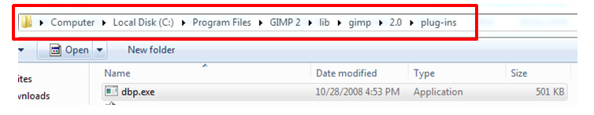

Након покретања програма Gimp 2, из менија Filters можемо да покренемо додатак Batch Process. 

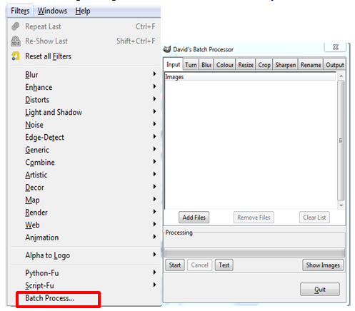

Отвара се прозор у оквиру кога кликом на Аdd Files додаш жељене слике и одабираш акцију коју желиш на
њих да примениш. Опис поступка за аутоматску обраду већег броја дигиталних слика можеш погледати на
следећем видеу:

.. ytpopup:: OjBVIQdWmDU
    :width: 735
    :height: 415
    :align: center 
  
.. infonote::

 **Шта смо научили?**
    •	дигиталну слику можеш додатно да уређујеш;
    •	инсталацијом додатака унапређујеш могућности програма Gimp 2 (нпр. примењујеш операције на више слика одједном).    