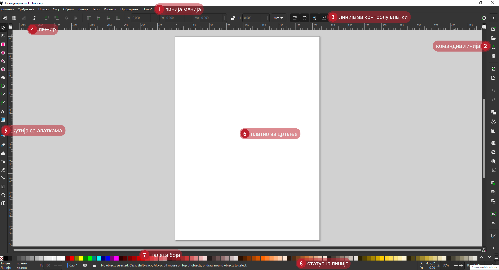
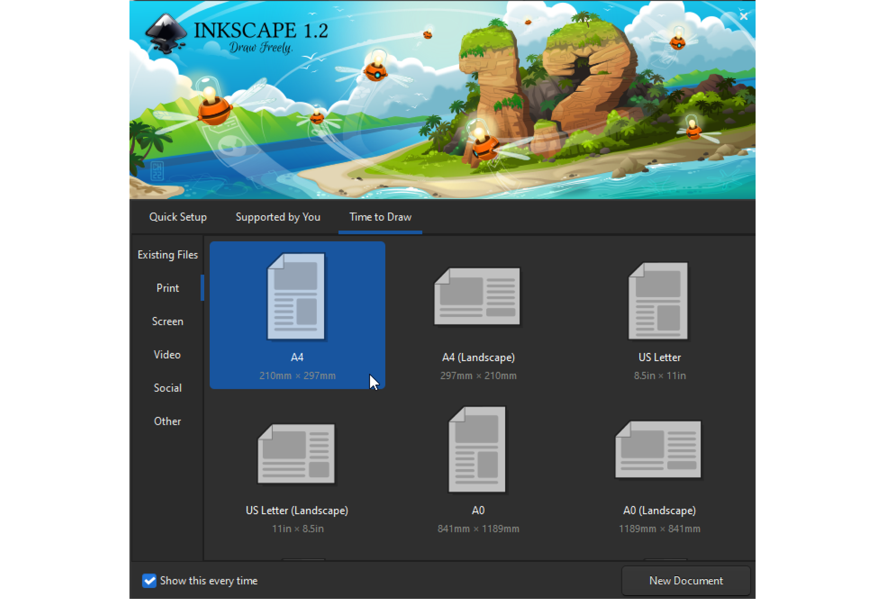
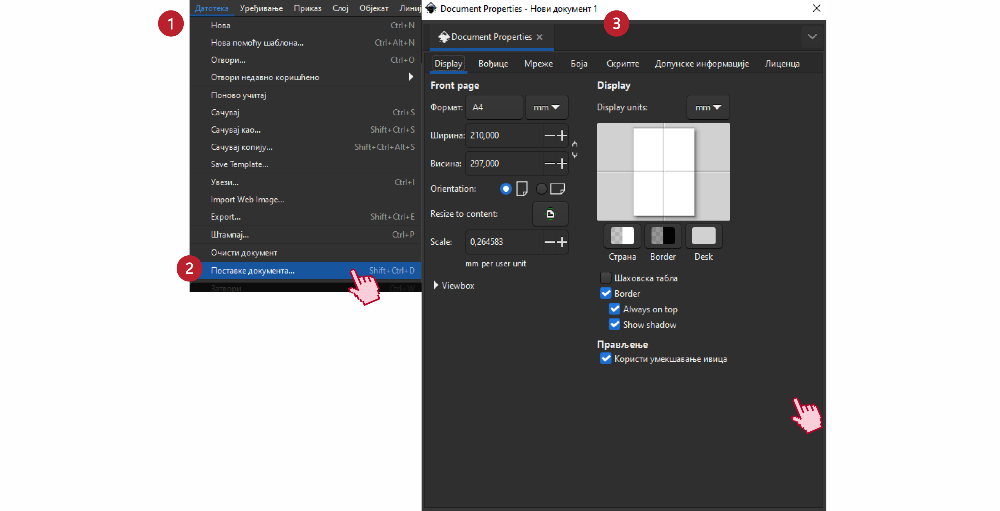
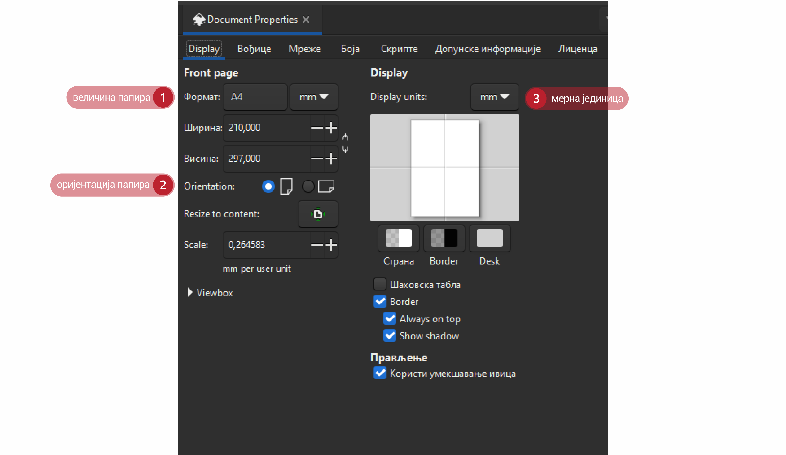
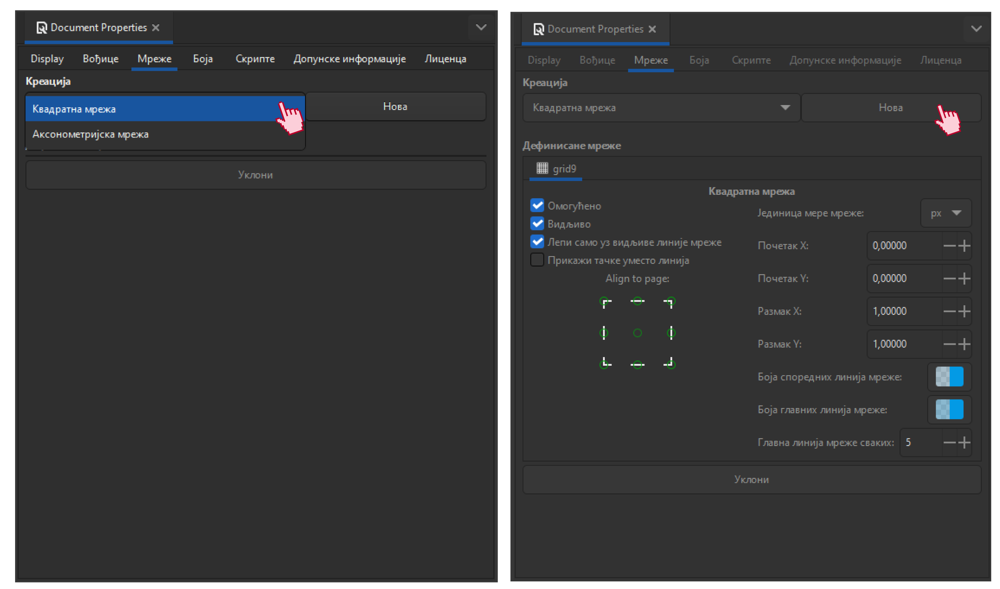
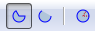

Креирање векторске графике
==========================

.. infonote::
 
 На овом часу научићеш:
    •	 шта обухвата припрема за цртање векторске графике;
    •	 како изгледа радно окружење програма за обраду векторске графике;
    •	 да црташ векторске објекте.

Хајде да се подсетимо.

Питање:
~~~~~~~

.. mchoice:: L76P1
    :answer_a: растерска графика
    :feedback_a: Нетачно    
    :answer_b: векторска графика
    :feedback_b: Тачно
    :answer_c: рачунарска графика
    :feedback_c: Нетачно
    :correct: b

	За коју врсту рачунарске графике важи да када се слика увећа, она остаје оштра, односно увећањем на било коју величину не губи се квалитет слике?

Векторска графика је начин приказивања слике помоћу линија и облика. Увећавањем не губи на квалитету.

До сада смо се бавили креирањем растерске графике, а у седмом разреду ћеш се упознати са основним техникама за креирање и обраду векторске графике.
Постоји велики број програма за креирање и обраду векторске графике, а неки од њих су Inkscape, Corel Draw и Adobe Illustrator. 

У овом разреду, бавићемо се основним техникама за креирање и обраду дигиталних слика у програму Inkscape. 

Програм можеш да преузмеш са интернет странице https://inkscape.org/en/download.  

Опис поступка инсталације програма Inkscape можеш погледати на следећем видеу:

.. ytpopup:: 8lEIXFeHiRM
    :width: 735
    :height: 415
    :align: center 

Када покренеш програм Inkscape, отвара се нови документ који је у формату **SVG** (Scalable Vector Graphics). 

Радно окружење програма Inkscape приказано је на следећој слици:

У радном окружењу централно место чини бела површина, страница или платно за цртање, чија се димензија бира приликом покретања програма као што је приказано на слици. 

Уколико желиш да цртеж одштампаш на папиру формата А4 онда је потребно да одабереш домензију 210mm x 297mm
и одговарајућу оријентацију. Ово је простор у који се постављају основни елементи (тачке, линије, криве,
кругови, многоуглови ...) који се користе за грађење дигиталне слике. Ти градивни елементи једним именом
се називају **објекти**. Објекти могу да буду отворени и затворени, испуњени и неиспуњени, један испред
другог, и могу да се преклапају формирајући слику.

Да би се подесила величина или оријентација платна за цртање, потребно је да кликнеш на мени **File** (1)
и одабереш опцију Поставке документа ``Document Properties`` (2). Отвара се прозор **Document Properties**
са више картица (3).

У оквиру картице **Display** можеш да промениш следеће параметре: величину и оријентацију папира, као
и мерну јединицу коју желиш да користиш у раду.

 
У оквиру картице **Вођице** могуће је активирати приказ помоћних линија (вођица) на страници.  
Ове линије користе се за прецизно постављање објеката на страницу. 
 
.. figure:: ../../_images/1_6_7.png
    :width: 780px
    :align: center  

Помоћне линије постављаш тако што кликнеш на лењир (хоризонтални или вертикални) и, држећи притиснут
леви тастер миша, повлачиш линију под жељеним углом. 

Двоструким кликом на линију отвара се помоћни прозор **Вођице** (Guideline), у оквиру кога подешаваш
назив маргине (``Label``), боју, позицију или угао линије.

Ако је за прецизно постављање потребно више помоћних линија, можеш да учиниш видљивом мрежу помоћних линија. 

У оквиру картице **Grids** можеш да одабереш да ли да мрежа помоћних линија буде правоугаона (``Rectangular``)
или просторна - аксонометријска (``Axonometric``).

У истој картици дефинишеш јединицу мере (``Grid units``), постављаш почетну координату (``Почетак X``,
``Почетак Y``), као и размак између линија (``Размак X``, ``Размак Y``).

Опис поступка постављања помоћних линија можеш погледати на следећем видеу:

.. ytpopup:: NzNa9dc1bBg
    :width: 735
    :height: 415
    :align: center 

Цртање правоугаоних и овалних облика 
------------------------------------

Програм Inkscape омогућава креирање основних геометријских облика избором одговарајуће алатке из кутије с алаткама Toolbox.

За цртање правоугаоника или квадрата користиш **Create rectangles and squares** |k1|. Правоугаоник исцртаваш
тако што кликнеш на платно за цртање и развучеш га држећи притиснут леви тастер миша, док квадрат исцртаваш
на исти начин, уз држање притиснутог тастера **Ctrl**.

Опис поступка за исцртавање правоугаоника и квадрата можеш погледати на следећем видеу:

.. ytpopup:: jtRnPkYBsE4
    :width: 735
    :height: 415
    :align: center 

Исцртавање елипсе или круга вршиш коришћењем алатке **Create circles, ellipses and arcs** |k2|. Елипсу
исцртаваш тако што кликнеш на страницу и развучеш елипсу држећи притиснут леви тастер миша, док круг
исцртаваш на исти начин, уз држање притиснутог тастера **Ctrl**.
 
Опис поступка за исцртавање елипсе и круга можеш погледати на следећем видеу:

.. ytpopup:: DVr_vNuds4c
    :width: 735
    :height: 415
    :align: center 

Од исцртаног круга могуће је креирати кружне исечке и лукове коришћењем алатке **Tool Controls Bar** |k3|,
у оквиру које је могуће да креираш кружни исечак или лук или вратиш објекат у почетно стање. 

.. infonote::

 **Шта смо научили?**
    •	векторску графику можеш да креираш и обрађујеш у програму Inkscape;
    •	основни елементи (тачке, линије, криве, кругови, многоуглови...) који граде векторску слику су објекти;
    •	програм Inkscape омогућава креирање основних геометријских објеката избором одговарајуће алатке из Toolbox;