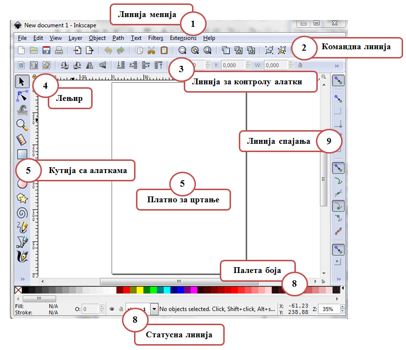
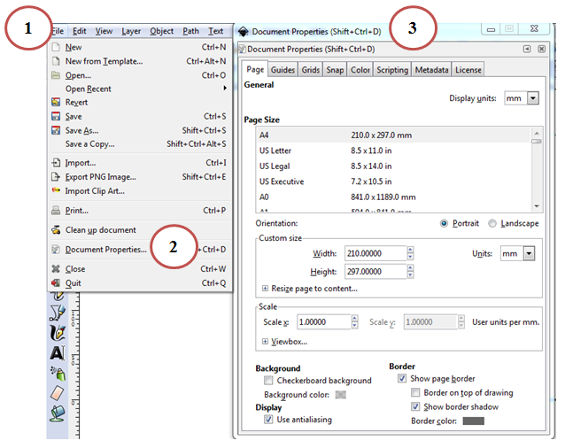
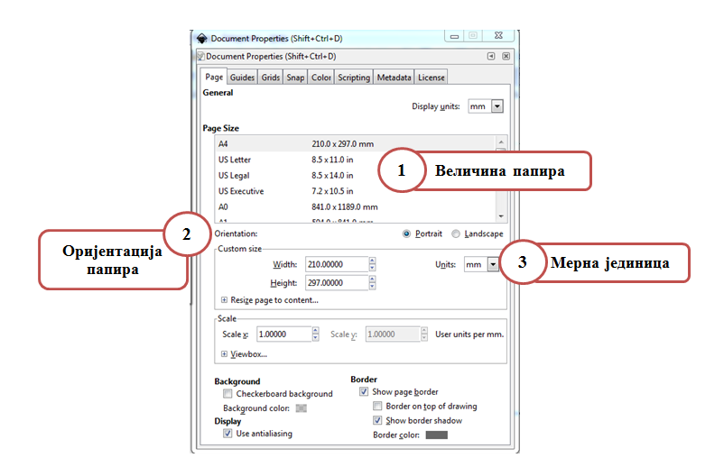
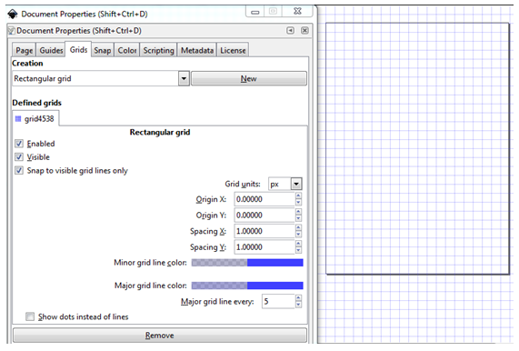

Час. Креирање векторске графике
================================

.. infonote::
 
 На овом часу ћемо говорити о:
    •	 припреми за цртање векторске графике;
    •	 радном окружењу програма за обраду векторске графике;
    •	 цртању векторских објеката.

Хајде да се подсетимо.

Питање:
~~~~~~~

.. mchoice:: L76P1
    :answer_a: растерска графика
    :feedback_a: Нетачно    
    :answer_b: векторска графика
    :feedback_b: Тачно
    :answer_c: рачунарска графика
    :feedback_c: Нетачно
    :correct: b

	За коју врсту рачунарске графике важи да када се слика увећа она остаје оштра, тачније увећањем на било коју величину не губи се квалитет слике.

Векторска графика је начин приказивања слике помоћу линија и облика. Увећавањем не губи на квалитету.

До сада смо се бавили креирањем растерске графике, у седмом разреду ћемо се упознати са основним техникама за креирање и обраду векторске графике.
Постоји велики број програма за креирање и обраду вексторске графике, и неки од њих су Inkscape, Corel Draw и Adobe Illustrator. 

У овом разреду, бавићемо се основним техникама за креирање и обраду дигиталних слика у програму Inkscape. 

Програм можемо да преузмемо са интернет странице https://inkscape.org/en/download.  

Опис поступка инсталације програма Inkscape можете погледати на доњем видеу:

.. ytpopup:: 8lEIXFeHiRM
    :width: 735
    :height: 415
    :align: center 

Када покренемо програм Inkscape отвара се нови документ који је у формату SVG (Scalable Vector Graphics). 

Радно окружење програма Inkscape приказано је на доњој слици:

У радном окружење централно место чини бела површина, страница или платно за цртање чија је димензија 210mm x 297mm. 
То је простор на коме се постављају различити објекти, основни елементи тачке, линије, криве, кругове, многоуглове... који се користе за грађење дигиталне слике. 
Ти градивно елементи једним именом се називају **објекти**. Објекти могу да буду отворени и затворени, испуњени и неиспуњени, један испред другог, могу да се преклапају… формирајући слику.

Да бисмо подесили величину или оријентацију платна за цртање потребно је да кликнемо на мени File (1) и одабиром опције Document Properties (2).
Отвара се прозор са више картица. 

У оквиру картице Page можемо да променимо:

 
У оквиру картице Guides могуће је активирати приказ помоћних линија (вођица) на страници.  
Ове линије користе се за прецизно постављање објеката на страницу. 
 
.. image:: ../../_images/L76S4.png
    :width: 600px
    :align: center  

Помоћне линије постављамо тако што кликнемо на лењир (хоризонтални или вертикални) и, држећи притиснут леви тастер миша, повлачимо линију под жељеним углом. 

Двоструким кликом на линију отвара се помоћни мени Guideline у оквиру кога подешавамо назив маргине (Label), боју, позицију или угао линије.

Ако је за прецизно постављање потребно више помоћних линија можемо да учинимо видљивом мрежу помоћних линија. 

У оквиру картице Grid можемо да одаберемо да ли да мрежа помоћних линија да буде правоугаона (Rectangular) или аксонометријска (Axonometric). 

У истој картици дефинишемо јединицу мере (Grid units), постављамо почетну координату (Origin X, Origin Y), као и размак између линија (Spacing X, Spacing Y).

Опис поступка постављања помоћних линија можете погледати на доњем видеу:

.. ytpopup:: NzNa9dc1bBg
    :width: 735
    :height: 415
    :align: center 

Цртање правоугаоних и овалних облика 
------------------------------------

Програм Inkscape омогућава креирање основних геометријских облика избором одговарајуће алатке из Toolbox.

.. |k1| image:: ../../_images/L76S6.png
            :width: 30px

.. |k3| image:: ../../_images/L76S8.png
            :width: 120px

Да бисмо исцртали правоугаоник или квадрат користимо Create rectangles and squares |k1|. 
Правоугаоник исцртавамо тако што кликнемо на платно за цртање и развучемо га држећи притиснут леви тастер миша, док квадрат исцртавамо на исти начин држањем притиснутог тастера Ctrl.

Опис поступка за исцртавање правоугаоника и квадрата можете погледати на доњем видеу:

.. ytpopup:: jtRnPkYBsE4
    :width: 735
    :height: 415
    :align: center 

Исцртавање елипсе или круга вршимо коришћењем алатке Create circles, ellipses and arcs |k2|. Елипсу исцртавамо тако што кликнемо на страницу и развучемо га држећи притиснут леви тастер миша, док круг исцртавамо на исти начин држањем притиснутог тастера Ctrl.
 
Опис поступка за исцртавање елипсе и круга можете погледати на доњем видеу:

.. ytpopup:: DVr_vNuds4c
    :width: 735
    :height: 415
    :align: center 

Од исцртаног круга могуће је креирати кружне исечке и лукове коришћењем алатке Tool Controls Bar |k3|, у оквиру које је могуће да креирамо кружни исечак или лук или вратимо објекат у почетно стање. 

.. infonote::

 **Шта смо научили?**
    •	да векторску графику можемо да креирамо и обрађујемо у програму Inkscape;
    •	да су основни елементи (тачке, линије, криве, кругове, многоуглове...) који граде векторску слику објекти;
    •	да програм Inkscape омогућава креирање основних геометријских објеката избором одговарајуће алатке из Toolbox;