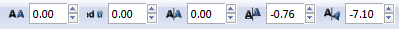

Час. Креирање векторске графике
===============================

.. infonote::
 
 На овом часу ћемо говорити о:
    •	 цртању векторских објеката.

Програм Inkscape омогућава креирање основних геометријских облика избором одговарајуће алатке из Toolbox.

Да бисмо исцртали правилни многоугао користимо опцију Create stars and polygons |x1|, а затим у Tool Controls Bar одаберемо алатку |x2| и унесемо број углова |x3|. Када смо подесили број углова, држимо притиснут леви тастер миша и развлачимо многоугао. 

На сличан начин исцртавамо звезду оодабиром алатке алатке |x3|. 
 
Опис поступка за исцртавање правилног многоугла и звезде можете погледати на доњем видеу:

.. ytpopup:: Te62qYbMsH8
    :width: 735
    :height: 415
    :align: center 

Да бисмо исцртали спирале користимо алатку Create spirals |x4| и држимо притиснут леви тастер миша, развучемо спиралу. 
 
Опис поступка за исцртавање спирале можете погледати на доњем видеу:

.. ytpopup:: 8OWrcGTk56o
    :width: 735
    :height: 415
    :align: center 

Цртање линија  
--------------

.. |x7| image:: ../../_images/L77S7.png
            :width: 30px

За цртање правих и неправилних линија користимо алатку Draw freehand lines |x5|.  

Да бисмо нацртали праву линију, потребно је да кликнемо левим тастером миша на страницу, а затим да преместимо курсор миша на место где желимо да буде крај дужи и поново кликнемо на страницу.

За исцртавање неправилних линија потребно је да кликнемо левим тастером миша на страницу и држимо га притиснутог док цртамо линију жељеног облика. Када отпустимо тастер миша, завршавамо исцртавање линије.

За цртање изломљених линија користимо алатку Bezier |x6|. 

Да бисмо исцртали изломљене линије, потребно је да кликнемо левим тастером миша на страницу, затим да преместимо курсор миша на место где желимо да изломимо линију, поново кликнемо и преместимо курсор миша, па понављамо ове радње све до крајње тачке изломљене линије, коју означавамо двокликом на страницу.

Опис поступка за исцртавање линије можете погледати на доњем видеу:

.. ytpopup:: u6vUBLS6mLI
    :width: 735
    :height: 415
    :align: center 
 
Уметност лепог писања 
---------------------

У програму Inkscape могуће је креирати објекте налик лепом писању - калиграфије. То остварујемо коришћењем алатке Calligraphy |x7|. 

Одабиром ове алатке добијамо могућност да цртамо посебне врсте линија - дебље или тање, под одређеним углом и правцем. 

Опис поступка за лепо писање - калиграфију, можете погледати на доњем видеу:

.. ytpopup:: hhFD1sj6rBI
    :width: 735
    :height: 415
    :align: center 

Креирање текста 
----------------

Такође, у програму Inkscape је могуће креирати комплексне текстове, наслове, банере, логое или натписе. 

За креирање текста потребно је да изаберемо алатку |x8|, кликнемо на страницу и унесемо текст. 

За форматирање текста потребно је да га селектујемо и из менија Text одаберемо опцију Convert to Text. 

На тексту можемо вршити измене:

-  фонта и његове величине;
-  хоризонталног и вертикалног растојања између речи или слова;
-  ротирања слова. 

Да бисмо направили те измене, потребно је да кликнемо између карактера и изаберемо одговарајуће подешавање у Tool Controls Bar |x9|.

Опис поступка за креирање текста можете погледати на доњем видеу:

.. ytpopup:: fj2BGf8x7XI
    :width: 735
    :height: 415
    :align: center 

.. infonote::

 **Шта смо научили?**
    •	да векторску графику можемо да креирамо и обрађујемо у програму Inkscape;
    •	да програм Inkscape омогућава креирање основних геометријских објеката избором одговарајуће алатке из Toolbox;
    •	да у програму Inkscape можемо да креирамо велике и комплексне текстове, али и наслове, банере, логое или натписе.