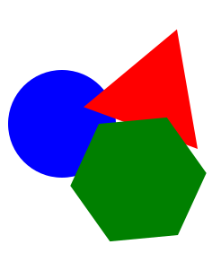

Задаци. Цртање векторских објеката
==================================

Задатак 1.
~~~~~~~~~~

У програму Inkscape отвори нов документ. Подеси величину странице на А4 и оријентиши је вертикално (Portrait).
Напиши текст Информатика и искористи неку од опција за улепшавање текста.
 
Сачувај датотеку.

.. |y5| image:: ../../_images/L78S5.png
            :width: 30px

Задатак 2.
~~~~~~~~~~

У програму Inkscape отвори нов документ.
Нацртај плави круг, црвени троугао и зелени шестоугао. Помери објекте тако да се делимично преклапају. 

Затим поред ових објеката нацртај жуту звезду са пет кракова и једну спиралу.

Сачувај датотеку.

Напомена: За померање објеката употреби алатку **Selector** |y5|.

Задатак 3.
~~~~~~~~~~

У програму Inkscape отвори нов документ.
Напиши назив твоје школе употребом алатке за калиграфију. 

Комбиновањем основних геометријских облика испод текста нацртај кућицу са прозорима и вратима.

Сачувај датотеку.
