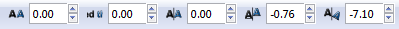

Цртање векторских објеката
==========================

.. infonote::
 
 На овом часу ћеш научити:
    •	 да нацрташ  различите векторске објекте: многоуглове, звезде, спирале...;
    •	 да користиш програм Inkscape за лепо писање - калиграфију;
    •	 да додајеш и уређујеш текст који је потребан за различите наслове, банере, логое, постере и слично.

Програм Inkscape омогућава креирање основних геометријских облика избором одговарајуће алатке из Toolbox-а.

.. |x1| image:: ../../_images/L77S1.png
            :width: 30px

.. |x2| image:: ../../_images/L77S2.png
            :width: 30px

.. |x3| image:: ../../_images/L77S3.png
            :width: 30px

За исцртавање правилног многоугла користиш алатку **Create stars and polygons** |x1|, а затим у ``Tool
Controls Bar`` одабереш алатку |x2| и унесеш број углова. Када унесеш број углова, држиш притиснут леви
тастер миша и развлачиш многоугао. 

На сличан начин исцртаваш звезду одабиром алатке |x3|. 
 
Опис поступка за исцртавање правилног многоугла и звезде можеш погледати на следећем видеу:

.. ytpopup:: Te62qYbMsH8
    :width: 735
    :height: 415
    :align: center 

Да бисмо исцртали спирале, користиш алатку **Create spirals** |x4| и док држиш притиснут леви тастер
миша, развучеш спиралу. 
 
Опис поступка за исцртавање спирале можеш погледати на следећем видеу:

.. ytpopup:: 8OWrcGTk56o
    :width: 735
    :height: 415
    :align: center 

Цртање линија  
--------------

.. |x6| image:: ../../_images/L77S6.png
            :width: 30px

За цртање правих и неправилних линија користиш алатку **Draw freehand lines** |x5|.  

За цртање праве линије потребно је да кликнеш левим тастером миша на страницу, а затим да преместиш
курсор миша на место где желиш да буде крај дужи и поново кликнеш на страницу.

За исцртавање неправилних линија потребно је да кликнеш левим тастером миша на страницу и држиш га
притиснутог док црташ линију жељеног облика. Када отпустиш тастер миша, завршаваш исцртавање линије.

За цртање Безијеових кривих линија (заобљене изломљене линије које се лако прилагођавају потребном
облику) користиш алатку **Bezier** |x6|.

За цртање Безијеове линије, потребно је да кликнеш левим тастером миша на страницу да означиш почетак
линије, затим да преместиш курсор миша на место где желиш да изломиш линију, поново кликнеш и преместиш
курсор миша, па понављаш ове радње све до крајње тачке изломљене линије, коју означаваш двокликом на страницу.

Опис поступка за исцртавање линије можеш погледати на следећем видеу:

.. ytpopup:: u6vUBLS6mLI
    :width: 735
    :height: 415
    :align: center 
 
Уметност лепог писања 
---------------------

У програму Inkscape могуће је креирати објекте налик лепом писању - калиграфије. То остварујеш коришћењем
алатке **Calligraphy** |x7|. 

Одабиром ове алатке добијаш могућност да црташ посебне врсте линија - дебље или тање, под одређеним углом
и правцем. 

Опис поступка за лепо писање - калиграфију, можеш погледати на следећем видеу:

.. ytpopup:: hhFD1sj6rBI
    :width: 735
    :height: 415
    :align: center 

Креирање текста 
----------------

.. |x8| image:: ../../_images/L77S8.png
            :width: 30px

Такође, у програму Inkscape је могуће креирати комплексне текстове, наслове, банере, логое или натписе. 

За креирање текста потребно је да изабереш алатку |x8|, кликнеш на страницу и унесеш текст. 

За форматирање текста потребно је да га селектујеш и из менија **Text** одабереш опцију ``Convert to Text``. 

На тексту можеш вршити измене:

-  фонта и његове величине;
-  хоризонталног и вертикалног растојања између речи или слова;
-  ротирања слова. 

За ове измене, потребно је да кликнеш између карактера и изабереш одговарајуће подешавање у ``Tool Controls Bar`` |x9|.

Опис поступка за креирање текста можеш погледати на следећем видеу:

.. ytpopup:: fj2BGf8x7XI
    :width: 735
    :height: 415
    :align: center 

.. infonote::

 **Шта смо научили?**
    •	векторску графику можеш да креираш и обрађујеш у програму Inkscape;
    •	програм Inkscape омогућава креирање основних геометријских објеката избором одговарајуће алатке из Toolbox;
    •	у програму Inkscape можеш да креираш велике и комплексне текстове, али и наслове, банере, логое или натписе.