Обрада векторске графике
========================

.. infonote::
 
    На овом часу ћеш научити:

    - да промениш редослед векторских објеката;
    - да извршиш основне oперације над објектима (померање, промена величине, ротирање...);
    - шта је векторизација и како да урадиш векторизацију растерске слике.

			

.. |y4| image:: ../../_images/L78S4.png
            :width: 30px

На претходна два часа смо креирали, тачније исцртавали различите геометријске облике (правоугаоник, квадрат, елипсу, праву линију, изломљену линију, спиралу,...).
Сви ти објекти на страници не морају да буду постављени у истој равни (један поред другог), већ можемо да их стављамо један преко другог. У задацима из претходне лекције си могао/могла да приметиш како изгледају објекти који се преклапају.

Објекти на векторској слици су поређани по нивоима, тако да се сваки нови објекат налази на нивоу изнад претходног. Редослед ових нивоа (па самим тим и редослед објеката на слици) се може променити.

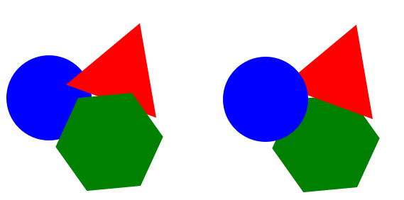

У програму Inkscape могуће је променити редослед означених објеката коришћењем опција из менија **Object**:

-  ``Raise`` |y1| да се објекат подигне за један ниво горе;
-  ``Lower`` |y2| да се објекат спусти за један ниво доле;
-  ``Raise to Top`` |y3| да се објекат подигне на врх;
-  ``Lower to Bottom`` |y4| да се објекат спусти на дно;

Опис поступка за мењање редоследа објеката у програму Inkscape можете погледати на следећем видеу:

.. ytpopup:: D1Pir-75X0k
    :width: 735
    :height: 415
    :align: center

Операције над објектима
----------------------- 

.. |y5| image:: ../../_images/L78S5.png
            :width: 30px

Да бисмо манипулисали објектима (померање, промена величине, ротација...) користимо алатку **Selector** |y5|.  

Када кликнемо на објекат користећи алатку за означавање (селекцију), око њега се формира оквир са 8 двостраних стрелица. Овакав објекат је спреман за све врсте манипулација (померање, мењање величине, ротирање...)

Померање објеката
------------------ 

Објекат можемо да померамо само када је селектован и то превлачењем мишем или употребом стрелица на тастатури. 
Притиском стрелица на тастатури објекат се помера у жељеном смеру за 2 пиксела. Уколико држимо пристиснут тастер **Shift** и стрелице на тастатури, померање је 10 пута веће (20 пиксела).

Опис поступка за померање објекта у програму Inkscape можете погледати на следећем видеу:

.. ytpopup:: RjDnLivWCJk
    :width: 735
    :height: 415
    :align: center

Промена величине објеката
--------------------------

Величину објекта мењамо кликом и повлачењем на одговарајуће двостране стрелице. 
Ширину или висину селектованог објекта мењамо кликом на двостране стрелице које су на средини страница оквира селектованог објекта и њиховим повлачењем. 
Ако кликнемо на двостране стрелице у угловима селектованог објекта истовремено мењамо и ширину и висину објекта. 
Пропорцију објекта, односно исти однос ширине и висине можемо да задржимо тако што током промене величине објекта држимо притиснут тастер **Ctrl**.

Опис поступка за промену величине објекта у програму Inkscape можете погледати на следећем видеу:

.. ytpopup:: 9H0mZp3T_AU
    :width: 735
    :height: 415
    :align: center

Ротирање и искошавање објеката
------------------------------- 

Да бисмо могли да ротирамо или искосимо објекат, треба да кликнемо на селектовани објекат чиме двостране стрелице мењају облик. На првој слици је приказан селектован објекат, а на другој је приказан изглед стрелица након што се кликне на селектовани објекат.

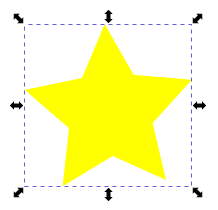

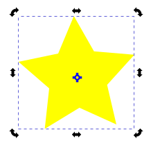

Објекат ротирамо повлачењем одговарајуће двостране стрелице којa се налази на углу селектованог објекта. 

Објекат можемо искосити вертикално повлачењем двостране стрелице која се налази на средини усправне странице оквира селектованог објекта (са леве и десне стране).

Објекат можемо искосити хоризонтално повлачењем двостране стрелице која се налази на средини водоравне странице оквира селектованог објекта (горе и доле). 

Опис поступка за ротирање и искошавање објекта у програму Inkscape можете погледати на следећем видеу:

.. ytpopup:: 560DKAwqHo0
    :width: 735
    :height: 415
    :align: center

Вишеструка селекција 
---------------------

У програму Inscape можемо да селектујемо више објеката, како бисмо на њима извршили исте операције.
Да бисмо селектовали више објеката потребно је да држимо притиснут тастер **Shift** и кликнемо на сваки од објеката. 
Број објеката које можемо да селектујемо на овај начин није ограничен. 
Ако желимо да селектујемо све објекте на страници, то радимо комбинацијом тастера ``Ctrl`` + ``A``.
  
Опис поступка за вишеструку селекцију објекта у програму Inkscape можете погледати на следећем видеу:

.. ytpopup:: KOOSJrmCGL8
    :width: 735
    :height: 415
    :align: center

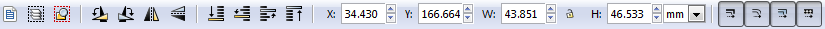

За прецизнију манипулацију над селектованим објектима користимо линију за контролу алатки

|y6|
 
или опцију ``Transform``, која се налази у менију **Object** (``Object`` →  ``Transform``). 

Уређивање објеката 
------------------

Када поставимо објекат на страницу можемо да модификујемо, тачније, да мењамо његов облик. 

  
То радимо тако што из кутије са алаткама Toolbox одаберемо алатку **Edit paths by nodes** |y8| и кликнемо на објекат који модификујемо. 
Приказаће нам се чворови беле боје. Њиховим повлачењем мењамо изглед делова објекта.

Да бисмо мењали број углова и додавали нове чворове на објекту неопходно је да објекте претворимо у путање (Path). То чинимо тако што селектујемо објекат и из менија **Path** бирамо опцију ``Object to Path``.

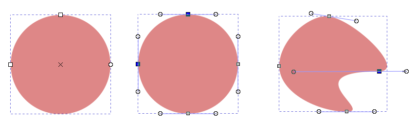

Када је објекат претворен у путању на располагању су нам 4 различите врсте чворова:

-  ``cusp`` - угаони чворови који су намењени за креирање оштрих углова; 
-  ``smooth`` - намењен за креирање глатких кривих; 
-  ``symmetric`` - намењен за креирање кривих;  
-  ``auto-smooth`` - за креирање идеално глатких кривих. 

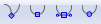

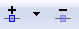

За подешавање одговарајуће врсте чвора потребно је да кликнимо на постојећи чвор, а затим да одаберемо једну од опција: |y9| које се налазе у Линији за контролу алатки. 
Објекат мењамо тако што повлачимо бели круг одговарајућег чвора. 

За додавање новог чвора довољно је да два пута кликнемо (двоклик) на жељено место на објекту. 
Да бисмо обрисали чвор, потребно је да га означимо, а затим притиснемо тастер **Delete**. 
За додавање и брисање чворова можемо да користимо и опцију |y10| са Линије за контролу алатки.

Опис поступка за додавање и брисање чвора на објекту у програму Inkscape можете погледати на следећем видеу:

.. ytpopup:: gidHEspmdYQ
    :width: 735
    :height: 415
    :align: center

Комбиновање објеката 
--------------------

У програму Inkscape могуће је креирати објекат уклањањем једног или више постојећих објеката, тачније могуће је извршити комбиновање више објеката креирајући потпуно нов објекат.

Објекте комбинујемо тако што превучемо један објекат преко другог, селектујемо оба и изаберемо начин комбиновања (``Union``, ``Difference``, ``Intersection``, ``Exclusion``, ``Divison``, ``Cut Path``) из менија **Path**.

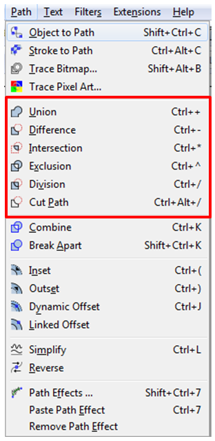

Опис поступка за комбиновање објеката у програму Inkscape можете погледати на следећем видеу:

.. ytpopup:: 4BalqI0w_so
    :width: 735
    :height: 415
    :align: center

Копирање и брисање објекта 
--------------------------

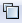

.. |y14| image:: ../../_images/L78S15.png
            :width: 30px

У програму Inkscape селектовани објекат можемо да копирамо на више начина:

-	коришћењем стандардних пречица са тастатуре (``Ctrl`` + ``C``, ``Ctrl`` + ``V``);
-	десним кликом миша на објекат и одабиром из падајућег менија наредбе ``Copy`` и ``Paste``;
-	избором пречица (``Copy`` |y11|, ``Paste`` |y12|) из Командне линије. 

Поред горе описаног начина копирања објеката у програму Inkscape могуће је извршити копирање и помоћу опција ``Duplicate`` |y13| и ``Clone`` |y14| из Командне линије. 
*Напомена*: Применом ових опција копирани објекти се појављују преко постојећих објеката па их је потребно померити на жељену позицију. 

Опис поступка за копирање објеката у програму Inkscape можете погледати на следећем видеу:

.. ytpopup:: RmNS9EqKYAk
    :width: 735
    :height: 415
    :align: center

Када селектујемо објекат и притиснемо тастер **Delete** бришемо објекат са радне површине.

Опис поступка за брисање објеката у програму Inkscape можете погледати на следећем видеу:

.. ytpopup:: WWak7c7G0vE
    :width: 735
    :height: 415
    :align: center

Поравнање објеката 
-------------------

Објекте можемо прецизно да поравнамо на два начина:

-  употребом помоћних линија (мреже) или
-  опцијом ``Align and distribute objects`` из менија **Object** до које се може доћи и помоћу пречице на тастатури ``Shift`` + ``Ctrl`` + ``A``. 

Ова опција отвара палету у којој се налазе опције за поравнање објеката (``Align``) и усклађивање размака (``Distribute``) између објеката.

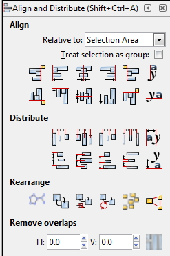

Опис поступка за поравнавање објеката у програму Inkscape можете погледати на следећем видеу:

.. ytpopup:: _rtZp-X2Ewk
    :width: 735
    :height: 415
    :align: center

Симетрично пресликавање 
------------------------

Да бисмо симетрично пресликали објекте, користимо опцију ``Path Effects`` из менија **Path**. 
Објекат треба да буде селектован да бисмо га симетрично пресликали. 
Након избора опције ``Path Effects`` отвара се палета у којој треба кликнути на опцију |y17|. Отвара се додатни прозор у којем бирамо опцију ``Mirror symmetry``.

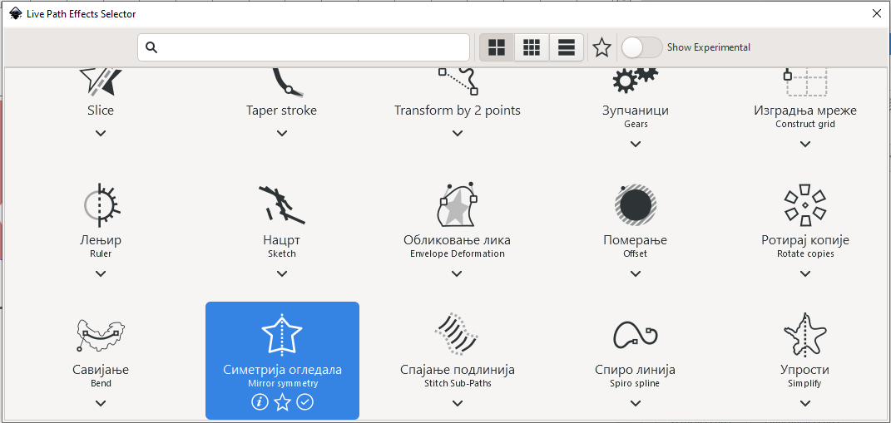

Након избора ове опције у палети **Path Effects** налазе се опције којима се подешава:

- ``Mode`` - начин рада, односно пресликавања;
- ``Mirror line start`` - почетне координате осе симетрије у односу на које се врши пресликавање;
- ``Mirror line end`` - крајње координате осе симетрије у односу на које се врши пресликавање;
- ``Mirror symmetry`` - избор ефекта.     	 

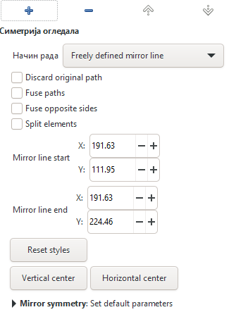

Опис поступка за симетрично пресликавање у програму Inkscape можете погледати на следећем видеу:

.. ytpopup:: OYcLWuCrqOI
    :width: 735
    :height: 415
    :align: center

Груписање и разлагање објеката
------------------------------- 

Више објеката на страници може да формира једну групу, тако да се са њима може истовремено манипулисати. Таква група делује као један објекат. За разлику од комбинованих објеката груписани објекти се по потреби поново могу раздвојити и посебно уређивати.
Групу формирамо од селектованих објеката кликом на опцију ``Group selected objects`` |y18| из Командне линије. 
Групу разлажемо на појединачне објекте кликом на опцију ``Ungroup selected groups`` |y19|. Опције за груписање објеката доступне су и у менију **Object**.
  
Опис поступка за груписање и растављање објеката у програму Inkscape можете погледати на следећем видеу:

.. ytpopup:: NPIMXmS6fao
    :width: 735
    :height: 415
    :align: center

Промена боје објекта 
--------------------

Сваки објекат у програму Inkscape је дефинисан унутрашњом облашћу (``Fill``) и ивицом (``Stroke``). Унутрашњој области и ивицама можемо независно да мењамо боју. 
Промену боје унутрашње области или ивице селектованог објекта (или групе објеката) вршимо избором жељене боје из палете боја. 
    
.. image:: ../../_images/L78S23.png
            :width: 500px
            :align: center

Кликом на боју поред назива Fill: и Stroke: отвара се палета **Fill and Stroke** у коме се врше детаљна подешавања изгледа унутрашње области и ивице објекта. 
    
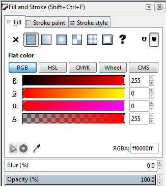

Палету **Fill and Stroke** можемо да покренемо и из менија **Object** (``Object`` → ``Fill and Stroke``).

Опис поступка за промену боје објеката у програму Inkscape можете погледати на следећем видеу:

.. ytpopup:: nnOe5zSusSM
    :width: 735
    :height: 415
    :align: center

За чување документа креираних у програму Inkscape користи се опција ``Save``, односно ``Save As``, из менија **File**. На овај начин пројекат ће бити сачуван у **.svg** формату и може се поново отворити и уређивати у програму Inkscape. Уколико је рад на пројекту завршен слика се може извести у **.png** формат помоћу опције ``Export`` која се такође налази у менију **File**.

Поступак чувања у програму Inkscape можете да погледате на следећем видеу:

.. ytpopup:: DTINrBQIUkA
    :width: 735
    :height: 415
    :align: center 

Векторизација растерске слике 
------------------------------

Процес којим растерску фотографију/слику претварамо у векторски цртеж, графички формат који не губи квалитет приликом увећавања називамо **векторизација**.

У програму Inkscape могуће је претварање растерске слике у векторску коришћењем опције ``Trace Bitmap`` (``Path`` → ``Trace Bitmap``). 
Избором већег броја скенирања (``Scans``) и избором из листе више боја (``Colors``) добија се квалитетнија векторска слика.

Поступак векторизације слике у програму Inkscape можете да погледате на следећем видеу:

.. ytpopup:: UOlc-X4iOiM
    :width: 735
    :height: 415
    :align: center 

.. infonote::

    **Шта смо научили?**
 
    - да је објектима могуће променити редослед на страници коришћењем наредби: подигни (``Raise``), спусти (``Lower``), подигни на врх (``Raise to Top``), спусти на дно (``Lower to Bottom``) из менија **Object**;
    - да поред селекције, померања и ротирања, објекте можемо да копирамо, групишемо, поравнавамо, мењамо им боју или провидност и на тај начин додатно уређујемо векторску графику;
    - да за симетрично пресликавање објеката користимо опцију ``Path Effects`` из менија **Path**;
    - да више објеката на страници може формирати једну групу. Када су објекти у групи, њима се може истовремено манипулисати (премештати, копирати, мењати боју,...);
    - да је векторизација процес претварања растерске фотографије/слике у векторски цртеж.