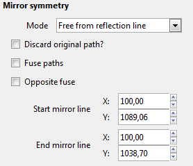
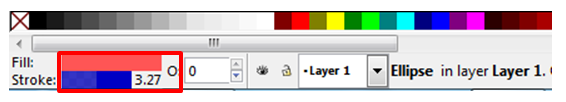

Час. Обрада векторске графике
==============================

.. infonote::
 
 На овом часу ћемо говорити о:
    •	 oперацијама над објектима;
    •	 векторизацији растерске слике.

.. |y1| image:: ../../_images/L78S1.png
            :width: 30px

.. |y2| image:: ../../_images/L78S2.png
            :width: 30px

			
.. |y3| image:: ../../_images/L78S3.png
            :width: 30px

.. |y4| image:: ../../_images/L78S4.png
            :width: 30px

На предходна два часа смо креирали, тачније исцртавали различите геометријске облике (правоугаоник, квадрат, елипсу, праву линију, изломљену линију, спиралу,...).
Сви ти објекти на страници не морају да буду постављени у истој равни, можемо да их стављамо један преко другог. Поређани су по нивоима, тако да се сваки нови објекат налази се на нивоу изнад претходног.

У програму Inkscape могуће је променити редослед означених објеката коришћењем опција из менија Object:

-  Raise |y1| да се објекат подигне;
-  Lower |y2| да се објекат спусти;
-  Raise to Top (Подигни на врх) |y3| да се објекат подигне на врх;
-  Lower to Bottom |y4| да се објекат подигне на дно;

Опис поступка за мењање редоследа објеката у програму Inkscape можете погледати на доњем видеу:

.. ytpopup:: D1Pir-75X0k
    :width: 735
    :height: 415
    :align: center

Операције над објектима
----------------------- 

.. |y5| image:: ../../_images/L78S5.png
            :width: 30px

Да бисмо могли да вршимо манипулацију над објектима (померање, промена величине, ротација...) можемо да користимо алатку Selector |y5|.  

Када кликнемо на објекат користећи алатку за означавање (селекцију) око њега се формира оквир са 8 двостраних стрелица. Овакав објекат је спреман за све врсте манипулација над њим, од померања, мењања величине, ротирања,....

Померање објеката
------------------ 

Објекат можемо да померамо само када је селектован и то превлачењем мишем или употребом стрелица на тастатури. 
Притиском стрелица на тастатури објекат се помера у жељеном смеру за 2 пиксела. Уколико држимо пристиснут тастер Shift и стрелице на тастатури, померање је 10 пута веће (20 пиксела).

Опис поступка за померање објекта у програму Inkscape можете погледати на доњем видеу:

.. ytpopup:: RjDnLivWCJk
    :width: 735
    :height: 415
    :align: center

Промена величине објеката
--------------------------

Величину објекта мењамо кликом и повлачењем на одговарајуће двостране стрелице. 
Ширину или висину селектованог објекта мењамо кликом на двостране стрелице које су на средини страница оквира селектованог објекта и њиховим повлачењем. 
Ако кликнемо на двостране стрелице у угловима селектованог објекта истовремено мењамо и ширину и висину објекта. 
Пропорцију објекта, односно исти однос ширине и висине можемо да задржимо тако што током промене величине објекта држимо притиснут тастер Ctrl.

Опис поступка за промену величине објекта у програму Inkscape можете погледати на доњем видеу:

.. ytpopup:: 9H0mZp3T_AU
    :width: 735
    :height: 415
    :align: center

Ротирање и нагињање објеката
----------------------------- 

Да бисмо могли да ротирамо или нагињемо објекат морамо да кликнемо на селектовани објекат чиме двостране стрелице мењају облик. 

Објекат ротирамо повлачењем одговарајуће двостране стрелице, које се налази на углу селектованог објекта. 

Објекат вертикално нагињемо повлачењем двостране стрелице која се налази на средини странице оквира селектованог објекта (са леве и десне стране).

Објекат хоризонтално нагињемо повлачењем двостране стрелице која се налази на средини странице оквира селектованог објекта (горе и доле). 

Опис поступка за ротирање и нагињање објекта у програму Inkscape можете погледати на доњем видеу:

**Видео**

Вишеструка селекција 
---------------------

У програму Inscape могуће је више објеката селектовати како би на њима извршили исте операције.
Да бисмо селектовали више објеката потребно је да држимо притиснут тастер Shift и кликнемо на сваки од објеката. 
Број објеката које можемо да селектујемо на овај начин није ограничен. 
Ако желимо да селектујемо све објекте на страници то радимо комбинацијом тастера Ctrl+A.
  
Опис поступка за вишеструку селекцију објекта у програму Inkscape можете погледати на доњем видеу:

**Видео**

Линију за контролу алатки |y6| или помоћни мени Transform, који активирамо из менија Object (Object →  Transform) користимо за прецизнију манипулацију над селектованим објектима. 

Уређивање објеката 
------------------

Када поставимо објекат на страницу можемо да модификујемо, тачније да мењамо његов облик. 

.. |y8| image:: ../../_images/L78S8.png
            :width: 30px
  
То радимо тако што из Toolbox одабиремо алатку Edit paths by nodes |y8| и кликнемо на објекат који модификујемо. 
Приказаће нам се чворови беле боје. Њиховим повлачењем мењамо изглед делова објекта.

Да бисмо мењали број углова и додавали нове чворове на објекту неопходно је да објекте претворимо у путање (Path). То чинимо тако што селектујемо објекат и из менија Path бирамо опцију Object to Path.

Када је објекат претворен у путању на располагању су нам 4 различите врсте чворова:

-  cusp - угаони чворови који су намењени за креирање оштрих углова; 
-  smooth - намењен за креирање глатких кривих; 
-  symmetric - намењен за креирање кривих;  
-  auto-smooth - за креирање идеално глатких кривих. 

.. |y9| image:: ../../_images/L78S9.png
            :width: 100px

.. |y10| image:: ../../_images/L78S10.png
            :width: 100px

За подешавање одговарајуће врсту чвора потребно је да кликнимо на постојећи чвор, а затим да одаберемо једну од опција: |y9| које се налазе у Линији за контролу алатки. 
Објекат мењамо тако што повлачимо бели круг одговарајућег чвора. 

Опис поступка за промену облика објекта у програму Inkscape можете погледати на доњем видеу:

**Видео**

За додавање новог чвора довољно је да два пута кликнемо (двоклик) на жељено место на објекту. 
Да бисмо обрисали чвор, потребно је да га означимо, а затим притиснемо тастер Delete. 
За додавање и брисање чворова можемо да користимо и опцију |y10| са Линије за контролу алатки.

Опис поступка за додавање и брисање чвора на објекту у програму Inkscape можете погледати на доњем видеу:

.. ytpopup:: gidHEspmdYQ
    :width: 735
    :height: 415
    :align: center

Комбиновање објеката 
--------------------

У програму Inkscape могуће је креирати објекат уклањањем једног или више постојећих објеката, тачније могуће је извршити комбиновање више објеката креирајући потпуно нов објекат.

Објекте комбинујемо тако што превучемо један објекат преко другог, селектујемо оба и изаберемо начин комбиновања (Union, Difference, Intersection, Exclusion, Divison, Cut Path) из менија Path.

Опис поступка за комбиновање објеката у програму Inkscape можете погледати на доњем видеу:

.. ytpopup:: 4BalqI0w_so
    :width: 735
    :height: 415
    :align: center

Копирање и брисање објекта 
--------------------------

.. |y12| image:: ../../_images/L78S13.png
            :width: 30px

.. |y14| image:: ../../_images/L78S15.png
            :width: 30px

У програму Inkscape селектовани објекат можемо да корирамо на више начина:

-	коришћењем стандардних пречица са тастатуре (Ctrl+C, Ctrl+V);
-	десним кликом миша на објекат и одабиром из падајућег менија наредбе Copy и Paste;
-	избором пречица (Copy |y11|, Paste |y12|) из Командне линије. 

Поред горе описаног начина копирања објеката у програму Inkscape могуће је извршити копирање и помоћу наредби Duplicate |y13| и Clone |y14| из Командне линије. 
Применом ових опција копирани објекти се појављују преко постојећих објеката па их је потребно померити на жељену позицију. 

Опис поступка за копирање објеката у програму Inkscape можете погледати на доњем видеу:

.. ytpopup:: RmNS9EqKYAk
    :width: 735
    :height: 415
    :align: center

Када селектујемо објекат и притиснемо тастер Delete бришемо објекат са радне површине.

Опис поступка за брисање објеката у програму Inkscape можете погледати на доњем видеу:

.. ytpopup:: WWak7c7G0vE
    :width: 735
    :height: 415
    :align: center

Поравнање објеката 
-------------------

.. |y15| image:: ../../_images/L78S16.png
            :width: 30px

Да бисмо прецизно поравнали објекте можемо то урадити на два начина:

-  да користимо помоћне линије, мрежу или 
-  опције из помоћног менија Align and distribute objects |y15| из Командне линије. 

У помоћном менију се налазе опције за поравнање објеката (Align) и усклађивање размака (Distribute) измећу објеката.
	 
.. image:: ../../_images/L78S17.png
	:width: 300px

Опис поступка за поравнавање објеката у програму Inkscape можете погледати на доњем видеу:

.. ytpopup:: _rtZp-X2Ewk
    :width: 735
    :height: 415
    :align: center

Симетрично пресликавање 
------------------------

.. |y17| image:: ../../_images/L78S18.png
            :width: 30px

Да бисмо симетрично пресликавање објеката користимо помоћни мени Path Effects из менија Path. 
Објекат мора да буде селектован да бисмо објекат симетрично пресликали. 
У помоћном менију Path Effects одаберемо опцију |y17|. Отвара се додатни мени у којем бирамо опцију Mirror symmetry.
	 

У оквиру менија Path Effects налазе се опције којима се подешава:

-	Mode - начин пресликавања;
-	Start mirror line - почетне координате осе симетрије у односу на које се врши пресликавање;
-   End mirror line - крајње координате осе симетрије у односу на које се врши пресликавање;
-	Mirror symmetry - избор ефекта.     	 

Опис поступка за симетрично пресликавање у програму Inkscape можете погледати на доњем видеу:

**Видео**

Груписање и разлагање објеката
------------------------------- 

.. |y18| image:: ../../_images/L78S21.png
            :width: 30px

			
.. |y19| image:: ../../_images/L78S22.png
            :width: 30px

На страници више објеката може да формира једну групу тако да се са њима може истовремено манипулисати. Таква група делује као један објекат. 
Групу формирамо од селектованих објеката кликом на опцију Group selected objects |y18| из Командне линије. 
Разлажемо групу на појединачне објекте кликом на опцију Ungroup selected groups |y19|. 
  
Опис поступка за груписање и разлагање објеката у програму Inkscape можете погледати на доњем видеу:

.. ytpopup:: NPIMXmS6fao
    :width: 735
    :height: 415
    :align: center

Промена боје објекта 
--------------------

Сваки објекат у програму Inkscape је дефинисан унутрашњом облашћу (Fill) и ивицом (Stroke). Унутрашњој области и ивицам можемо независно да мењамо боју. 
Промену боје унутрашње области или ивице селектованог објекта или групе вршимо избором жељене боје из палете боја. 
    

Кликом на боју поред назива Fill: и Stroke: отвара се помоћни мени Fill and Stroke у коме се врше детаљна подешавања изгледа унутрашње области и ивице објекта. 
    
.. image:: ../../_images/L78S24.png
            :width: 400px

Помоћни мени Fill and Stroke можемо да покренемо и из менија Object (Object → Fill and Stroke).

Опис поступка за промену боје објеката у програму Inkscape можете погледати на доњем видеу:

.. ytpopup:: nnOe5zSusSM
    :width: 735
    :height: 415
    :align: center

Векторизација растерске слике 
------------------------------

Процес којим фотографију/слику претварамо у векторски цртеж, графички формат који не губи квалитет приликом увећавања називамо **векторизација**.

У програму Inkscape могуће је претварање растерске слике у векторску коришћењем опције Trace Bitmap (Path → Trace Bitmap). 
Избором већег броја скенирања (Scans) и избором из листе више боја (Colors) добија се квалитетнија векторска слика.

Поступак чувања у програму Inkscape можете да погледате на доњем видеу:

.. ytpopup:: DTINrBQIUkA
    :width: 735
    :height: 415
    :align: center 

Поступак векторизације слике у програму Inkscape можете да погледате на доњем видеу:

**Видео**

.. infonote::

 **Шта смо научили?**
    •	да је објектима могуће променити редослед на страници коришћењем наредби: подигни (Raise), спусти (Lower), подигни на врх (Raise to Top), спусти на дно (Lower to Bottom) из менија Object;
    •	да поред селекције, померања и ротирања, објекте можемо да копирамо, групишемо, поравнавамо, мењамо им боју или провидност и на тај начин додатно уређујемо векторску графику;
    •	да за симетрично пресликавање објеката користимо помоћни мени Path Effects из менија Path;
    •	да више објеката на страници може формирати једну групу. Када су објекти у групи, њима се може истовремено манипулисати (премештати, копирати, мењати боју,...);
    •	да је векторизација процес претварања фотографије/слике у векторски цртеж.