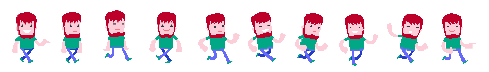

Задаци. Анимиране слике
=======================

Задатак 1.
~~~~~~~~~~

У програму Microsoft Gif Animator отвори нов документ.
Прeузми на свој рачунар следећу слику и од ње креирај девет слика у **gif** формату које ће представљати фрејмове за анимацију облака. 

Од припремљених слика у програму Microsoft Gif Animator креирај анимацију облака.  

Сачувај документ.

Задатак 2.
~~~~~~~~~~

У програму Microsoft Gif Animator отвори нов документ.
Прeузми на свој рачунар следећу слику и од ње креирај десет слика у **gif** формату које ће представљати фрејмове за анимацију дечака који трчи. 

Од припремљених слика у програму Microsoft Gif Animator креирај анимацију.

Сачувај документ.

Задатак 3.
~~~~~~~~~~

У програму Microsoft Gif Animator отвори нов документ.
Пронађи и преузми са интернета слике које желиш да употребиш за креирање анимације цвета који расте, лопте која се креће и слично.
Слике можеш креирати и самостално у програму за векторску графику Inkscape.

Од припремљених слика у програму Microsoft Gif Animator креирај анимацију.

Сачувај документ.