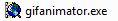
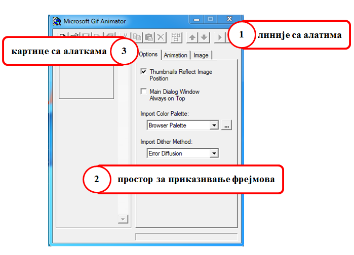
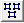
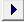
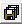

Анимиране слике
===============

.. infonote::
 
 На овом часу ћемо говорити о:
    •	 појму анимације;
    •	 креирању анимиране слике;
    •	 уграђивању анимиране слике у мултимедијалну презентацију.

**Анимација** је поступак стварања слике у покрету у правилним временским интервалима. 
Свака покретна слика назива се оквир или фрејм анимације (енгл. frame). 
Брзина којом се слике мењају мери се бројем промена тих слика у секунди и означава се са fps (frames per second). 

У овој лекцији бавићемо се креирањем анимираних датотека које садрже слике чијим се мењањем ствара привид покретних слика.

За креирање анимираних слика постоји велики број програма од којих су најпознатији:

-  Maya, 3D Studio Max за сложеније анимације;
-  Microsoft Gif Animator, Gif Creator за једноставне анимације.

Microsoft Gif Animator преузимамо са интернет странице  https://microsoft-gif-animator.en.uptodown.com/windows кликом на дугме Latest version.
Довољно је да покренемо извршну датотеку |m1|. 

Опис поступка за комбиновање објеката у програму Inkscape можете погледати на следећем видеу:

.. ytpopup:: nyw4rP0FUfk
    :width: 735
    :height: 415
    :align: center 

Радно окружење програма састоји се од три дела: 

1.  линије са алатима;
2.  простор за приказ фрејмова;
3.  три картице Options, Animation и Image. 

Kартице Animation и Image активирају се тек након постављања прве слике. 
  

Свака анимирана слика је сачињена од више (непокретних) слика, па је за израду анимације потребно да се припреми довољан број слика истих димензија.  
Да бисмо могли да креирамо анимирану слику у програму Microsoft Gif Animator потребно је да припремљене слике буду запамћене у GIF формату. 

Подсећања ради, GIF (Graphics Interchange Format) спада у компримоване формате без губитака квалитетa слике. 

Опис поступка за припрему слике за анимацију можете погледати на следећем видеу:

.. ytpopup:: EzjtdR18luk
    :width: 735
    :height: 415
    :align: center

Прву слику увозимо кликом на опцију Open из линије са алатима. Отвара се прозор за отварање датотеке у оквиру кога бирамо слику и избор потврђујемо кликом на дугме Open. 

 

У простору за приказ фрејмова биће приказана прва изабрана слика. Остале слике увозимо избором алатке Insert |m2|. 
Ако увеземо погрешну слику, слику можемо да обришемо тако што је селектујемо и кликнемо на алатку Delete |m3|. 
У случају да слике у простору за фрејмове нису поређане у одговарајућем редоследу, жељени распоред вршимо коришћењем алатки Move Up/Down |m4|.

У картици Options, можемо да подесимо однос величине слика и сцене за приказивање анимације одабиром опције Thumbnails Reflect Image Position. 

У истој картици у зависности од сложености слика, бирамо одговарајући метод за приказивање палете боја:

-  Solid (за линије и слике са неколико боја);
-  Pattern (за слике са умереним бројем боја);
-  Random (за слике са више боја);
-  Error Diffusion (за ублажавање прелаза између боја). 
	 
Величину сцене за приказ анимације подешавамо на картици Animation тако што жељене вредности уносимо у поља Animation Width и Animation Height. 
Видљивост броја унетих слика за креирање анимације налази се у пољу Image Count. 
У случају да желимо да се анимација понавља треба да означимо поље Looping и унесемо број понављања у поље Repeat Count или одаберемо бесконачно понављање означавањем поља Repeat Forever.

У оквиру картице Image подешавамо основне особине фрејмова: 

-	позицију на сцени (Left, Top);
-	дужину трајања (Duration 1/100s);
-	начин приказивања слика (Undraw Method);
-	провидност позадине (Transaparency). 

Избором алатке Select All |m5| ове особине могу да се подесе за све оквире истовремено.

Опис поступка за креирање покретне слике можете погледати на следећем видеу:

.. ytpopup:: 5WktEqRDux4
    :width: 735
    :height: 415
    :align: center 

Покретање и чување анимације
----------------------------

Анимацију покрећемо избором алатке Preview |m6| из Линије са алаткама. 
Отвориће се нови прозор у којем се приказује анимација и у којем можемо да поново покренемо и зауставимо анимацију или је прикажемо фрејм по фрејм.

Анимирану слику чувамо у формату .gif, избором алатке Save As |m7| из Линије са алаткама. 

Опис поступка за креирање анимране слике можете погледати на следећем видеу:

.. ytpopup:: vtIoGLr7Jfk
    :width: 735
    :height: 415
    :align: center 

Уграђивање анимације у мултимедијалну презентацију 
--------------------------------------------------

Анимирану слику не можемо прегледати у програмима за обраду слике. Такву слику можемо погледати у програму за креирање анимација, да је прикажемо у веб прегледачима, али и у програмима за креирање мултимедијалних презентација. 

У програму Microsoft PowerPoint можемо да уметнемо анимацију на слајд тако што у менију изаберемо Insert → Pictures → одабир анимације → Insert.

Тако уметнута слика ће бити "непокретна" све док не покренемо презентацију кликом на дугме F5 са тастатуре.
Када смо покренули презентацију анимирана слика биће приказана у форми "покрета". 

Опис поступка уграђивања анимације у мултимедијалну презентацију можете погледати на следећем видеу:

.. ytpopup:: Adgz2n54yC4
    :width: 735
    :height: 415
    :align: center

.. infonote::

 **Шта смо научили?**
    •	да је анимација процес смењивања слика којим се ствара привид да се неки објекат мења (или креће) током времена;
    •	да је фрејм једна од слика/фотографија које сачињавају покретну слику;
    •	да анимирану слику чувамо у .GIF формату;
    •	да анимирану слику није могуће приказати у програмима за преглед слика, али их је, поред програма за креирање анимација, могуће приказати у веб-прегледачима, као и у програмима за креирање мултимедијалних презентација.
