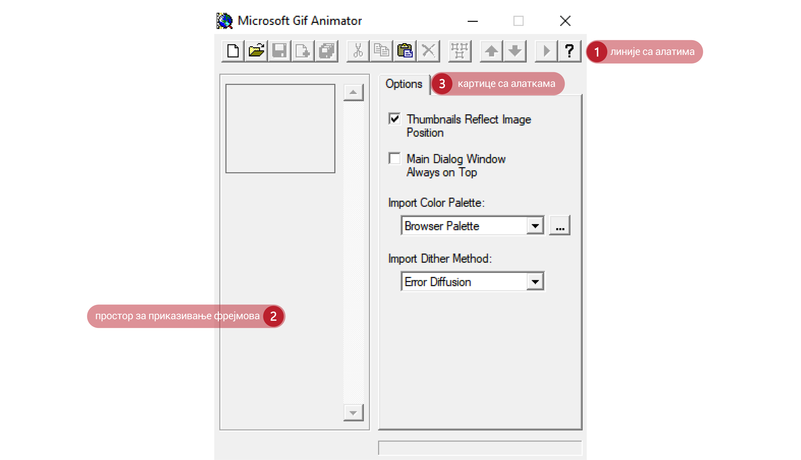

Анимиране слике
===============

.. infonote::
 
 На овом часу научићеш:
    •	 шта су анимације;
    •	 да креираш анимиране слике;
    •	 да уградиш анимиране слике у мултимедијалну презентацију.

Данас се покретне слике најчешће креирају помоћу рачунара. и тада је реч о рачунарским анимацијама.
**Анимација** је поступак стварања слике у покрету у правилним временским интервалима. Анимација подразумева брзу промену слике на екрану. На тај начин ствара се илузија да се објекат приказан на слици креће.
На пример, брзим смењивањем следећих сличица имаћемо утисак да дечак трчи. 

.. image:: ../../_images/animacijeZdecak.png
    :width: 900px
    :align: center

Свака кратко приказана слика у оквиру анимације назива се **оквир** или **фрејм** анимације (енгл. frame). 
Брзина којом се слике мењају мери се бројем промена тих слика у секунди и означава се са **fps** (frames per second). 

У овој лекцији бавићемо се креирањем анимираних датотека које садрже слике чијим се мењањем ствара привид покретних слика.

За креирање анимираних слика постоји велики број програма од којих су најпознатији:

-  Maya, 3D Studio Max за сложеније анимације;
-  Microsoft Gif Animator, Gif Creator за једноставне анимације.

.. |m1| image:: ../../_images/L79S1.png
            :width: 100px

Microsoft Gif Animator преузимамо са интернет странице  https://microsoft-gif-animator.en.uptodown.com/windows кликом на дугме Latest version.
Довољно је да покренемо извршну датотеку |m1|. 

Опис поступка за преузимање и покретање програма Microsoft Gif Animator можеш погледати на следећем видеу:

.. ytpopup:: nyw4rP0FUfk
    :width: 735
    :height: 415
    :align: center 

Радно окружење програма састоји се од три дела: 

1.  линије са алатима;
2.  простора за приказ фрејмова;
3.  три картице **Options**, **Animation** и **Image**. 

Kартице **Animation** и **Image** активирају се тек након постављања прве слике. 
  

Свака анимирана слика је сачињена од више (непокретних) слика, па је за израду анимације потребно да се припреми више слика истих димензија. Код креирања анимација обично се свака следећа слика мало разликује од претходне, што даје утисак да се објекат у анимацији креће.  
Да би се креирала анимирана слика у програму Microsoft Gif Animator, потребно је да припремљене слике буду запамћене у **GIF** формату. 

Подсетимо се да **GIF** (Graphics Interchange Format) спада у компримоване формате без губитака квалитетa слике. 

Опис поступка за припрему сликa за анимацију можеш погледати на следећем видеу:

.. ytpopup:: EzjtdR18luk
    :width: 735
    :height: 415
    :align: center

Прву слику увозиш кликом на опцију ``Open`` из линије са алатима. Отвара се прозор за отварање датотеке
у оквиру кога бираш слику и избор потврђујеш кликом на дугме **Open**. 

 
.. |m2| image:: ../../_images/L79S3.png
            :width: 30px

.. |m3| image:: ../../_images/L79S4.png
            :width: 30px

.. |m4| image:: ../../_images/L79S5.png
            :width: 30px

.. |m5| image:: ../../_images/L79S6.png
            :width: 30px

У простору за приказ фрејмова биће приказана прва изабрана слика. Остале слике увозиш избором алатке
**Insert** |m2|. Ако увезеш погрешну слику, слику можеш да обришеш тако што је селектујеш и кликнеш
на алатку **Delete** |m3|. У случају да слике у простору за фрејмове нису поређане у одговарајућем
редоследу, жељени распоред вршиш коришћењем алатки **Move Up/Down** |m4|.

У картици **Options**, можеш да подесиш однос величине слика и сцене за приказивање анимације одабиром
опције ``Thumbnails Reflect Image Position``. 

У истој картици у зависности од сложености слика, бираш одговарајући метод за приказивање палете боја:

-  ``Solid`` (за линије и слике са неколико боја);
-  ``Pattern`` (за слике са умереним бројем боја);
-  ``Random`` (за слике са више боја);
-  ``Error Diffusion`` (за ублажавање прелаза између боја). 
	 
Величину сцене за приказ анимације подешавамо на картици **Animation** тако што жељене вредности уносиш
у поља ``Animation Width`` и ``Animation Height``. Видљивост броја унетих слика за креирање анимације
налази се у пољу ``Image Count``. У случају да желиш да се анимација понавља, треба да означиш поље
``Looping`` и унесеш број понављања у поље ``Repeat Count`` или да одабереш бесконачно понављање означавањем
поља ``Repeat Forever``.

У оквиру картице **Image** подешаваш основне особине фрејмова: 

-	позицију на сцени (``Left``, ``Top``);
-	дужину трајања (``Duration``, мерна јединица 1/100s);
-	начин приказивања слика (``Undraw Method``);
-	провидност позадине (``Transaparency``). 

Избором алатке **Select All** |m5| ове особине могу да се подесе за све оквире истовремено.

Опис поступка за креирање покретне слике можеш погледати на следећем видеу:

.. ytpopup:: 5WktEqRDux4
    :width: 735
    :height: 415
    :align: center 

Покретање и чување анимације
----------------------------

.. |m6| image:: ../../_images/L79S7.png
            :width: 30px

.. |m7| image:: ../../_images/L79S8.png
            :width: 30px

Анимацију покрећеш избором алатке **Preview** |m6| из Линије са алаткама. Отвориће се нови прозор у
којем се приказује анимација и у којем можеш да поново покренеш и зауставиш анимацију или је прикажеш
фрејм по фрејм.

Анимирану слику чуваш у формату **.gif**, избором алатке **Save As** |m7| из Линије са алаткама. 

Опис поступка за креирање анимиране слике можеш погледати на следећем видеу:

.. ytpopup:: vtIoGLr7Jfk
    :width: 735
    :height: 415
    :align: center 

Уграђивање анимације у мултимедијалну презентацију 
--------------------------------------------------

Анимирану слику не можеш прегледати у програмима за обраду слике. Такву слику можеш погледати у програму
за креирање анимација, да је прикажеш у веб-прегледачима, али и у програмима за креирање мултимедијалних
презентација. 

У програму Microsoft PowerPoint можеш да уметнеш анимацију на слајд тако што у менију изабереш ``Insert``
→ ``Pictures`` → одабир анимације → ``Insert``.

Тако уметнута слика биће „непокретна“ све док не покренеш презентацију кликом на дугме **F5** са тастатуре.
Када покренеш презентацију, анимирана слика биће приказана у форми „покрета“. 

Опис поступка уграђивања анимације у мултимедијалну презентацију можеш погледати на следећем видеу:

.. ytpopup:: Adgz2n54yC4
    :width: 735
    :height: 415
    :align: center

.. infonote::

 **Шта смо научили?**
    •	анимација је процес смењивања слика којим се ствара привид да се неки објекат мења (или креће) током времена;
    •	фрејм је једна од слика/фотографија које сачињавају покретну слику;
    •	анимирану слику чуваш у .GIF формату;
    •	анимирану слику није могуће приказати у програмима за преглед слика, али их је, поред програма за креирање анимација, могуће приказати у веб-прегледачима, као и у програмима за креирање мултимедијалних презентација.